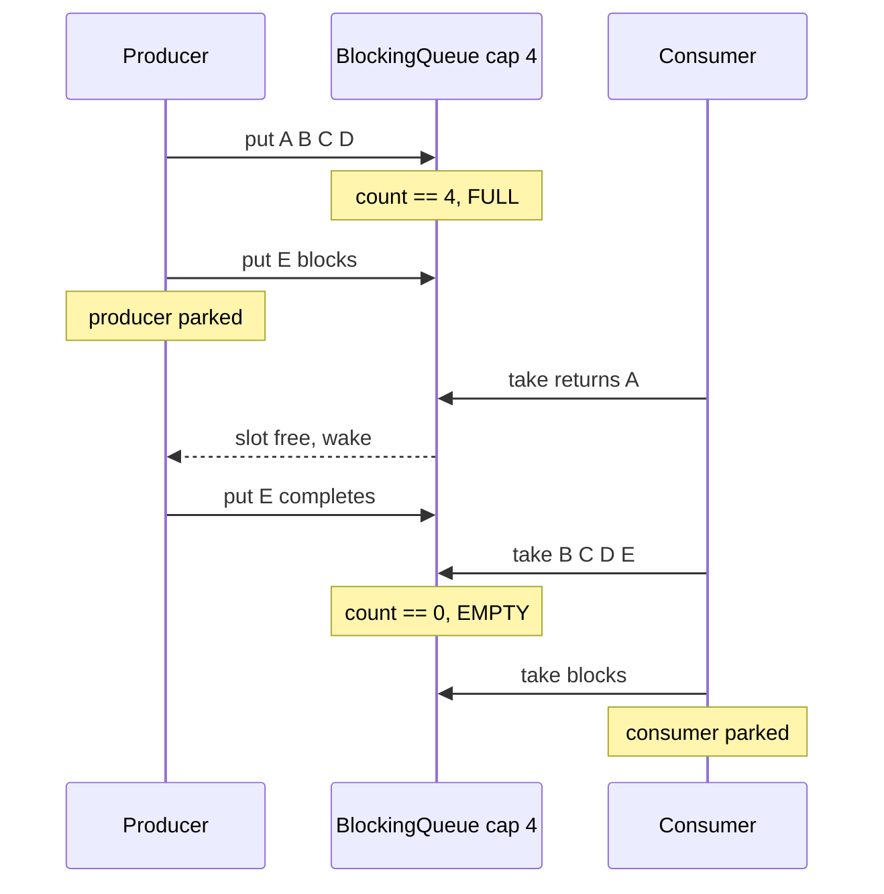

The **producer–consumer** pattern decouples threads that *make* work from threads that *process* it,
using a shared **bounded buffer** in between. Producers `put` items in; consumers `take` items out.
The buffer's magic is that it **blocks**: producers wait when it is full, consumers wait when it is
empty — so neither side can outrun the other, and you get **backpressure** for free.

## The bounded buffer is a ring

A fixed-size buffer is usually a **ring (circular) buffer**: a plain array with two indices, `head`
(where the consumer takes) and `tail` (where the producer puts), each wrapping around modulo the
capacity. A `count` tells full from empty — because `head == tail` happens at *both* extremes.

```walkthrough
title: A bounded ring buffer — fills to FULL, drains to EMPTY
code: |
  buf[tail] = item;          // producer: write at tail
  tail = (tail + 1) % cap;   // producer: advance, wrapping
  item = buf[head];          // consumer: read at head
  head = (head + 1) % cap;   // consumer: advance, wrapping
steps:
  - text: 'Empty ring buffer, capacity **4**. `head` and `tail` both sit at slot 0, `count = 0`. A consumer calling `take()` right now would **block** — there is nothing to take.'
    array: ['—', '—', '—', '—']
    pointers: { 0: 'head=tail' }
    line: 3
  - text: 'A **producer** `put(A)`, `put(B)`: write at `tail`, advancing it each time. `count = 2`.'
    array: ['A', 'B', '—', '—']
    highlight: [1]
    pointers: { 0: 'head', 2: 'tail' }
    line: 1
  - text: 'Producer `put(C)`, `put(D)` fill the last two slots; `tail` **wraps** from 3 back to 0. `count = 4 = capacity` — the buffer is **FULL**.'
    array: ['A', 'B', 'C', 'D']
    highlight: [3]
    pointers: { 0: 'head=tail' }
    line: 2
  - text: 'A fifth `put(E)` sees `count == capacity`, so the producer **blocks** — it parks until a consumer frees a slot. No overwrite, no dropped item. This is **backpressure**.'
    array: ['A', 'B', 'C', 'D']
    highlight: [0]
    pointers: { 0: 'head=tail' }
    line: 1
  - text: 'A **consumer** `take()` reads slot at `head` (0) → **A**, and advances `head` to 1. `count = 3`. Freeing a slot **signals the parked producer**.'
    array: ['—', 'B', 'C', 'D']
    highlight: [0]
    pointers: { 1: 'head', 0: 'tail' }
    line: 3
  - text: 'The woken producer completes `put(E)` into the freed slot 0; `tail` advances to 1. `count = 4` again — FIFO order preserved: A came out first, E goes in last.'
    array: ['E', 'B', 'C', 'D']
    highlight: [0]
    pointers: { 1: 'head=tail' }
    line: 1
  - text: 'Now the consumer drains fast: `take()` returns **B, C, D, E** in order as `head` walks around the ring. `count` falls to **0** — the buffer is **EMPTY** again.'
    array: ['—', '—', '—', '—']
    pointers: { 1: 'head=tail' }
    line: 3
  - text: 'The next `take()` finds `count == 0` and **blocks** the consumer until a producer offers an item. Two blocking conditions: **full** parks producers, **empty** parks consumers — the buffer self-regulates.'
    array: ['—', '—', '—', '—']
    sorted: [0, 1, 2, 3]
    pointers: { 1: 'head=tail' }
    line: 3
```

## The handshake, as a timeline

A `BlockingQueue` hides the ring, the indices, and the parking behind two calls — `put` and `take`:



## How to build it

Reach for a `BlockingQueue` first. Hand-rolling with a monitor is an interview classic, but you
almost never should in real code.

````tabs
tabs:
  - label: BlockingQueue (do this)
    body: |
      The library already implements the bounded buffer, both blocks, and the signaling. `put`/`take`
      block; you write no lock code at all.
      ```java
      BlockingQueue<Task> q = new ArrayBlockingQueue<>(1024);
      // producer
      q.put(task);          // blocks while full
      // consumer
      Task t = q.take();    // blocks while empty
      ```
      Bounded capacity gives backpressure; unbounded queues can grow until OutOfMemoryError.
  - label: synchronized + wait/notify
    body: |
      The textbook version. The **while-loop** guard is mandatory, and you must `notifyAll` so a
      waiting *consumer* is not left asleep when only *producers* were waiting on the same monitor.
      ```java
      synchronized (lock) {
        while (count == cap) lock.wait();   // guard, not `if`
        buf[tail] = item; tail = (tail + 1) % cap; count++;
        lock.notifyAll();                   // wake takers AND putters
      }
      ```
  - label: Lock + two Conditions
    body: |
      A `ReentrantLock` with **separate** `notFull` / `notEmpty` conditions lets you wake *exactly*
      the right side — a producer signals only waiting consumers, and vice versa. This is what
      `ArrayBlockingQueue` does internally.
      ```java
      lock.lock();
      try {
        while (count == cap) notFull.await();
        enqueue(item);
        notEmpty.signal();   // wake a consumer, not other producers
      } finally { lock.unlock(); }
      ```
````

:::gotcha
**Always guard `wait()` with a `while`, never an `if`.** A thread can return from `wait()` without
the condition being true — a *spurious wakeup*, or another thread grabbed the slot first. With `if`,
you fall through and act on a full/empty buffer and corrupt it. And with a single condition variable,
prefer `notifyAll` over `notify`: `notify` can wake the *wrong* kind of waiter (another producer
instead of a consumer), producing a **lost wakeup** where everyone sleeps forever.
:::

:::senior
Bounding the buffer is a **design decision, not a detail**. A bounded queue applies backpressure:
when consumers fall behind, producers slow down, and memory stays flat. An *unbounded* queue trades
that safety for latency spikes and eventual `OutOfMemoryError` under a sustained producer surge. Also
know the four method families: `put`/`take` block, `offer`/`poll` return a value or time out,
`add`/`remove` throw, and `offer(e, t, u)`/`poll(t, u)` block with a timeout. Choose by how you want
to handle a full or empty queue.
:::

## Check yourself

```quiz
title: Producer–consumer check
questions:
  - q: 'What happens when a producer calls `put()` on a full bounded `BlockingQueue`?'
    options:
      - text: 'The producer thread blocks until a consumer removes an item'
        correct: true
      - 'The oldest item is silently overwritten'
      - 'It throws `IllegalStateException` immediately'
    explain: '`put` is the blocking method: on a full queue it parks the producer until space frees up. `add` would throw; `offer` would return false.'
  - q: 'Why must a hand-rolled buffer check its wait condition inside a `while` loop rather than an `if`?'
    options:
      - '`while` is faster than `if` for locks'
      - text: 'A thread can wake spuriously or find the condition already changed, so it must re-check'
        correct: true
      - '`if` cannot be used inside a `synchronized` block'
    explain: 'After `wait()` returns, the guarded condition may be false again (spurious wakeup, or another thread won the race). Re-checking in a loop is the only safe pattern.'
  - q: 'What is the main benefit of making the shared buffer *bounded*?'
    options:
      - 'It makes take() faster'
      - text: 'Backpressure — producers block when full, keeping memory bounded'
        correct: true
      - 'It guarantees LIFO ordering'
    explain: 'A fixed capacity forces fast producers to wait on slow consumers, which caps memory use and prevents the queue from growing until OOM.'
```

:::key
**Producer–consumer** decouples work generation from work processing through a **bounded buffer**
(often a **ring buffer** with `head`/`tail` indices). The buffer blocks both sides — **full** parks
producers, **empty** parks consumers — delivering **backpressure**. Use a `BlockingQueue` and its
`put`/`take`; if you hand-roll it, guard every `wait()` with a `while` loop and prefer `notifyAll`.
:::
