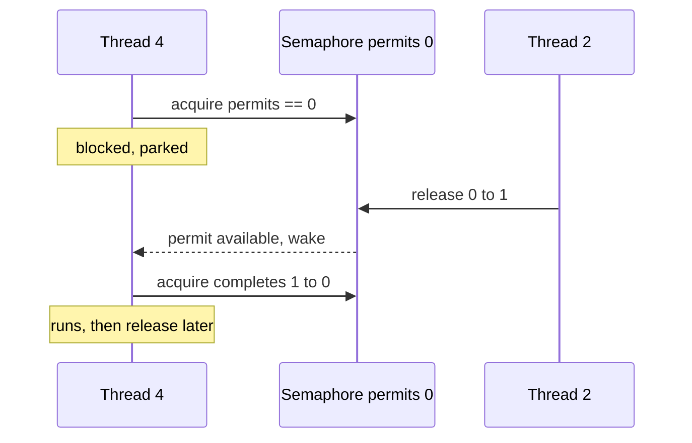

A **semaphore** is a counter of **permits**. `acquire()` takes a permit (decrementing the count) and
**blocks** if none are left; `release()` returns a permit (incrementing the count) and wakes a waiter.
It is the classic tool for **throttling** — limiting how many threads may touch a bounded resource at
once, such as a pool of database connections, file handles, or outbound sockets.

## Permits are a bounded resource pool

Model a pool of **3 DB connections** as `new Semaphore(3)`. A thread must `acquire()` a permit before
using a connection and `release()` it after. Only 3 threads can hold a connection at a time; a 4th
waits its turn.

```walkthrough
title: A Semaphore(3) — a pool of 3 DB connections
code: |
  sem.acquire();     // take a permit, or block at 0
  useConnection();   // ... run the query ...
  sem.release();     // give the permit back
steps:
  - text: '`new Semaphore(3)` — **3 permits**, a pool of 3 free connections. `availablePermits() == 3`. No thread holds a connection yet.'
    array: ['free', 'free', 'free']
    sorted: [0, 1, 2]
    line: 1
  - text: '**T1** `acquire()` takes a permit. Permits: **3 → 2**. T1 now holds connection 0 and runs its query.'
    array: ['T1', 'free', 'free']
    highlight: [0]
    sorted: [1, 2]
    line: 2
  - text: '**T2** and **T3** `acquire()` as well. Permits: **2 → 1 → 0**. All three connections are checked out; the pool is saturated.'
    array: ['T1', 'T2', 'T3']
    highlight: [0, 1, 2]
    line: 2
  - text: '**T4** `acquire()` — but `availablePermits() == 0`. T4 **blocks**, parked until someone releases. This is the throttle doing its job.'
    array: ['T1', 'T2', 'T3']
    highlight: [0, 1, 2]
    pointers: { 1: 'T4 waits' }
    line: 1
  - text: '**T2** finishes and calls `release()`. Permits: **0 → 1**. Connection 1 returns to the pool.'
    array: ['T1', 'free', 'T3']
    highlight: [1]
    sorted: [1]
    line: 3
  - text: 'That released permit **wakes T4**, whose `acquire()` now completes. It takes connection 1. Permits: **1 → 0** again.'
    array: ['T1', 'T4', 'T3']
    highlight: [1]
    line: 1
  - text: 'As each thread finishes, `release()` climbs the count back up: **0 → 1 → 2 → 3**. The pool is fully available again, ready for the next wave.'
    array: ['free', 'free', 'free']
    sorted: [0, 1, 2]
    line: 3
```

The acquire/block/release/wake cycle as a timeline:



## Ways to take a permit

`acquire()` is not the only option — you often want a non-blocking or time-boxed attempt so a saturated
pool degrades gracefully instead of piling up blocked threads.

````tabs
tabs:
  - label: Blocking acquire
    body: |
      Wait as long as it takes. Always release in a `finally` so a thrown exception cannot leak a
      permit and permanently shrink the pool.
      ```java
      sem.acquire();
      try { useConnection(); }
      finally { sem.release(); }
      ```
  - label: tryAcquire (non-blocking)
    body: |
      Take a permit only if one is free right now; otherwise fail fast and shed load.
      ```java
      if (sem.tryAcquire()) {
        try { useConnection(); }
        finally { sem.release(); }
      } else {
        return Response.busy();   // backpressure to the caller
      }
      ```
  - label: tryAcquire with timeout
    body: |
      Wait, but only up to a bound — great for latency SLAs.
      ```java
      if (sem.tryAcquire(200, TimeUnit.MILLISECONDS)) {
        try { useConnection(); }
        finally { sem.release(); }
      } else {
        throw new TimeoutException("pool exhausted");
      }
      ```
````

:::gotcha
**A semaphore has no owner.** Unlike a lock, the thread that `release()`s need not be the one that
`acquire()`d — that is a *feature* for signaling between threads, but a footgun otherwise. Calling
`release()` without a matching `acquire()` **inflates** the permit count above its initial value,
quietly breaking the limit you were trying to enforce. And because a **binary semaphore** (`Semaphore(1)`)
lacks ownership *and* reentrancy, it is **not** a drop-in mutex: a thread that "holds" it can deadlock
on its own second `acquire()`, and any other thread can release it.
:::

:::senior
Two dials matter under contention. **Fairness**: `new Semaphore(n, true)` grants permits in FIFO order,
preventing barging and starvation at some throughput cost; the default unfair mode is faster but can
starve a waiter. **Signaling vs mutual exclusion**: because release is unowned, a semaphore also works
as a cross-thread signal — one thread `acquire()`s (waits) while a different thread `release()`s (fires),
which is exactly how bounded-buffer "slots available" counters are built. If you need ownership,
reentrancy, or `Condition`s, use a `ReentrantLock`, not a binary semaphore.
:::

## Check yourself

```quiz
title: Semaphores check
questions:
  - q: 'A `Semaphore(3)` has all 3 permits taken. What happens when a fourth thread calls `acquire()`?'
    options:
      - text: 'It blocks until another thread calls `release()`'
        correct: true
      - 'It throws because the count is zero'
      - 'It silently proceeds with a 4th permit'
    explain: 'At zero permits `acquire()` parks the caller until a `release()` makes one available — that is exactly the throttling behavior.'
  - q: 'What is a key difference between a binary semaphore and a mutex (lock)?'
    options:
      - 'A binary semaphore is always faster'
      - text: 'A semaphore has no ownership — any thread can release it, and it is not reentrant'
        correct: true
      - 'A mutex can count above 1, a semaphore cannot'
    explain: 'A lock is owned and reentrant: only the holder unlocks, and it can re-lock itself. A binary semaphore has neither property, so it is not a safe mutex substitute.'
  - q: 'Why should `release()` almost always go in a `finally` block?'
    options:
      - 'To make acquire faster'
      - text: 'So an exception during the critical section cannot leak the permit and shrink the pool'
        correct: true
      - 'Because `finally` runs before the method body'
    explain: 'If the guarded code throws and you skip `release()`, that permit is gone forever — the pool permanently loses capacity. `finally` guarantees the return.'
```

:::key
A **semaphore** is a **permit counter**: `acquire()` decrements and blocks at zero, `release()`
increments and wakes a waiter. It **throttles** access to a bounded resource pool and applies
backpressure. Crucially it has **no ownership and no reentrancy**, so a binary semaphore is *not* a
mutex — use it to limit concurrency or to signal across threads, and always `release()` in a `finally`.
:::
