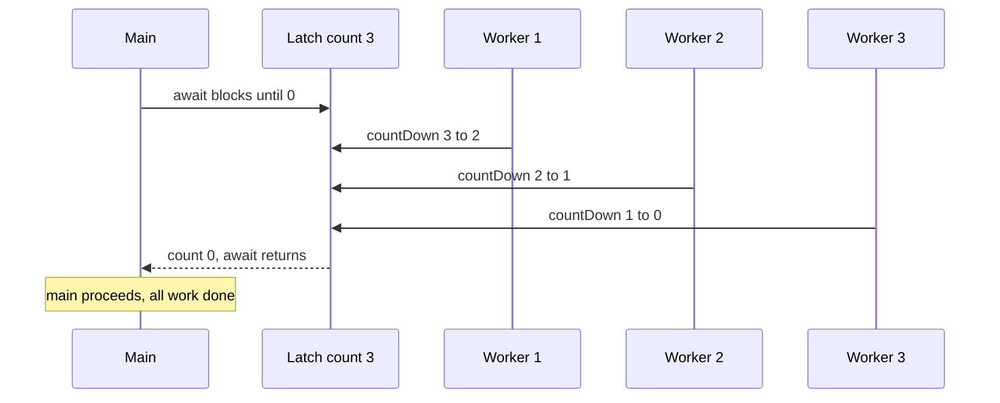
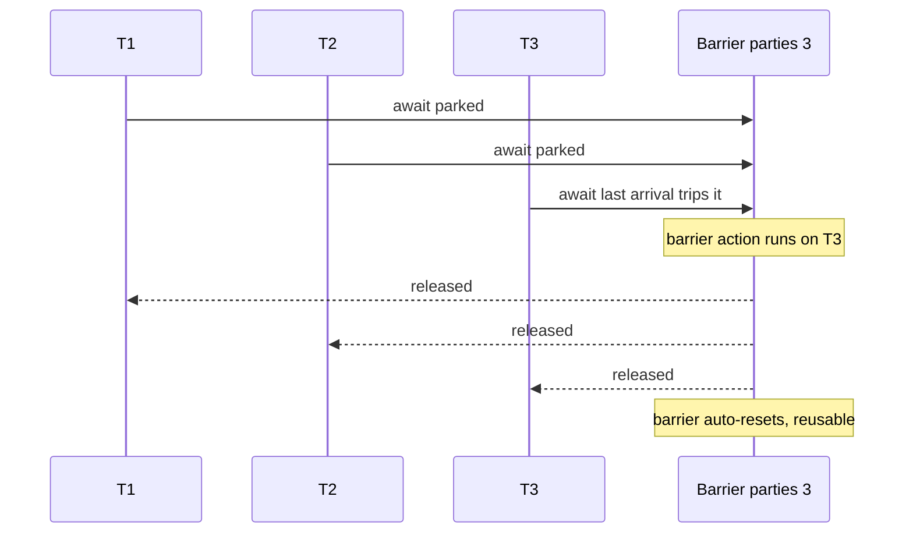

Sometimes threads must **wait for each other** at a point in time rather than for a shared data slot.
Two shapes cover almost everything: a **latch** — a one-shot gate that opens once N events have
happened — and a **barrier** — a reusable meeting point where a fixed set of threads wait for the
whole group to arrive. `CountDownLatch`, `CyclicBarrier`, and `Phaser` are the JDK tools.

## A CountDownLatch: main waits for N workers

A **`CountDownLatch(N)`** holds a count. Any thread can `countDown()` (decrement); threads that
`await()` block until the count hits **0**, then all proceed. It is perfect for "start the test only
after 3 services report ready" or "main resumes once all workers finish."



```java
CountDownLatch done = new CountDownLatch(3);
for (int i = 0; i < 3; i++) {
  pool.submit(() -> { try { work(); } finally { done.countDown(); } });
}
done.await();          // main blocks here until all 3 have counted down
System.out.println("all workers finished");
```

## A CyclicBarrier: threads wait for each other, then repeat

A **`CyclicBarrier(parties)`** makes `parties` threads wait *for one another*. Each calls `await()`;
the barrier trips only when the **last** thread arrives, releasing everyone — and then it **resets**
so it can be used again for the next phase (hence *cyclic*). An optional **barrier action** runs once
per trip, **on the last-arriving thread**, before the others are released.



## Choosing between them

They look similar but differ in reusability, who waits, and who counts.

| | CountDownLatch | CyclicBarrier | Phaser |
|--|--|--|--|
| Reusable | **No** — one-shot | **Yes** — auto-resets each trip | **Yes** — many phases |
| Waiters | any threads via `await()` | the participating threads themselves | registered parties |
| Who advances it | any thread(s), any number of `countDown()` | each party arriving at `await()` | `arrive()` / `arriveAndAwaitAdvance()` |
| Parties | fixed N, decoupled from waiters | fixed N, symmetric | **dynamic** — `register`/`arriveAndDeregister` |
| Group action | none | optional `Runnable` on last arrival | override `onAdvance()` |

````tabs
tabs:
  - label: CountDownLatch
    body: |
      One-shot. Great as a **start gate** (all threads await one latch, main opens it) or a **done
      gate** (main awaits N workers). Cannot be reset.
      ```java
      CountDownLatch start = new CountDownLatch(1);
      // workers: start.await(); ... run ...
      start.countDown();   // fire the pistol once — never rearms
      ```
  - label: CyclicBarrier
    body: |
      Reusable rendezvous for **iterative** parallel work — every thread finishes a phase, meets at
      the barrier, an optional action merges results, then all continue to the next phase.
      ```java
      CyclicBarrier barrier = new CyclicBarrier(3, () -> mergePhaseResults());
      // each worker, per phase:
      computeMyChunk();
      barrier.await();     // wait for the other two, then loop again
      ```
  - label: Phaser
    body: |
      Like a barrier but with **dynamic** membership and multiple phases — parties can join or leave
      between phases. Ideal when the number of participants changes over time.
      ```java
      Phaser phaser = new Phaser(1);          // register self
      phaser.register();                       // a new party joins
      phaser.arriveAndAwaitAdvance();          // sync this phase, then continue
      phaser.arriveAndDeregister();            // leave the group
      ```
````

:::gotcha
**A `CountDownLatch` cannot be reset.** Once the count reaches 0 it stays 0 forever, and every future
`await()` returns *immediately*. If you need the gate again, you need a `CyclicBarrier` (or a fresh
latch). The mirror trap on the barrier: the **barrier action runs on the last thread to arrive**, not
on a separate thread and not on `main` — so anything it touches must be safe from that thread, and if
it throws, every party gets a `BrokenBarrierException`.
:::

:::senior
The deep difference is **coupling**. A latch **decouples** counters from waiters: the threads that
`countDown()` need not be the ones that `await()`, and the counts need not come one-per-thread (one
thread can count down five times). A barrier is **symmetric**: the participants *are* the waiters, and
each contributes exactly one arrival. That is why a latch models "wait for these events to happen"
(startup, shutdown, fan-in) while a barrier models "let these workers march in lockstep" (phased
simulations, map-reduce rounds). A timeout or interrupt at a `CyclicBarrier` **breaks it for everyone**
— reach for `Phaser` when parties come and go, since it tolerates dynamic registration.
:::

## Check yourself

```quiz
title: Latches and barriers check
questions:
  - q: 'You need main to wait until 5 background tasks have each finished once. Which tool fits best?'
    options:
      - text: 'A `CountDownLatch(5)` — each task counts down, main awaits'
        correct: true
      - 'A `CyclicBarrier(5)` reused after each run'
      - 'A `Semaphore(5)`'
    explain: 'This is a one-shot fan-in: N events must occur before one thread proceeds. A latch decouples the counting tasks from the awaiting main thread.'
  - q: 'What is the defining difference between a CountDownLatch and a CyclicBarrier?'
    options:
      - 'A latch is thread-safe, a barrier is not'
      - text: 'A latch is one-shot and cannot reset; a barrier is reusable and resets after each trip'
        correct: true
      - 'A barrier can only be used with exactly two threads'
    explain: 'Once a latch hits zero it stays open forever. A CyclicBarrier automatically rearms after all parties arrive, so it supports repeated phases.'
  - q: 'On which thread does a CyclicBarrier''s optional barrier action run?'
    options:
      - 'On the main thread'
      - text: 'On the last thread to arrive at the barrier, before the others are released'
        correct: true
      - 'On a dedicated background thread the barrier spawns'
    explain: 'The barrier action executes on the final arriving party while the rest stay parked, then all are released together — so it must be safe to run from that thread.'
```

:::key
A **latch** (`CountDownLatch`) is a **one-shot** gate: threads `await()` until N `countDown()`s reach
0, then it stays open forever — counters and waiters are **decoupled**. A **barrier** (`CyclicBarrier`)
is a **reusable rendezvous**: fixed parties wait for each other, an optional action runs on the
**last arriver**, then it resets. Need dynamic membership across many phases? Use a **`Phaser`**.
:::
