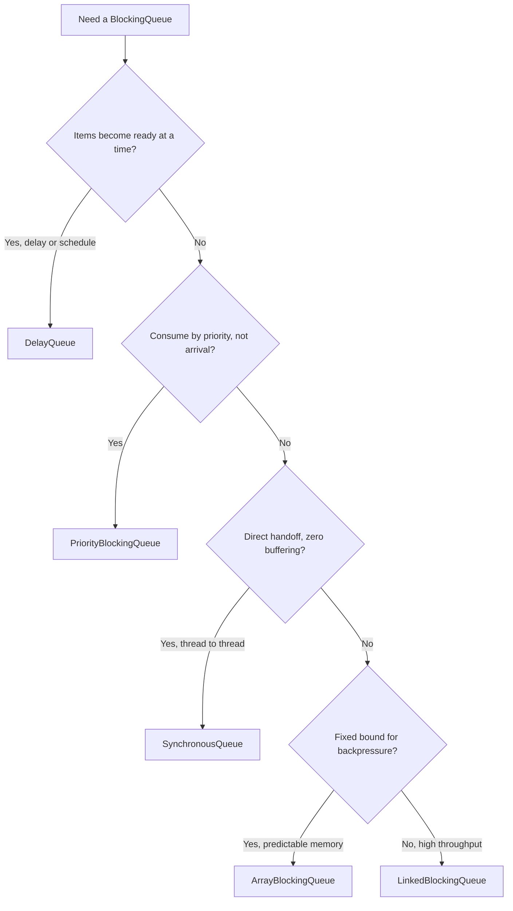

A **`BlockingQueue`** is the JDK's off-the-shelf **producer–consumer buffer**: `put` blocks when full,
`take` blocks when empty, and all the locking and signaling is done for you. The interview question is
never *how* it blocks — it is **which implementation** to choose. Five cover the field, and they differ
along three axes: **bounded or not**, **ordering**, and **whether items are stored or handed off directly**.

## Pick one with a decision tree



## The five, side by side

| Queue | Bounded | Ordering | Structure | Reach for it when |
|--|--|--|--|--|
| **ArrayBlockingQueue** | Yes, fixed | FIFO | array, single lock | you want true **backpressure** and predictable memory |
| **LinkedBlockingQueue** | Optional | FIFO | linked nodes, **two locks** | throughput matters; separate put/take locks reduce contention |
| **SynchronousQueue** | Zero capacity | direct handoff | no storage | a producer must hand an item **straight to** a consumer |
| **PriorityBlockingQueue** | Unbounded | priority (comparator) | binary heap | you process **most important first**, not oldest first |
| **DelayQueue** | Unbounded | earliest expiry | heap of `Delayed` | items may be taken **only after** their delay elapses |

`ArrayBlockingQueue` is the natural bounded buffer from the producer–consumer topic: fixed slots,
FIFO, one lock guarding both ends. `LinkedBlockingQueue` splits put and take onto **two** locks so
producers and consumers rarely block each other — higher throughput, at the cost of per-node allocation.

## Blocking is one of four ways to fail

Every `BlockingQueue` exposes **four method families**, one per policy for "queue is full/empty." Picking
the wrong family is a classic bug — `add` on a full queue throws where you expected a block.

````tabs
tabs:
  - label: Blocks
    body: |
      Wait until the operation can proceed — the producer–consumer default.
      ```java
      q.put(task);        // waits while full
      Task t = q.take();  // waits while empty
      ```
  - label: Times out
    body: |
      Wait, but give up after a bound and return a signal value. Best for latency-sensitive paths.
      ```java
      boolean ok = q.offer(task, 100, MILLISECONDS);  // false if still full
      Task t   = q.poll(100, MILLISECONDS);           // null if still empty
      ```
  - label: Returns a value
    body: |
      Never block — report success or failure immediately.
      ```java
      boolean ok = q.offer(task);  // false if full, right now
      Task t   = q.poll();         // null if empty, right now
      ```
  - label: Throws
    body: |
      Treat full/empty as an error. Rarely what you want on a shared buffer.
      ```java
      q.add(task);       // IllegalStateException if full
      Task t = q.remove(); // NoSuchElementException if empty
      ```
````

:::gotcha
**`LinkedBlockingQueue` is unbounded by default.** `new LinkedBlockingQueue<>()` uses a capacity of
`Integer.MAX_VALUE`, so `put` effectively never blocks — a producer surge grows the queue until
`OutOfMemoryError`, with *no* backpressure. If you want the bounded-buffer safety from producer–consumer,
pass a capacity: `new LinkedBlockingQueue<>(1024)`. Likewise `SynchronousQueue` has **zero** capacity:
`put` blocks until a consumer is *actively* taking, so there is no storage at all — surprising if you
expected it to hold even one item.
:::

:::senior
This choice quietly reshapes a `ThreadPoolExecutor`. With a **`SynchronousQueue`**, every task needs a
free thread *now*, so the pool grows to `maximumPoolSize` then rejects — that is what
`Executors.newCachedThreadPool` does. With an **unbounded `LinkedBlockingQueue`**, the queue absorbs
everything, so `maximumPoolSize` is **ignored** and the pool never grows past core — that is
`newFixedThreadPool`, and its hidden risk is unbounded queue growth. Only a **bounded**
`ArrayBlockingQueue` gives real backpressure plus a `RejectedExecutionHandler` to shed load. Also note
`PriorityBlockingQueue` and `DelayQueue` are unbounded, so they cannot backpressure either — bound your
producers another way.
:::

## Drill: queues and method families

```flashcards
title: BlockingQueue recall
cards:
  - front: '`ArrayBlockingQueue`'
    back: '**Bounded** FIFO over a fixed array, one lock for both ends. The queue for real **backpressure** and predictable memory.'
  - front: '`LinkedBlockingQueue`'
    back: 'FIFO over linked nodes, **two locks** (put vs take) for throughput. **Default constructor is unbounded** (`Integer.MAX_VALUE`) — pass a capacity or risk OOM.'
  - front: '`SynchronousQueue`'
    back: '**Zero capacity** — every `put` must rendezvous with an active `take`. Direct thread-to-thread handoff; powers `newCachedThreadPool`.'
  - front: '`PriorityBlockingQueue`'
    back: '**Unbounded** binary heap ordered by comparator — consume most-important-first. No backpressure, and equal-priority order is unspecified.'
  - front: '`DelayQueue`'
    back: '**Unbounded** heap of `Delayed` items; `take` returns an item only after its delay expires. The structure behind schedulers and timeout maps.'
  - front: 'The four method families for full/empty'
    back: '**Block**: `put`/`take`. **Timeout**: `offer(e, t, u)`/`poll(t, u)`. **Return value**: `offer` → false / `poll` → null. **Throw**: `add` → `IllegalStateException` / `remove` → `NoSuchElementException`.'
```

## Check yourself

```quiz
title: Blocking queues check
questions:
  - q: 'You need a bounded producer-consumer buffer with strict backpressure and predictable memory. Which queue?'
    options:
      - text: 'ArrayBlockingQueue with a fixed capacity'
        correct: true
      - 'LinkedBlockingQueue with the default constructor'
      - 'PriorityBlockingQueue'
    explain: 'ArrayBlockingQueue has a fixed array capacity, so put blocks when full — real backpressure. The default LinkedBlockingQueue is unbounded, and PriorityBlockingQueue is always unbounded.'
  - q: 'What is special about a SynchronousQueue?'
    options:
      - 'It sorts elements by priority'
      - text: 'It has zero capacity — put blocks until a consumer is taking, a direct handoff'
        correct: true
      - 'It never blocks the producer'
    explain: 'A SynchronousQueue stores nothing; each put must rendezvous with a take. It powers newCachedThreadPool, where every task needs an immediately available thread.'
  - q: 'Why can a default `LinkedBlockingQueue` be dangerous under a heavy producer surge?'
    options:
      - 'It deadlocks after 1000 items'
      - text: 'It is effectively unbounded, so it can grow until OutOfMemoryError with no backpressure'
        correct: true
      - 'It silently drops the newest items'
    explain: 'The no-arg constructor uses Integer.MAX_VALUE capacity, so put rarely blocks and the queue keeps growing. Pass an explicit capacity to get bounded backpressure.'
```

:::key
A **`BlockingQueue`** is the ready-made producer–consumer buffer — choose by **bound, ordering, and
handoff**. **`ArrayBlockingQueue`** for bounded FIFO backpressure; **`LinkedBlockingQueue`** for
throughput (but bound it — the default is unbounded); **`SynchronousQueue`** for direct handoff;
**`PriorityBlockingQueue`** for priority order; **`DelayQueue`** for time-released items. And match the
method family to your policy: `put`/`take` block, `offer`/`poll` time out or return, `add`/`remove` throw.
:::
