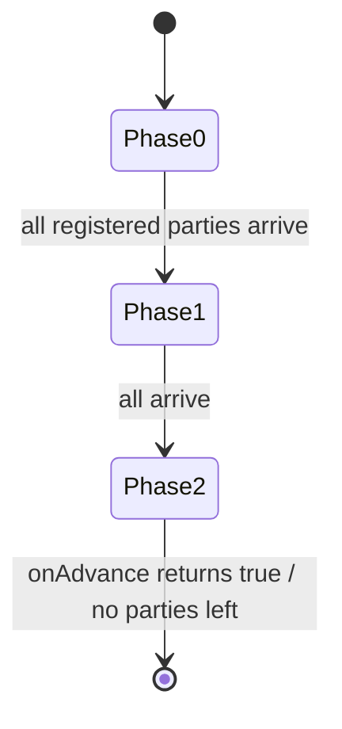

`CountDownLatch` is one-shot; `CyclicBarrier` is reusable but has a **fixed** party count. `Phaser` is the flexible cousin: **reusable**, **multi-phase**, and it lets threads **register and deregister dynamically** — the right tool when the number of participants changes as the computation runs.

## The family, at a glance

| Tool | Reusable? | Party count | Best for |
|--|--|--|--|
| `CountDownLatch` | No (one-shot) | fixed | wait for N events once (startup gate) |
| `CyclicBarrier` | Yes | **fixed** | N threads rendezvous each round |
| **`Phaser`** | Yes | **dynamic** | phased work where participants come and go |

## How a phase works

Each party **arrives** at the end of a phase and waits for the others; when all registered parties have arrived, the phaser **advances** to the next phase and releases everyone.

```java
Phaser phaser = new Phaser(1);          // "1" registers the main thread

for (Worker w : workers) {
    phaser.register();                  // dynamically add a party
    new Thread(() -> {
        loadData();
        phaser.arriveAndAwaitAdvance(); // barrier: end of phase 0

        process();
        phaser.arriveAndAwaitAdvance(); // barrier: end of phase 1

        phaser.arriveAndDeregister();   // done — leave the phaser
    }).start();
}

phaser.arriveAndDeregister();           // main bows out; workers run on
```

- `register()` / `bulkRegister(n)` — add parties (even mid-run).
- `arrive()` — record arrival **without waiting**; keep working and sync up later.
- `arriveAndAwaitAdvance()` — arrive and block until the phase completes.
- `arriveAndDeregister()` — arrive and permanently leave (party count drops).
- `awaitAdvance(phase)` — wait for a phase to end **without being a party** (observer).
- `onAdvance(phase, parties)` — override to run logic between phases or to end the phaser.



## The counters underneath

A `Phaser` tracks three numbers: **registered** parties, **arrived**, and **unarrived**
(`registered - arrived`), plus the current **phase number** (starts at 0, increments on each
advance, wraps at `Integer.MAX_VALUE`; it goes negative only when the phaser terminates). The
mechanics of one phase, step by step:

```walkthrough
title: One phase of a 3-party Phaser
code: |
  Phaser ph = new Phaser(3);          // 3 registered parties
  // each worker: ph.arriveAndAwaitAdvance();
steps:
  - text: 'Phase **0** begins: registered = 3, so **unarrived = 3**. All workers are computing.'
    array: [0, 3, 'all running']
    pointers: { 0: 'phase', 1: 'unarrived', 2: 'event' }
    line: 1
  - text: '**T1 arrives** — unarrived drops to 2. T1 parks in `WAITING` inside `arriveAndAwaitAdvance()`.'
    array: [0, 2, 'T1 parked']
    highlight: [1]
    pointers: { 0: 'phase', 1: 'unarrived', 2: 'event' }
    line: 2
  - text: '**T2 arrives** — unarrived 1. Two parked, one still working. Nobody advances yet.'
    array: [0, 1, 'T2 parked']
    highlight: [1]
    pointers: { 0: 'phase', 1: 'unarrived', 2: 'event' }
    line: 2
  - text: '**T3 arrives last** — unarrived would hit 0, which triggers the advance. **T3 itself runs `onAdvance(0, 3)`** before anyone is released.'
    array: [0, 0, 'T3 runs onAdvance']
    highlight: [1, 2]
    pointers: { 0: 'phase', 1: 'unarrived', 2: 'event' }
    line: 2
  - text: '`onAdvance` returns false → the phaser **advances**: phase becomes **1**, unarrived resets to registered (3), and all parked parties are released together.'
    array: [1, 3, 'all released']
    highlight: [0, 1]
    pointers: { 0: 'phase', 1: 'unarrived', 2: 'event' }
    line: 2
  - text: 'Round two runs on the **same phaser** — no reset call, and parties may `register()` or `arriveAndDeregister()` before the next rendezvous. That dynamism is the whole point.'
    array: [1, 3, 'phase 1 running']
    sorted: [0, 1, 2]
    pointers: { 0: 'phase', 1: 'unarrived', 2: 'event' }
    line: 2
```

## One tool, three shapes

Because arrival and waiting are separate operations, a `Phaser` can impersonate both of its cousins:

````tabs
tabs:
  - label: As a CountDownLatch
    body: |
      A one-shot start gate: workers wait for the main thread's single arrival.
      ```java
      Phaser gate = new Phaser(1);              // main is the only party
      // worker: gate.awaitAdvance(gate.getPhase());   // wait, not a party
      // main:   gate.arriveAndDeregister();           // opens the gate for all
      ```
      Unlike a latch, you could reuse it for a *second* round if needed.
  - label: As a CyclicBarrier
    body: |
      N fixed parties rendezvous per round — same behavior, no `BrokenBarrierException`.
      ```java
      Phaser barrier = new Phaser(N);
      // each worker, per round:
      barrier.arriveAndAwaitAdvance();
      ```
      The "barrier action" becomes `onAdvance`, run by the **last arriver**.
  - label: As itself — dynamic phases
    body: |
      Parties join and leave mid-computation; each stage is a numbered phase.
      ```java
      phaser.register();                 // a new worker joins mid-run
      phaser.arriveAndAwaitAdvance();    // finish this stage with everyone
      phaser.arriveAndDeregister();      // leave; others continue
      ```
      No other synchronizer supports a changing party count.
````

**Scaling note — tiering:** with hundreds of parties, every arrival CASes the same state word.
`new Phaser(parent)` builds a **tree of phasers**: children advance independently and only
propagate to the parent, cutting contention for very large party counts — a design no latch or
barrier offers.

:::gotcha
Three phaser-specific traps. **(1) The forgotten main party:** `new Phaser(1)` registers the
*constructing* thread's slot — if main never calls `arriveAndDeregister()`, every phase waits for a
party that never arrives and all workers hang. **(2) Over-arrival:** calling `arrive()` when there
are no unarrived parties throws `IllegalStateException` — arrivals must match registrations.
**(3) Interrupts are ignored:** `arriveAndAwaitAdvance()` does **not** respond to interruption
(unlike `CyclicBarrier.await`, which throws and *breaks* the barrier) — if you need cancellable
waiting, use `awaitAdvanceInterruptibly(phase)`.
:::

## Drill: the synchronizer toolbox

The five coordination classes in one recall pass — interviewers love "which synchronizer would you
use for X?".

```flashcards
title: 'Synchronizers: one-line purpose'
cards:
  - front: '`CountDownLatch`'
    back: '**One-shot gate**: N `countDown()` events release all `await()`ers. Cannot be reset — threads wait for *events*, not for each other.'
  - front: '`CyclicBarrier`'
    back: '**Fixed-N rendezvous, reusable**: all N threads `await()` each round; last arrival runs the barrier action. Breaks (`BrokenBarrierException`) if a waiter is interrupted or times out.'
  - front: '`Semaphore`'
    back: '**N permits bounding concurrent access**: `acquire()`/`release()`. No ownership — any thread may release, which enables handoff designs (and enables bugs).'
  - front: '`Phaser`'
    back: '**Reusable multi-phase barrier with dynamic parties**: `register()`/`arriveAndDeregister()` at runtime; the last arriver runs `onAdvance`. Tierable for huge party counts.'
  - front: '`Exchanger`'
    back: '**Pairwise swap**: exactly two threads meet at `exchange(x)` and each receives the other''s object — e.g. swapping a full buffer for an empty one.'
  - front: 'Latch vs barrier in one line?'
    back: 'A **latch** waits for *events* (workers count down and move on); a **barrier** waits for *threads* (everyone waits for everyone). Latch = one-shot; barrier = per-round.'
```

:::senior
Reach for `Phaser` when a `CyclicBarrier` almost fits but the party count isn't fixed — e.g. a work-stealing simulation where tasks spawn or finish between rounds, or a staged pipeline where stages drop out. Override `onAdvance` to terminate deterministically (`return phase >= maxPhases || registeredParties == 0`). For a fixed set of tasks that just need a single rendezvous, a `CyclicBarrier` is simpler — don't over-reach.
:::

## Check yourself

```quiz
title: Phaser check
questions:
  - q: 'What can a Phaser do that a CyclicBarrier cannot?'
    options:
      - text: 'Let parties register and deregister dynamically, and coordinate multiple phases'
        correct: true
      - 'Block threads at a barrier'
      - 'Be used more than once'
    explain: 'Both are reusable barriers, but CyclicBarrier has a fixed party count; Phaser lets participants join/leave at runtime and advances through numbered phases.'
  - q: 'Which method arrives at the barrier and permanently removes the caller from the phaser?'
    options:
      - '`arriveAndAwaitAdvance()`'
      - text: '`arriveAndDeregister()`'
        correct: true
      - '`register()`'
    explain: 'arriveAndDeregister() records arrival and drops the registered-party count, so the phaser can advance without waiting for that thread again.'
  - q: 'CountDownLatch vs CyclicBarrier vs Phaser — which is one-shot?'
    options:
      - text: 'CountDownLatch — it cannot be reset once it reaches zero'
        correct: true
      - 'CyclicBarrier'
      - 'Phaser'
    explain: 'A CountDownLatch counts down once and is done; CyclicBarrier and Phaser are both reusable across rounds/phases.'
```

:::key
`Phaser` = a **reusable, dynamic** barrier. Parties `register()`/`arriveAndDeregister()` at runtime and rendezvous each **phase** via `arriveAndAwaitAdvance()`; override `onAdvance` to control phase transitions and termination. Use it when the party count changes or work is staged; use `CountDownLatch` for a one-shot gate and `CyclicBarrier` for a fixed-size repeated rendezvous.
:::
