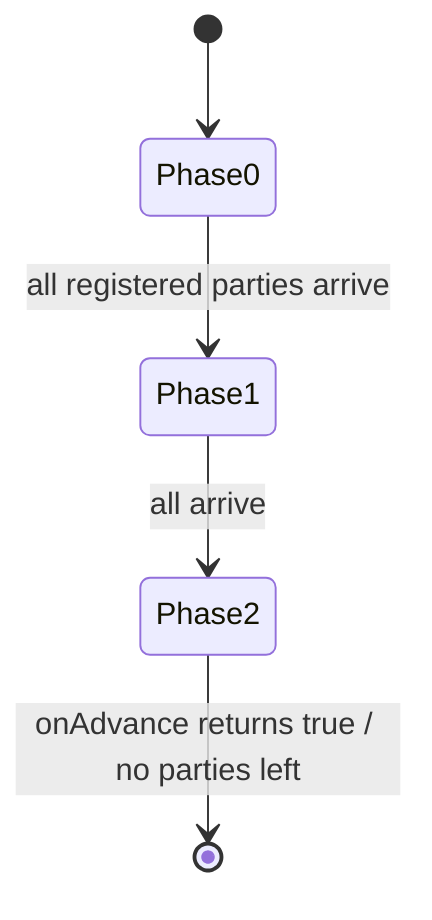

`CountDownLatch` is one-shot; `CyclicBarrier` is reusable but has a **fixed** party count. `Phaser` is the flexible cousin: **reusable**, **multi-phase**, and it lets threads **register and deregister dynamically** — the right tool when the number of participants changes as the computation runs.

## The family, at a glance

| Tool | Reusable? | Party count | Best for |
|--|--|--|--|
| `CountDownLatch` | No (one-shot) | fixed | wait for N events once (startup gate) |
| `CyclicBarrier` | Yes | **fixed** | N threads rendezvous each round |
| **`Phaser`** | Yes | **dynamic** | phased work where participants come and go |

## How a phase works

Each party **arrives** at the end of a phase and waits for the others; when all registered parties have arrived, the phaser **advances** to the next phase and releases everyone.

```java
Phaser phaser = new Phaser(1);          // "1" registers the main thread

for (Worker w : workers) {
    phaser.register();                  // dynamically add a party
    new Thread(() -> {
        loadData();
        phaser.arriveAndAwaitAdvance(); // barrier: end of phase 0

        process();
        phaser.arriveAndAwaitAdvance(); // barrier: end of phase 1

        phaser.arriveAndDeregister();   // done — leave the phaser
    }).start();
}

phaser.arriveAndDeregister();           // main bows out; workers run on
```

- `register()` / `bulkRegister(n)` — add parties (even mid-run).
- `arriveAndAwaitAdvance()` — arrive and block until the phase completes.
- `arriveAndDeregister()` — arrive and permanently leave (party count drops).
- `onAdvance(phase, parties)` — override to run logic between phases or to end the phaser.



:::senior
Reach for `Phaser` when a `CyclicBarrier` almost fits but the party count isn't fixed — e.g. a work-stealing simulation where tasks spawn or finish between rounds, or a staged pipeline where stages drop out. Override `onAdvance` to terminate deterministically (`return phase >= maxPhases || registeredParties == 0`). For a fixed set of tasks that just need a single rendezvous, a `CyclicBarrier` is simpler — don't over-reach.
:::

## Check yourself

```quiz
title: Phaser check
questions:
  - q: 'What can a Phaser do that a CyclicBarrier cannot?'
    options:
      - text: 'Let parties register and deregister dynamically, and coordinate multiple phases'
        correct: true
      - 'Block threads at a barrier'
      - 'Be used more than once'
    explain: 'Both are reusable barriers, but CyclicBarrier has a fixed party count; Phaser lets participants join/leave at runtime and advances through numbered phases.'
  - q: 'Which method arrives at the barrier and permanently removes the caller from the phaser?'
    options:
      - '`arriveAndAwaitAdvance()`'
      - text: '`arriveAndDeregister()`'
        correct: true
      - '`register()`'
    explain: 'arriveAndDeregister() records arrival and drops the registered-party count, so the phaser can advance without waiting for that thread again.'
  - q: 'CountDownLatch vs CyclicBarrier vs Phaser — which is one-shot?'
    options:
      - text: 'CountDownLatch — it cannot be reset once it reaches zero'
        correct: true
      - 'CyclicBarrier'
      - 'Phaser'
    explain: 'A CountDownLatch counts down once and is done; CyclicBarrier and Phaser are both reusable across rounds/phases.'
```

:::key
`Phaser` = a **reusable, dynamic** barrier. Parties `register()`/`arriveAndDeregister()` at runtime and rendezvous each **phase** via `arriveAndAwaitAdvance()`; override `onAdvance` to control phase transitions and termination. Use it when the party count changes or work is staged; use `CountDownLatch` for a one-shot gate and `CyclicBarrier` for a fixed-size repeated rendezvous.
:::
