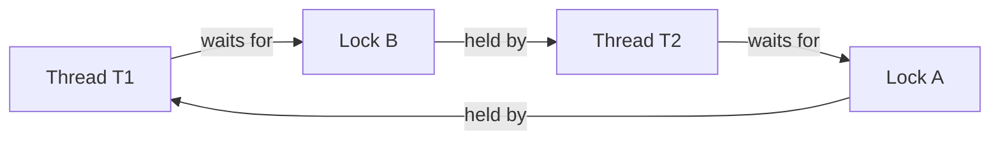

A **deadlock** is a set of threads that are all blocked forever, each waiting for a resource that
another thread in the set is holding. Nobody can proceed, nobody will release, and — unlike a crash —
there is no exception and no CPU usage. The program just **hangs**. The textbook cause is two threads
that acquire the same two locks in **opposite order**.

## The classic: two locks, opposite order

`T1` takes **A then B**. `T2` takes **B then A**. Each grabs its first lock, then reaches for the
second — which the other thread now holds. The two cells below are **Lock A** (left) and **Lock B**
(right); each shows its current **owner**, and a pointer marks the thread **blocked waiting** for it.

```walkthrough
title: Circular wait — T1 takes A then B, T2 takes B then A
code: |
  T1: lock(A)   // T1 grabs A
  T2: lock(B)   // T2 grabs B
  T1: lock(B)   // T1 wants B ... blocks
  T2: lock(A)   // T2 wants A ... blocks
steps:
  - text: 'Both locks are **free**. T1 will take **A then B**; T2 will take **B then A** — the opposite order. That single mismatch is the whole bug.'
    array: ['—', '—']
    pointers: { 0: 'Lock A', 1: 'Lock B' }
  - text: '**T1 locks A.** Lock A is now owned by T1. So far, ordinary.'
    array: ['T1', '—']
    highlight: [0]
    line: 1
  - text: '**T2 locks B** before T1 continues. Now each thread holds exactly one lock — the setup for disaster.'
    array: ['T1', 'T2']
    highlight: [1]
    line: 2
  - text: '**T1 tries to lock B** — but T2 owns it. T1 **blocks**, still clutching A. The pointer marks T1 waiting on B.'
    array: ['T1', 'T2']
    highlight: [1]
    pointers: { 1: 'T1 wants' }
    line: 3
  - text: '**T2 tries to lock A** — but T1 owns it. T2 **blocks**, still clutching B. Now both cells have a waiter.'
    array: ['T1', 'T2']
    highlight: [0]
    pointers: { 0: 'T2 wants', 1: 'T1 wants' }
    line: 4
  - text: '**Deadlock.** T1 waits for B held by T2; T2 waits for A held by T1 — a closed loop. Neither releases, so both wait **forever**. No error is thrown; the threads simply stop.'
    array: ['T1', 'T2']
    highlight: [0, 1]
    pointers: { 0: 'T2 wants', 1: 'T1 wants' }
    line: 4
```

The dependency loop is easy to see as a **wait-for graph** — a cycle means deadlock:



## The four Coffman conditions

A deadlock can occur **only if all four** of these hold at once. This is the mental checklist
interviewers want:

1. **Mutual exclusion** — a resource is held in a non-shareable mode. *Here:* each lock has one owner.
2. **Hold and wait** — a thread holds one resource while waiting for another. *Here:* T1 holds A while requesting B.
3. **No preemption** — a resource cannot be forcibly taken; only its owner can release it. *Here:* nobody can rip A away from T1.
4. **Circular wait** — a closed chain of threads, each waiting for the next one's resource. *Here:* T1 → B → T2 → A → T1.

Because **all four** are necessary, breaking **any one** prevents deadlock — that is exactly what the
avoidance techniques in a later topic do.

## The same bug hides in ordinary code

The opposite-order acquisition rarely looks this obvious. It usually emerges when two callers pass the
same objects in different orders:

````tabs
tabs:
  - label: The code
    body: |
      A money transfer locks the source, then the destination:
      ```java
      void transfer(Account from, Account to, long amount) {
        synchronized (from) {
          synchronized (to) {
            from.balance -= amount;
            to.balance   += amount;
          }
        }
      }
      ```
      Looks perfectly reasonable — each transfer locks both accounts it touches.
  - label: The deadly interleaving
    body: |
      Two transfers in opposite directions run at once:
      ```java
      // Thread 1                 // Thread 2
      transfer(alice, bob, 100);  transfer(bob, alice, 50);
      // locks alice, wants bob   // locks bob, wants alice
      ```
      Thread 1 holds `alice` and waits for `bob`; Thread 2 holds `bob` and waits for `alice`.
      Circular wait — both hang. The fix is a **global lock order** (covered later).
````

**Dining philosophers** is the same shape scaled up: five philosophers sit around a table with one
fork between each pair. Each grabs the fork on the **left**, then reaches for the **right**. If all
five grab their left fork simultaneously, every right fork is already taken — a five-way circular
wait, and nobody eats.

:::gotcha
Deadlock is **silent**. There is no stack trace, no OOM, no CPU spike — the threads are `BLOCKED`, not
running. Your tests pass and the app looks healthy right up until two requests happen to interleave in
production. That invisibility is why you must reason about lock **order** up front, not debug it later.
:::

:::senior
Deadlock does not require two `synchronized` blocks. The same trap appears across abstraction
boundaries — a thread-pool task that blocks waiting on **another task submitted to the same
bounded pool** (pool starvation deadlock), a thread holding a DB row lock while waiting on a JVM lock
another thread holds in reverse, or a non-reentrant lock re-acquired by the same thread. The
resource types differ; the **circular wait** is identical.
:::

## Drill the four conditions

Interviewers ask these as a list, then follow up with "which one would you break?" — drill both
directions.

```flashcards
title: Coffman conditions — and how to break each
cards:
  - front: 'Condition 1: Mutual exclusion'
    back: 'A resource is held in a **non-shareable** mode — one owner at a time. Break it: use lock-free/atomic structures or immutable data, so there is nothing exclusive to hold.'
  - front: 'Condition 2: Hold and wait'
    back: 'A thread **holds** one resource while **waiting** for another. Break it: acquire *all* locks up front in one atomic step, or release what you hold before waiting (`tryLock` + back off).'
  - front: 'Condition 3: No preemption'
    back: 'A resource cannot be forcibly taken from its owner. Break it: use **timed** acquisition (`tryLock(t, u)`) so a thread effectively preempts itself and releases on timeout.'
  - front: 'Condition 4: Circular wait'
    back: 'A closed chain: T1 → resource held by T2 → resource held by T1. Break it: impose a **global lock ordering** — everyone acquires locks in the same order, so no cycle can form. This is the standard production fix.'
  - front: 'Why is breaking ONE condition enough?'
    back: 'Deadlock requires **all four simultaneously** — they are jointly necessary. Removing any single one makes the cycle impossible; lock ordering (killing circular wait) is the cheapest and most common choice.'
```

## Check yourself

```quiz
title: Deadlock check
questions:
  - q: 'Two threads deadlock on locks A and B. What is the classic root cause?'
    options:
      - text: 'They acquire the two locks in opposite orders'
        correct: true
      - 'One thread has a higher priority than the other'
      - 'The locks were never initialized'
    explain: 'If T1 takes A then B while T2 takes B then A, each can grab its first lock and then block forever waiting for the other — a circular wait.'
  - q: 'Which is NOT one of the four Coffman conditions for deadlock?'
    options:
      - text: 'Thread starvation'
        correct: true
      - 'Hold and wait'
      - 'Circular wait'
    explain: 'The four conditions are mutual exclusion, hold-and-wait, no preemption, and circular wait. Starvation is a separate liveness problem, not a deadlock condition.'
  - q: 'How does a deadlocked program typically appear from the outside?'
    options:
      - 'It throws a DeadlockException and crashes'
      - text: 'It hangs with the threads BLOCKED and no CPU usage or error'
        correct: true
      - 'CPU pegs at 100% while the threads spin'
    explain: 'Deadlocked threads are blocked, not running, so there is no exception and no CPU burn — the process simply stops making progress. (Busy spinning with high CPU is livelock, not deadlock.)'
```

:::key
A **deadlock** = a cycle of threads, each holding a resource and waiting for the next one's. It needs
**all four Coffman conditions** — mutual exclusion, hold-and-wait, no preemption, circular wait —
simultaneously. The canonical trigger is acquiring two locks in **opposite order**. Break any one
condition and the deadlock cannot form.
:::
