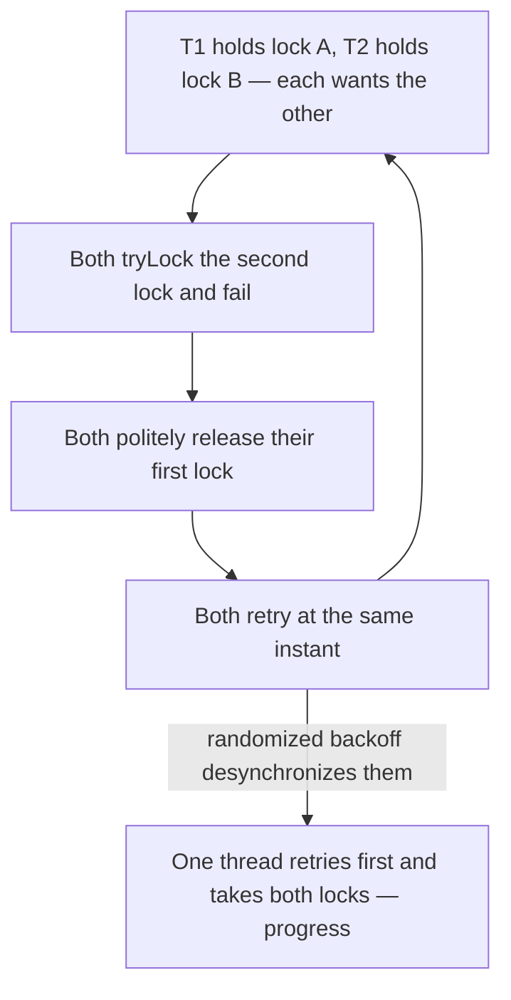

Deadlock is the famous **liveness failure**, but not the only one. A **liveness** property says
"something good eventually happens." Three failures break it in different ways: **deadlock** (stuck and
idle), **livelock** (busy but making no progress), and **starvation** (one thread perpetually skipped).
Interviewers love to see whether you can distinguish them.

## Livelock: the hallway shuffle

Two people meet head-on in a narrow hallway. Each politely steps aside to let the other pass — but they
**mirror** each other, so they keep ending up on the same side and re-block. They are moving constantly,
yet neither advances. That is **livelock**: threads actively responding to each other, changing state
forever, never making progress. The cells are the corridor side each person occupies (`C`enter, `L`eft, `R`ight).

```walkthrough
title: Livelock — two people politely blocking each other forever
steps:
  - text: 'Two people meet in the middle of a narrow hallway, face to face. Each blocks the other.'
    array: ['C', 'C']
    highlight: [0, 1]
    pointers: { 0: 'P1', 1: 'P2' }
  - text: 'Both politely step aside — but they step the **same way**. Now both stand on the left. Still blocked.'
    array: ['L', 'L']
    highlight: [0, 1]
    pointers: { 0: 'P1', 1: 'P2' }
  - text: 'Both correct by stepping the other way — together again. Both on the right. Still blocked.'
    array: ['R', 'R']
    highlight: [0, 1]
    pointers: { 0: 'P1', 1: 'P2' }
  - text: 'Left again. Their moves are perfectly synchronized, so they never break the symmetry.'
    array: ['L', 'L']
    highlight: [0, 1]
    pointers: { 0: 'P1', 1: 'P2' }
  - text: 'Right again. They are **RUNNABLE** and burning CPU the whole time — but progress is zero. That is the tell of livelock versus deadlock.'
    array: ['R', 'R']
    highlight: [0, 1]
    pointers: { 0: 'P1', 1: 'P2' }
  - text: 'The fix: **break the symmetry**. Each waits a **random** moment before retrying, so eventually they pick opposite sides and pass. Resolved.'
    array: ['L', 'R']
    sorted: [0, 1]
    pointers: { 0: 'P1', 1: 'P2' }
```

In code, livelock famously appears in naive deadlock avoidance: two threads each grab one lock, notice
they cannot get the second, **politely release and retry** — in lockstep, forever. The loop and its
one-line exit:



The retry logic is *correct* in isolation; the failure is **emergent symmetry** between two correct
threads. That is why the fix is randomness, not more logic.

## Starvation: always last in line

**Starvation** is when a thread is perpetually denied a resource it needs, because other threads keep
winning it. The thread is ready to run but never gets its turn. Causes include an **unfair lock** that
lets newcomers "barge" ahead of queued waiters, aggressive high-priority threads monopolizing the CPU,
or a few greedy threads that always reacquire a hot lock before a waiter is scheduled.

## Telling the three apart

This side-by-side table is the answer interviewers are fishing for:

| | Deadlock | Livelock | Starvation |
|--|--|--|--|
| **What happens** | Threads block permanently | Threads run but make no progress | One thread waits indefinitely while others proceed |
| **Thread state** | `BLOCKED` / `WAITING`, idle | `RUNNABLE`, actively looping | Ready, but never granted the resource |
| **CPU use** | None (nobody runs) | High (busy spinning/retrying) | Normal for others; victim idles |
| **Cause** | Circular wait on held locks | Symmetric reaction + retry | Unfair scheduling, barging, greedy peers |
| **Fix** | Lock ordering, `tryLock` + timeout | Randomized backoff, break symmetry | Fair locks, bounded waiting, fair scheduling |

## Fixing livelock vs starvation

````tabs
tabs:
  - label: Livelock — random backoff
    body: |
      The cure for symmetric retry is **asymmetry**. Add a randomized wait so the two threads fall out
      of lockstep:
      ```java
      while (!gotBoth) {
        lockA.lock();
        if (lockB.tryLock()) {
          gotBoth = true;              // success: hold both
        } else {
          lockA.unlock();             // give A back and retry
          Thread.sleep(ThreadLocalRandom.current().nextInt(50)); // RANDOM backoff
        }
      }
      ```
      Without the random sleep, both threads retry in perfect sync and livelock forever.
  - label: Starvation — fair lock
    body: |
      A **fair** lock grants ownership in FIFO arrival order, so no waiter is skipped forever:
      ```java
      ReentrantLock unfair = new ReentrantLock();      // default: barging allowed
      ReentrantLock fair   = new ReentrantLock(true);  // FIFO: no thread waits forever
      ```
      Fairness guarantees **bounded waiting** but costs throughput — fewer barging wins means more
      context switches. Use it only when starvation is a real, measured problem.
````

:::gotcha
Livelock is **sneakier than deadlock**. Deadlocked threads are idle, so CPU flatlines and monitoring
notices. Livelocked threads are `RUNNABLE` and burning CPU, so dashboards look busy and healthy, health
checks still respond, and nothing obviously screams "stuck" — even though throughput is zero.
:::

:::senior
`synchronized` is **unfair** by design: a thread that releases and immediately reacquires a monitor can
"barge" past threads already queued, which risks starvation but usually **improves throughput** (fewer
context switches). Fair `ReentrantLock(true)` removes barging at a real cost. Tuning thread
**priorities** to fix starvation is an anti-pattern — priority behavior is OS-dependent and invites
**priority inversion**, where a high-priority thread waits on a low-priority one that never gets scheduled.
:::

## Check yourself

```quiz
title: Livelock and starvation check
questions:
  - q: 'How does livelock differ from deadlock at runtime?'
    options:
      - text: 'Livelocked threads stay RUNNABLE and burn CPU while making no progress'
        correct: true
      - 'Livelocked threads throw exceptions; deadlocked ones do not'
      - 'Livelock only happens on a single core'
    explain: 'In deadlock the threads are blocked and idle. In livelock they are actively running and reacting to each other, so CPU is high but progress is still zero.'
  - q: 'Two threads keep releasing a lock and retrying in lockstep, never both succeeding. What fixes it?'
    options:
      - 'Give both threads the same higher priority'
      - text: 'Add a randomized backoff so they fall out of sync'
        correct: true
      - 'Remove the tryLock and block unconditionally'
    explain: 'The problem is symmetry: identical retry timing. A random wait breaks the symmetry so one thread eventually proceeds. (Blocking unconditionally would reintroduce deadlock risk.)'
  - q: 'A low-priority thread never acquires a hot lock because others keep barging ahead. This is:'
    options:
      - 'Deadlock'
      - 'Livelock'
      - text: 'Starvation, fixable with a fair (FIFO) lock'
        correct: true
    explain: 'The thread is ready but perpetually denied while others win the lock — starvation. A fair ReentrantLock(true) grants in arrival order so no waiter is skipped forever.'
```

:::key
Deadlock, livelock, and starvation are all **liveness failures** — no useful progress — but by different
mechanisms. **Deadlock**: stuck and idle in a cycle (fix with lock ordering). **Livelock**: busy but
symmetric, changing state without advancing (fix with randomized backoff / asymmetry). **Starvation**:
perpetually denied while others proceed (fix with fair locks and bounded waiting).
:::
