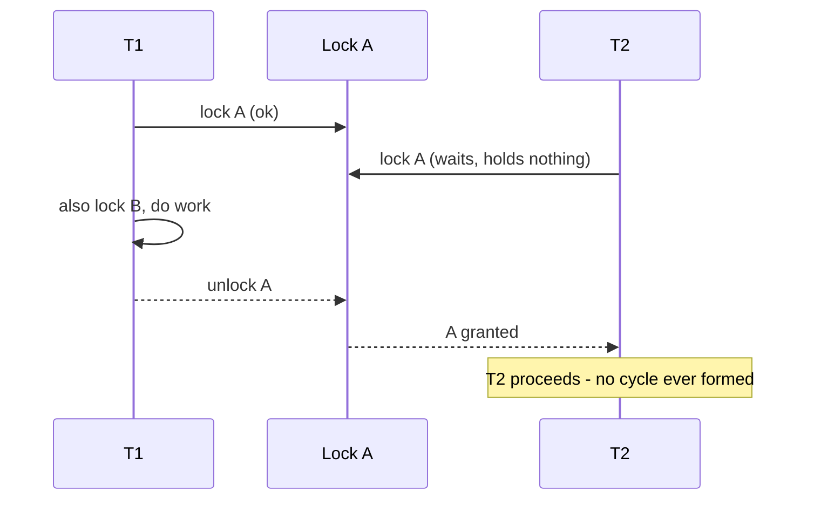

Deadlock needs **all four** Coffman conditions at once, so prevention means **breaking any one** of
them. The most reliable technique is a **global lock ordering**: if every thread acquires locks in the
same total order, a **circular wait** is mathematically impossible.

## Fixing the module-01 deadlock with lock ordering

Recall the two-lock deadlock: T1 took **A then B**, T2 took **B then A**. Impose one rule —
**everyone takes A before B** — and the cycle can never form. Watch it play out with the same two cells
(**Lock A** left, **Lock B** right):

```walkthrough
title: Lock ordering — every thread takes A before B, so no cycle forms
steps:
  - text: 'New rule for **all** threads: acquire **A before B**, always. T2 no longer reaches for B first. Both locks start free.'
    array: ['—', '—']
    pointers: { 0: 'Lock A', 1: 'Lock B' }
  - text: '**T1 locks A** first, per the rule.'
    array: ['T1', '—']
    highlight: [0]
    pointers: { 0: 'Lock A', 1: 'Lock B' }
  - text: '**T2 also wants A first** now — not B. A is taken, so T2 **blocks**. Crucially, T2 holds **nothing** while it waits.'
    array: ['T1', '—']
    highlight: [0]
    pointers: { 0: 'T2 wants', 1: 'Lock B' }
  - text: '**T1 locks B** — free, because no one grabbed it out of order. T1 now holds both and can do its work.'
    array: ['T1', 'T1']
    highlight: [1]
    pointers: { 0: 'T2 wants', 1: 'Lock B' }
  - text: '**T1 finishes and releases** B then A. Nothing was ever waiting on T1 in a cycle, so it always could progress.'
    array: ['—', '—']
    pointers: { 0: 'T2 wants', 1: 'Lock B' }
  - text: '**T2 now takes A, then B**, runs, and finishes. No circular wait ever existed. Ordered acquisition makes this deadlock **impossible**.'
    array: ['T2', 'T2']
    sorted: [0, 1]
    pointers: { 0: 'Lock A', 1: 'Lock B' }
```

Why it works: in a total order, any blocked thread holds only locks that come **before** the one it is
waiting on. So the thread holding the **highest-ordered** lock in any potential cycle is never itself
blocked — it can finish and release, and the chain unwinds. No cycle, no deadlock.



## The toolbox

````tabs
tabs:
  - label: Global lock ordering
    body: |
      Order the locks by a **stable key** and always acquire in that order. For the bank transfer,
      order by account id:
      ```java
      void transfer(Account from, Account to, long amount) {
        Account first  = from.id < to.id ? from : to;   // always lock lower id first
        Account second = from.id < to.id ? to : from;
        synchronized (first) {
          synchronized (second) {
            from.balance -= amount;
            to.balance   += amount;
          }
        }
      }
      ```
      Now `transfer(alice, bob)` and `transfer(bob, alice)` lock the **same** account first — no
      opposite ordering, no cycle. This breaks the **circular wait** condition.
  - label: tryLock + timeout + backoff
    body: |
      Do not wait forever. Take both locks or **give them all back** and retry:
      ```java
      while (true) {
        if (lockA.tryLock(100, MILLISECONDS)) {
          try {
            if (lockB.tryLock(100, MILLISECONDS)) {
              try { /* critical section */ return; }
              finally { lockB.unlock(); }
            }
          } finally { lockA.unlock(); }        // release A if B failed
        }
        Thread.sleep(ThreadLocalRandom.current().nextInt(50)); // random backoff
      }
      ```
      This breaks **hold-and-wait** / **no-preemption**: a thread that cannot get both releases what it
      holds. The random backoff is mandatory — without it you get **livelock**.
  - label: Shrink scope / go lock-free
    body: |
      The best lock is the one you never take. Hold fewer locks, for less time — ideally never two at once:
      ```java
      var snapshot = compute();                  // expensive work, no lock held
      synchronized (lock) { state = snapshot; }  // tiny critical section

      // Or avoid locks entirely:
      ref.updateAndGet(cur -> cur.withChange()); // CAS: never blocks, cannot deadlock
      ```
      If you never hold two locks simultaneously, circular wait is impossible. **Lock-free** code (atomics,
      immutable snapshots) has no locks to form a cycle on.
````

:::gotcha
Lock ordering only works if **every** code path obeys the **same** order. A single method anywhere that
locks B before A reintroduces the exact deadlock you thought you fixed. It is a **global, codebase-wide
discipline** — not a local change — and it silently rots as new code is added. Document the order and,
ideally, funnel all multi-lock acquisitions through one helper that enforces it.
:::

:::senior
When there is **no natural ordering key** (two bare `Object` locks, no id), order by
`System.identityHashCode`. Handle the rare hash **collision** with a global "tie lock":
```java
int hFrom = System.identityHashCode(from);
int hTo   = System.identityHashCode(to);
if (hFrom < hTo)      { lock(from); lock(to); }
else if (hFrom > hTo) { lock(to);   lock(from); }
else synchronized (TIE_LOCK) {        // identical hashes: acquire the global gate first
  lock(from); lock(to);
}
```
This is the canonical *Java Concurrency in Practice* pattern for induced lock ordering.
:::

## Check yourself

```quiz
title: Avoiding deadlock check
questions:
  - q: 'Why does acquiring all locks in one global order prevent deadlock?'
    options:
      - text: 'A total order makes a circular wait impossible — some thread always holds the last lock and can finish'
        correct: true
      - 'It makes the locks reentrant'
      - 'It converts the locks into read-write locks'
    explain: 'With a consistent total order, a blocked thread only holds locks earlier than the one it wants, so no closed cycle can form. The holder of the highest-ordered lock is never blocked and unwinds the chain.'
  - q: 'What is the main hazard of using tryLock with timeout and immediately retrying on failure?'
    options:
      - 'It deadlocks harder'
      - text: 'Livelock — threads can retry in lockstep forever without a randomized backoff'
        correct: true
      - 'It corrupts the lock state'
    explain: 'Symmetric release-and-retry can loop forever making no progress. A randomized backoff breaks the symmetry so a thread eventually wins both locks.'
  - q: 'You must lock two objects with no natural ordering key. How do you impose a safe order?'
    options:
      - 'Lock whichever was created first'
      - text: 'Order by System.identityHashCode, with a global tie lock for the rare collision'
        correct: true
      - 'Always lock them in the order the method received them'
    explain: 'identityHashCode gives a stable arbitrary order; a global tie lock handles the rare case where two objects share a hash, preserving a consistent acquisition order.'
```

:::key
Break **any one** Coffman condition to prevent deadlock. **Global lock ordering** (kill circular wait)
is the default fix — acquire locks in one consistent order everywhere. **tryLock + timeout + backoff**
breaks hold-and-wait/no-preemption but risks livelock without randomization. **Shrinking scope** or
**going lock-free** avoids holding multiple locks at all. With no natural order, order by
`System.identityHashCode` plus a tie lock.
:::
