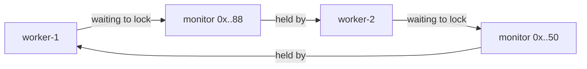

When a service silently stops making progress, deadlock is a prime suspect — and the JVM makes it
surprisingly easy to confirm. A **thread dump** is a snapshot of every thread's stack and the locks it
holds or waits on. Better still, the JVM **auto-detects** monitor cycles and prints a banner naming the
culprits.

## What a deadlock looks like in a thread dump

Here is the payoff section of a real dump. Two worker threads are each **waiting to lock** a monitor the
other **holds** — a textbook cycle:

```text
Found one Java-level deadlock:
=============================
"worker-2":
  waiting to lock monitor 0x00007f9a4c006a08 (object 0x000000076ab60050, a com.acme.Account),
  which is held by "worker-1"
"worker-1":
  waiting to lock monitor 0x00007f9a4c0091b0 (object 0x000000076ab60088, a com.acme.Account),
  which is held by "worker-2"

Java stack information for the threads listed above:
===================================================
"worker-2":
        at com.acme.Bank.transfer(Bank.java:24)
        - waiting to lock <0x000000076ab60050> (a com.acme.Account)
        - locked <0x000000076ab60088> (a com.acme.Account)
        at com.acme.Bank.lambda$main$1(Bank.java:41)
"worker-1":
        at com.acme.Bank.transfer(Bank.java:24)
        - waiting to lock <0x000000076ab60088> (a com.acme.Account)
        - locked <0x000000076ab60050> (a com.acme.Account)
        at com.acme.Bank.lambda$main$0(Bank.java:40)

Found 1 deadlock.
```

Read it as a graph: `worker-1` **locked** `..50` and **waits to lock** `..88`; `worker-2` **locked**
`..88` and **waits to lock** `..50`. That is the cycle, and both threads are parked at the same line —
`Bank.java:24`.



## How to capture a dump

Three equivalent ways to get that output from a live JVM:

````tabs
tabs:
  - label: jstack / jcmd
    body: |
      Find the pid, then dump. Non-intrusive — it reads the running JVM:
      ```bash
      jps -l                    # list Java pids
      jstack 12345              # full thread dump to stdout
      jcmd 12345 Thread.print   # same dump, preferred on modern JDKs
      ```
      Search the output for `Found one Java-level deadlock:` — the JVM detects the cycle for you.
  - label: kill -3 (SIGQUIT)
    body: |
      When you cannot attach a tool, signal the process:
      ```bash
      kill -3 12345             # same as kill -QUIT
      ```
      This does **not** terminate the JVM. `SIGQUIT` tells it to print a thread dump to its own
      **stdout/console** (your log file). On Windows, press `Ctrl-Break` in the console instead.
  - label: ThreadMXBean (in-process)
    body: |
      Detect it programmatically — ideal for a watchdog thread that alerts or restarts:
      ```java
      ThreadMXBean bean = ManagementFactory.getThreadMXBean();
      long[] stuck = bean.findDeadlockedThreads();     // null if none
      if (stuck != null) {
        for (ThreadInfo ti : bean.getThreadInfo(stuck, true, true)) {
          log.error("DEADLOCK: {} waiting on {} held by {}",
              ti.getThreadName(), ti.getLockName(), ti.getLockOwnerName());
        }
      }
      ```
      `findDeadlockedThreads()` covers monitors **and** `ReentrantLock`s; `findMonitorDeadlockedThreads()`
      covers intrinsic monitors only.
````

## Diagnosis, step by step

1. **Find the pid** with `jps -l`.
2. **Capture a dump** (any method above). Take **two or three** a few seconds apart: if the same threads sit at the same lines every time, it is a genuine hang — not just slow work.
3. **Scan for the banner** `Found one Java-level deadlock:`. If present, the JVM already named the threads in the cycle.
4. **Reconstruct the cycle** from the `waiting to lock <addr> ... which is held by <thread>` lines.
5. **Map addresses to code** via the stack: each `- locked <addr>` / `- waiting to lock <addr>` ties a monitor to the line that touched it. Here both threads point at `Bank.transfer(Bank.java:24)`.
6. **Fix at the source** — almost always by imposing a consistent lock order at those sites.

:::gotcha
The automatic "Found one Java-level deadlock" banner only catches cycles over **intrinsic monitors** and
**`AbstractOwnableSynchronizer`** locks (`ReentrantLock`, `ReentrantReadWriteLock`). It does **not**
detect deadlocks through `Semaphore`, `CountDownLatch`, blocking queues, or a JVM-lock-plus-external
resource such as a database row. Those appear only as threads stuck in `WAITING`/`parking` with **no
banner** — you have to spot the cycle yourself.
:::

:::senior
A single snapshot cannot tell a true deadlock from a merely slow call — always take **multiple dumps**
and compare. `findDeadlockedThreads()` is cheap enough to run on a timer as a production watchdog that
logs the offending threads and pages on-call (some teams even auto-restart). And do not confuse
`kill -3` with `kill -9`: `SIGQUIT` requests a dump and leaves the JVM running; `SIGKILL` destroys it.
:::

## Check yourself

```quiz
title: Detecting deadlock check
questions:
  - q: 'What is the fastest way to confirm a suspected deadlock in a running JVM?'
    options:
      - text: 'Capture a thread dump (jstack / jcmd / kill -3) and look for the deadlock banner'
        correct: true
      - 'Attach a debugger and single-step every thread'
      - 'Add print statements and redeploy the service'
    explain: 'A thread dump snapshots every stack and lock, and the JVM prints "Found one Java-level deadlock" when it detects a monitor/ReentrantLock cycle — no redeploy or debugger needed.'
  - q: 'Does `kill -3 <pid>` terminate the Java process?'
    options:
      - 'Yes, it force-kills it like kill -9'
      - text: 'No — SIGQUIT makes the JVM print a thread dump and keep running'
        correct: true
      - 'Only if the process is deadlocked'
    explain: 'kill -3 sends SIGQUIT, which the JVM handles by dumping all thread stacks to its console. The process continues; only SIGKILL (kill -9) terminates it.'
  - q: 'Two threads hang forever, but jstack shows no "Found one Java-level deadlock" banner. The most likely reason?'
    options:
      - 'The JDK is too old to detect deadlocks'
      - text: 'They are blocked on a Semaphore/latch/external resource, which the auto-detector does not track'
        correct: true
      - 'Thread dumps never show deadlocks'
    explain: 'The automatic detector only knows about intrinsic monitors and AbstractOwnableSynchronizer locks. Cycles through Semaphore, CountDownLatch, or a DB resource must be diagnosed by reading the stacks manually.'
```

:::key
To confirm a deadlock, capture a **thread dump** (`jstack`, `jcmd Thread.print`, or `kill -3`) and look
for the **Found one Java-level deadlock** banner plus the **waiting to lock X ... held by Y** cycle — or
detect it in-process with **`ThreadMXBean.findDeadlockedThreads`**. Take multiple dumps to rule out
slowness, and remember the auto-detector is blind to `Semaphore`, latches, and external resources.
:::
