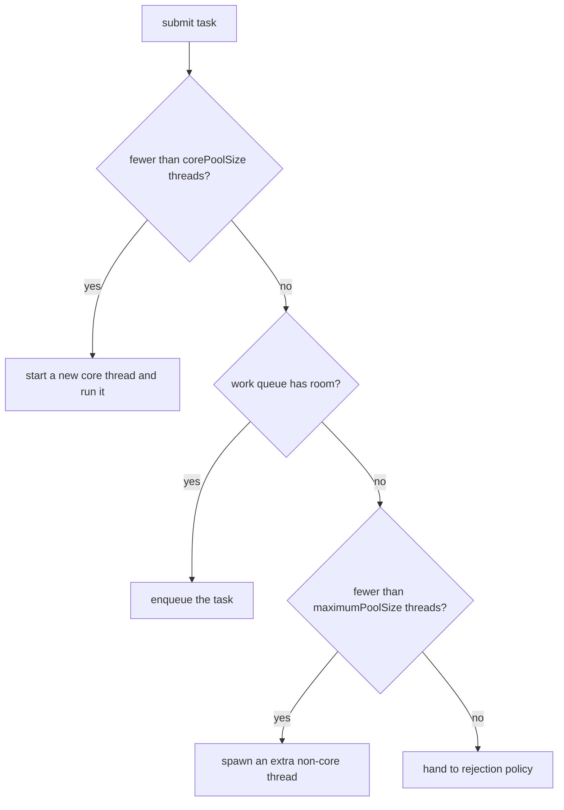

Raw `new Thread()` per task is a trap: thread creation is expensive, unbounded threads exhaust
memory, and you have no back-pressure. The **ExecutorService** fixes this by decoupling *task
submission* from *task execution* — you hand it `Runnable`/`Callable` work, and a managed **thread
pool** of reusable workers pulls tasks off a queue and runs them.

## A queue feeding N workers

A pool is just a **work queue** plus a fixed set of **worker threads**. Submitted tasks wait in the
queue; each idle worker grabs the head and runs it. Watch 4 tasks flow through a 2-worker pool:

```walkthrough
title: A task queue feeding 2 worker threads
code: |
  var pool = Executors
      .newFixedThreadPool(2);   // 2 workers
  for (var t : tasks)
      pool.submit(t);           // enqueue
  pool.shutdown();              // no new tasks
steps:
  - text: '**Submit 4 tasks** to a pool with 2 workers. Both workers are idle, so the tasks wait in the queue.'
    array: ['T1', 'T2', 'T3', 'T4', '—', '—']
    highlight: [0, 1, 2, 3]
    pointers: { 0: 'queue head', 4: 'W1', 5: 'W2' }
    line: 4
  - text: '**Dispatch.** Worker `W1` takes the head task `T1`. The queue shifts forward.'
    array: ['T2', 'T3', 'T4', '—', 'T1', '—']
    highlight: [4]
    pointers: { 0: 'queue head', 4: 'W1', 5: 'W2' }
  - text: '**W2 takes `T2`.** Both workers are now busy — the pool is at full capacity, `T3` and `T4` wait.'
    array: ['T3', 'T4', '—', '—', 'T1', 'T2']
    highlight: [5]
    pointers: { 0: 'queue head', 4: 'W1', 5: 'W2' }
  - text: '`T1` **completes** on `W1`. Its result is returned via the task''s `Future`; `W1` is free again.'
    array: ['T3', 'T4', '—', '—', '✓', 'T2']
    sorted: [4]
    pointers: { 0: 'queue head', 4: 'W1', 5: 'W2' }
  - text: '**W1 pulls the next queued task `T3`** — no new thread was created, the *same* worker is reused.'
    array: ['T4', '—', '—', '—', 'T3', 'T2']
    highlight: [4]
    pointers: { 0: 'queue head', 4: 'W1', 5: 'W2' }
  - text: '`T2` completes; **W2 pulls `T4`**. The queue is now empty and both workers are busy on the last two tasks.'
    array: ['—', '—', '—', '—', 'T3', 'T4']
    highlight: [5]
    pointers: { 0: 'queue head', 4: 'W1', 5: 'W2' }
  - text: 'Both finish. All 4 tasks ran on just **2 reused threads**. After `shutdown()`, the idle workers exit and the pool terminates.'
    array: ['—', '—', '—', '—', '✓', '✓']
    sorted: [4, 5]
    pointers: { 4: 'W1', 5: 'W2' }
    line: 5
```

## The factory shortcuts

`Executors` gives you one-liners. Each is really a preconfigured `ThreadPoolExecutor`:

````tabs
tabs:
  - label: newFixedThreadPool
    body: |
      A fixed number of workers, backed by an **unbounded** `LinkedBlockingQueue`.
      ```java
      ExecutorService pool = Executors.newFixedThreadPool(8);
      ```
      Steady, predictable parallelism — but the queue can grow without limit (see the gotcha).
  - label: newCachedThreadPool
    body: |
      Zero core threads, **unbounded** worker count, a `SynchronousQueue` (no buffering), and a
      60s keep-alive that reaps idle threads.
      ```java
      ExecutorService pool = Executors.newCachedThreadPool();
      ```
      Great for many short-lived, bursty tasks — dangerous for slow tasks (it can spawn thousands of threads).
  - label: newSingleThreadExecutor
    body: |
      Exactly one worker, so submitted tasks run **sequentially** in submission order.
      ```java
      ExecutorService pool = Executors.newSingleThreadExecutor();
      ```
      A safe way to confine work to one thread (an event loop, ordered writes).
  - label: newVirtualThreadPerTask
    body: |
      Java 21+: one cheap **virtual thread** per task — no pooling needed for blocking IO.
      ```java
      ExecutorService pool = Executors.newVirtualThreadPerTaskExecutor();
      ```
      Ideal for high-concurrency IO. Do **not** pool virtual threads; create one per task.
````

## The real engine: ThreadPoolExecutor

Under every factory sits `ThreadPoolExecutor`. Its constructor exposes the knobs that actually
matter, and a submitted task flows through them in a strict order:



The parameters, and the counter-intuitive part:

| Param | Meaning |
|--|--|
| `corePoolSize` | Threads kept alive even when idle |
| `maximumPoolSize` | Hard ceiling on threads |
| `workQueue` | Where tasks wait when all core threads are busy |
| `keepAliveTime` | How long *extra* (non-core) idle threads survive |
| `RejectedExecutionHandler` | What to do when queue is full **and** max threads are running |

The trap: extra threads (up to `maximumPoolSize`) are only created **after the queue is full**. With
an **unbounded** queue, the queue never fills, so `maximumPoolSize` is *never reached* — the pool
stays at `corePoolSize` forever. Bounded queue + max > core is what gives you elastic capacity.

The four built-in rejection policies: `AbortPolicy` (throws — the default), `CallerRunsPolicy` (runs
it on the submitting thread → natural back-pressure), `DiscardPolicy` (silently drops), and
`DiscardOldestPolicy` (drops the oldest queued task).

## Sizing the pool

There is no universal number — it depends on what the tasks *do*:

- **CPU-bound** (compute, no waiting): threads ≈ **number of cores** (`Runtime.availableProcessors()`),
  maybe `cores + 1`. More threads just thrash the scheduler and caches.
- **IO-bound** (DB calls, HTTP, disk): threads can be **much higher**, because each thread spends
  most of its time blocked. Rule of thumb: `cores × (1 + waitTime / computeTime)`.

:::gotcha
`Executors.newFixedThreadPool(n)` uses an **unbounded** `LinkedBlockingQueue`. If tasks arrive
faster than they complete, the queue grows without limit until you get an **`OutOfMemoryError`** —
a silent, delayed crash under load. Prefer constructing `ThreadPoolExecutor` directly with a
**bounded** queue and a rejection policy. And **always `shutdown()`**: pool worker threads are
non-daemon, so a leaked pool keeps the JVM alive forever.
:::

:::senior
Prefer `new ThreadPoolExecutor(...)` over the `Executors` factories in production code — the
factories hide the two most dangerous defaults (unbounded queue, and for `newCachedThreadPool`,
unbounded thread count). Bound the queue, choose a rejection policy that gives back-pressure
(`CallerRunsPolicy` is often right), and name your threads with a custom `ThreadFactory` so stack
dumps are readable. For clean shutdown, call `shutdown()` then `awaitTermination(...)`, and
`shutdownNow()` only as a last resort — it interrupts running tasks.
:::

## Drill: factory method → pool shape

Every factory is a `ThreadPoolExecutor` configuration in disguise — knowing the exact shape is what
lets you predict its failure mode.

```flashcards
title: Executors factory methods
cards:
  - front: '`newFixedThreadPool(n)`'
    back: 'core = max = **n**, **unbounded** `LinkedBlockingQueue`. Steady parallelism; failure mode = silent queue growth → OOM under sustained overload.'
  - front: '`newCachedThreadPool()`'
    back: 'core = 0, max = **Integer.MAX_VALUE**, `SynchronousQueue` (no buffering), 60s keep-alive. Great for short bursty tasks; failure mode = **thread explosion** when tasks are slow.'
  - front: '`newSingleThreadExecutor()`'
    back: '**One** worker + unbounded queue → tasks run **sequentially in submission order**. Wrapped so it cannot be reconfigured; the thread is replaced if a task kills it.'
  - front: '`newScheduledThreadPool(n)`'
    back: '`ScheduledThreadPoolExecutor` with a delay-ordered queue: `schedule` (once, after delay), `scheduleAtFixedRate`, `scheduleWithFixedDelay`. Rate vs delay: fixed-rate aims at a cadence; fixed-delay spaces runs from each *end*.'
  - front: '`newWorkStealingPool()`'
    back: 'A **ForkJoinPool** with parallelism = cores and **work-stealing deques** — not FIFO, no execution-order guarantee. Best for many small independent (or recursive) compute tasks.'
  - front: '`newVirtualThreadPerTaskExecutor()` (Java 21)'
    back: '**No pool at all** — a fresh virtual thread per task, unbounded concurrency, cheap blocking. The right default for IO-bound fan-out; useless extra weight for CPU-bound work.'
```

## Check yourself

```quiz
title: Executors and pools check
questions:
  - q: 'Why can `Executors.newFixedThreadPool(4)` run out of memory even though it caps threads at 4?'
    options:
      - text: 'It is backed by an unbounded queue, which grows without limit if tasks pile up faster than they finish'
        correct: true
      - 'Four threads is too many for most machines'
      - 'Fixed pools leak a thread on every submit'
    explain: 'The pool bounds threads but not the queue. An unbounded LinkedBlockingQueue can accumulate tasks until the heap is exhausted.'
  - q: 'In a `ThreadPoolExecutor`, when does the pool create threads beyond `corePoolSize`?'
    options:
      - 'As soon as all core threads are busy'
      - text: 'Only after the work queue is full, up to maximumPoolSize'
        correct: true
      - 'Never — corePoolSize is a hard cap'
    explain: 'Tasks go to core threads, then the queue, and only when the queue is full does the pool grow toward maximumPoolSize. With an unbounded queue, max is never reached.'
  - q: 'You have a CPU-bound task on an 8-core machine. Roughly how many pool threads?'
    options:
      - text: 'About 8 — one per core (or cores + 1)'
        correct: true
      - 'Hundreds, to maximize throughput'
      - 'Exactly 1, to avoid contention'
    explain: 'CPU-bound work is limited by cores; extra threads only add scheduling and cache-thrash overhead. IO-bound work is where you go much higher.'
```

:::key
An **ExecutorService** decouples submission from execution: tasks wait in a **queue** and a fixed set
of **reused worker threads** run them. `ThreadPoolExecutor` is the engine — tasks fill **core
threads**, then the **queue**, then extra threads up to **max**, then the **rejection policy**.
Extra threads only appear once the queue is full, so an **unbounded queue caps you at core and can
OOM**. Size ≈ **cores** for CPU-bound, **higher** for IO-bound, and **always `shutdown()`**.
:::
