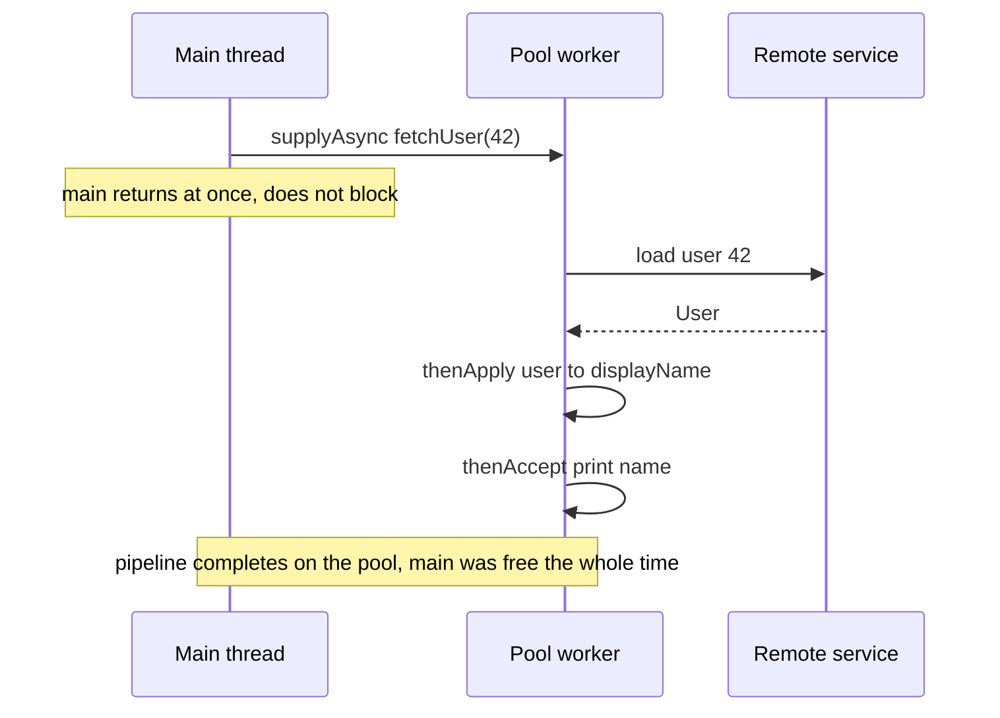

A plain `Future` can only be **polled or blocked on** with `get()` — you cannot say "when this
finishes, do that." A **CompletableFuture** is a future you can *chain*: you attach callbacks that
fire when a stage completes, so a whole async pipeline runs without any thread blocking.

## A two-stage async pipeline

The core pattern: **`supplyAsync`** kicks off work on a background thread, **`thenApply`/`thenCompose`**
transforms the result, and **`thenAccept`** consumes it — all as callbacks. The main thread returns
immediately and never blocks:



In code that pipeline reads top-to-bottom, like synchronous code that happens to be async:

```java
CompletableFuture
    .supplyAsync(() -> fetchUser(42), pool)   // stage 1: produce
    .thenApply(user -> user.displayName())    // stage 2: transform
    .thenAccept(name -> log.info(name));       // stage 3: consume
```

## Transform vs. flat-map vs. combine

The three verbs you must not mix up — `thenApply` maps, `thenCompose` flat-maps a nested future,
and `thenCombine` joins two independent futures:

````tabs
tabs:
  - label: thenApply (map)
    body: |
      Transform the result with a **plain function** `T -> U`.
      ```java
      CompletableFuture<Integer> len =
          cf.thenApply(String::length);   // CF<String> -> CF<Integer>
      ```
      Use when your transform returns a *value*, not another future.
  - label: thenCompose (flatMap)
    body: |
      Chain a **second async call** that itself returns a `CompletableFuture`.
      ```java
      CompletableFuture<Order> order =
          userCf.thenCompose(u -> fetchOrder(u.id()));  // returns CF<Order>
      ```
      Use `thenApply` here and you get a nested `CF<CF<Order>>`. `thenCompose` flattens it.
  - label: thenCombine (join two)
    body: |
      Wait for **two independent** futures and merge their results.
      ```java
      priceCf.thenCombine(taxCf, (price, tax) -> price + tax);
      ```
      Both run concurrently; the combiner runs once both complete.
````

## Fan-out and fan-in

To launch many calls and wait for all of them, use **`allOf`** (or `anyOf` for the first to finish):

```java
var a = CompletableFuture.supplyAsync(() -> callA(), pool);
var b = CompletableFuture.supplyAsync(() -> callB(), pool);
var c = CompletableFuture.supplyAsync(() -> callC(), pool);
CompletableFuture.allOf(a, b, c).join();   // wait for all three
var results = List.of(a.join(), b.join(), c.join());  // now instant
```

`allOf` returns `CompletableFuture<Void>`, so you re-read each future's value with `join()` after it
resolves.

## Handling failures

Exceptions propagate down the chain and skip the normal stages until a handler catches them:

- **`exceptionally(fn)`** — recover with a fallback value if the stage failed.
- **`handle((v, ex) -> ...)`** — always runs; sees either the value *or* the exception.
- **`whenComplete((v, ex) -> ...)`** — a side-effecting peek that does not alter the result.

```java
cf.thenApply(this::risky)
  .exceptionally(ex -> "fallback");   // recover on failure
```

:::gotcha
The `...Async` methods without an `Executor` run on the shared **`ForkJoinPool.commonPool()`** —
sized to *cores − 1*. Do blocking IO there and you can **starve the whole JVM** (every parallel
stream and default async task shares it). **Always pass your own executor** to `supplyAsync`,
`thenApplyAsync`, etc. for IO work. Also know the thread rule: **`thenApply`** may run on whatever
thread completed the previous stage (possibly the caller); **`thenApplyAsync`** *always* hands the
callback to a pool. When it matters which thread runs the callback, use the `Async` form with an
explicit executor.
:::

:::senior
Exceptions inside a stage are wrapped in a **`CompletionException`** — remember to unwrap `getCause()`
in handlers. Prefer **`join()`** over `get()` at the end of a chain: it throws an unchecked
`CompletionException` instead of forcing checked `ExecutionException`/`InterruptedException` handling.
And `CompletableFuture` does **not** cancel the underlying work — `cancel(true)` only completes the
future exceptionally; the running task keeps going unless it checks for interruption.
:::

## Drill: the method zoo

CompletableFuture questions are mostly vocabulary — map the verb to the situation and you have the
answer.

```flashcards
title: CompletableFuture methods
cards:
  - front: '`supplyAsync` vs `runAsync`'
    back: 'Both start a stage on a pool: `supplyAsync(Supplier<T>)` produces a **value**; `runAsync(Runnable)` produces **Void**. Default pool is `commonPool()` — pass your own executor for IO.'
  - front: '`thenApply` vs `thenCompose`'
    back: '`thenApply` = **map**: transform with `T -> U`. `thenCompose` = **flat-map**: chain a function returning another `CompletableFuture`, flattening `CF<CF<U>>` to `CF<U>`.'
  - front: '`thenCombine`'
    back: 'Join **two independent** futures: both run concurrently; the `(a, b) -> r` combiner fires when both complete. For dependent calls use `thenCompose` instead.'
  - front: '`allOf` / `anyOf`'
    back: '`allOf(...)` completes when **all** do — returns `CF<Void>`, so re-read each input with `join()`. `anyOf(...)` completes with the **first** result (including a first *failure*).'
  - front: '`exceptionally` vs `handle` vs `whenComplete`'
    back: '`exceptionally`: runs **only on failure**, supplies a fallback. `handle((v, ex))`: **always** runs, can transform either path. `whenComplete`: always runs but is a **peek** — cannot change the result.'
  - front: '`thenApply` vs `thenApplyAsync` — which thread?'
    back: 'Plain `thenApply` may run on **whichever thread completed the previous stage** (even the caller, if already complete). `thenApplyAsync` always dispatches to a pool — use it with an explicit executor when the thread matters.'
```

## Check yourself

```quiz
title: CompletableFuture check
questions:
  - q: 'A stage calls a method that itself returns a `CompletableFuture`. Which composition avoids a nested `CompletableFuture<CompletableFuture<T>>`?'
    options:
      - text: 'thenCompose'
        correct: true
      - 'thenApply'
      - 'thenAccept'
    explain: 'thenCompose flat-maps: it unwraps the inner future so you get CF<T>, not CF<CF<T>>. thenApply would leave it nested.'
  - q: 'Why is it risky to run blocking IO in `supplyAsync(() -> httpCall())` without passing an executor?'
    options:
      - text: 'It runs on the shared ForkJoinPool.commonPool, whose few threads can be starved, stalling all async work'
        correct: true
      - 'supplyAsync cannot return a value from IO'
      - 'It silently swallows all exceptions'
    explain: 'The default async pool is the small, JVM-wide commonPool. Blocking it starves every parallel stream and default async task. Pass a dedicated executor for IO.'
  - q: 'You launched three independent calls as `CompletableFuture`s. How do you proceed only once all three finish?'
    options:
      - text: 'CompletableFuture.allOf(a, b, c).join(), then read each value'
        correct: true
      - 'Call a.get(); b.get(); c.get() so they run one after another'
      - 'thenCombine chained three times'
    explain: 'allOf waits for all of them (they still run concurrently). It returns CF<Void>, so you re-read each future via join() afterward. Sequential get() would serialize them.'
```

:::key
**CompletableFuture** turns futures into composable async pipelines: **`supplyAsync`** starts work,
**`thenApply`** maps, **`thenCompose`** flat-maps a nested future, **`thenCombine`** joins two, and
**`allOf`** fans in. Errors flow to **`exceptionally`/`handle`**. The big trap: `...Async` defaults
to the tiny shared **`commonPool`** — **pass your own executor** for IO, and use the **`Async`**
variants when you need to control which thread runs the callback.
:::
