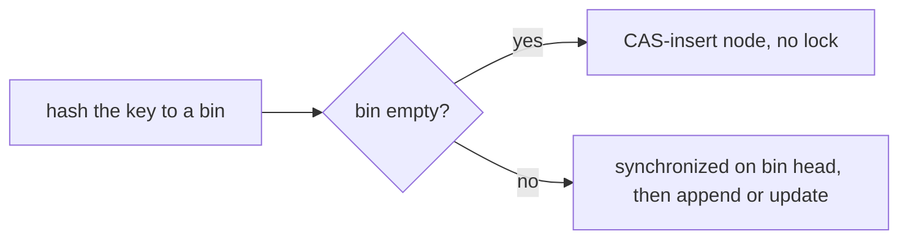
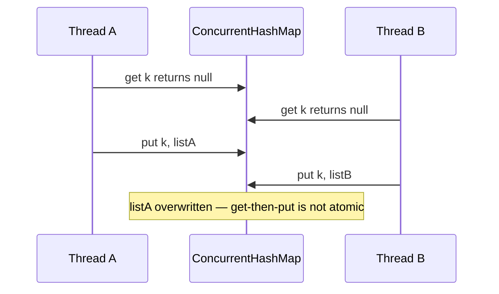

Wrapping a plain map in `Collections.synchronizedMap` locks the **whole map** on every operation —
one big lock, zero parallelism. The `java.util.concurrent` collections are engineered for
concurrency: **ConcurrentHashMap** locks at the granularity of a single bin, **CopyOnWriteArrayList**
lets reads run lock-free, and **ConcurrentLinkedQueue** is a lock-free FIFO.

## Pick the right one

| Collection | Best for | How it stays safe | Watch out for |
|--|--|--|--|
| **ConcurrentHashMap** | General concurrent map, high read + write | CAS on empty bins, `synchronized` on the bin head otherwise — never a global lock | `size()` and iterators are weakly consistent; no null keys/values |
| **CopyOnWriteArrayList** | Read-heavy, rarely-written lists (listeners) | Every write copies the whole backing array; reads are lock-free on an immutable snapshot | Writes are O(n) and costly; iterators show a stale snapshot |
| **ConcurrentLinkedQueue** | Unbounded lock-free FIFO producer/consumer | Lock-free CAS on head/tail nodes | `size()` is O(n) and approximate; no blocking (use `LinkedBlockingQueue` for that) |
| **ConcurrentSkipListMap** | Concurrent **sorted** map | Lock-free skip list | Slower than a hash map when you do not need ordering |

## Inside ConcurrentHashMap

There is no single lock. The table is an array of **bins**; a key hashes to one bin. Writing to an
*empty* bin is a lock-free **CAS**; writing to an *occupied* bin takes a short `synchronized` lock on
just that bin's head node. Two threads touching different bins never contend:



## The get-then-put race

The number-one bug: a `get`, a decision, then a `put` is **three separate operations**. Another
thread can slip between them, and one write is lost — even though the map itself is thread-safe:



The fix is an **atomic** combinator that does the check-and-act in one locked step:

````tabs
tabs:
  - label: The race (broken)
    body: |
      Check-then-act across two calls — two threads can both see `null` and both create a list.
      ```java
      List<String> v = map.get(key);
      if (v == null) {
          v = new ArrayList<>();
          map.put(key, v);   // may clobber another thread's list
      }
      v.add(item);
      ```
  - label: computeIfAbsent (lazy init)
    body: |
      Atomically create-if-missing. The mapping function runs **at most once** per key.
      ```java
      map.computeIfAbsent(key, k -> new CopyOnWriteArrayList<>())
         .add(item);   // exactly one list per key, no lost writes
      ```
  - label: merge (accumulate)
    body: |
      Perfect for atomic counters and reductions.
      ```java
      counts.merge(key, 1L, Long::sum);   // increment, or insert 1
      ```
      No get-then-put, no race — the whole update is atomic per key.
````

:::gotcha
Making each *operation* thread-safe does **not** make a *sequence* of them atomic. `get` then `put`
(or `containsKey` then `put`) is a classic race — use **`computeIfAbsent`**, **`merge`**, or
**`compute`** to fold the check and the write into one atomic step. Also: `size()`, `isEmpty()`, and
iterators are **weakly consistent** — they never throw `ConcurrentModificationException`, but they
reflect *some* state during traversal, not a consistent snapshot. Never drive control flow off a
concurrent `size()`.
:::

:::senior
Know each structure's cost model. **CopyOnWriteArrayList** copies the entire array on *every* write,
so it is only for read-dominated, small, or rarely-mutated lists (event listeners) — never a hot
write path. Inside **`computeIfAbsent`**, the mapping function runs while holding the bin lock, so it
must **not** update the same map for a *different* key that could hash to the same bin — that can
deadlock or throw. And remember ConcurrentHashMap is **null-hostile**: a null value would make
`get` returning null ambiguous ("absent" vs. "mapped to null"), so both are banned.
:::

## Check yourself

```quiz
title: Concurrent collections check
questions:
  - q: 'Two threads run `if (!map.containsKey(k)) map.put(k, v);` on a `ConcurrentHashMap`. Why can this still be wrong?'
    options:
      - text: 'containsKey and put are separate operations; a thread can insert between them, so the check-then-act is racy'
        correct: true
      - 'ConcurrentHashMap is not actually thread-safe'
      - 'put throws if the key already exists'
    explain: 'Per-operation safety does not make a two-call sequence atomic. Use putIfAbsent, computeIfAbsent, or merge to make the check-and-write one atomic step.'
  - q: 'Which collection is the best fit for a list of event listeners that is read constantly and written rarely?'
    options:
      - text: 'CopyOnWriteArrayList'
        correct: true
      - 'A LinkedList wrapped in synchronizedList'
      - 'ConcurrentHashMap'
    explain: 'CopyOnWriteArrayList gives lock-free, snapshot reads; its expensive copy-on-write is fine because writes are rare. Reads dominate the listener use case.'
  - q: 'What is true of a `ConcurrentHashMap` iterator or its `size()`?'
    options:
      - text: 'They are weakly consistent — they never throw ConcurrentModificationException but may not reflect the latest state'
        correct: true
      - 'They lock the whole map for the duration of the traversal'
      - 'They throw ConcurrentModificationException on any concurrent write'
    explain: 'Concurrent collections traverse without a global lock and tolerate concurrent modification, so their iterators and size() are only weakly consistent snapshots.'
```

:::key
Prefer purpose-built concurrent collections over `synchronized` wrappers. **ConcurrentHashMap** uses
**per-bin CAS/locking** (no global lock); **CopyOnWriteArrayList** suits **read-heavy** lists;
**ConcurrentLinkedQueue** is a **lock-free FIFO**. The signature trap is that per-operation safety is
not sequence atomicity — **get-then-put is still a race**, so use **`computeIfAbsent`/`merge`/`compute`**.
And treat `size()` and iterators as **weakly consistent**.
:::
