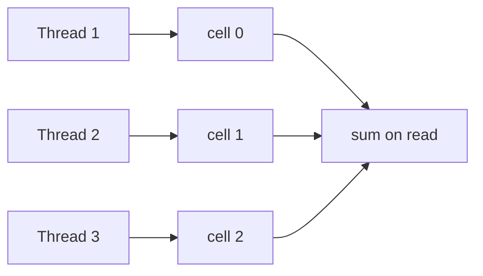

Locks make threads **block**. **Atomic variables** (`AtomicInteger`, `AtomicLong`,
`AtomicReference`) update a single value **without locking**, using one hardware instruction:
**compare-and-swap (CAS)**. CAS says "set this field to `new` *only if* it still equals `expected`" —
atomically. If someone changed it first, the swap fails and you retry.

## A CAS retry loop, step by step

Every atomic method like `incrementAndGet()` is a **spin loop**: read the current value, compute the
new one, and `compareAndSet`. If a competing thread moved the value in between, the CAS fails and the
loop retries with the fresh value. Watch one thread lose a race, then win:

```walkthrough
title: compare-and-swap — retry after a lost race
code: |
  int expected, next;
  do {
    expected = value.get();          // read
    next = expected + 1;             // compute
  } while (!value.compareAndSet(expected, next));  // publish
steps:
  - text: 'Shared `value` is **5**. Our thread reads it into `expected`. Cell layout: `[expected, shared, new]`.'
    array: [5, 5, '—']
    highlight: [0]
    pointers: { 0: 'expected', 1: 'shared', 2: 'new' }
    line: 3
  - text: '**Compute** the candidate: `next = expected + 1 = 6`. Nothing is published yet.'
    array: [5, 5, 6]
    highlight: [2]
    pointers: { 0: 'expected', 1: 'shared', 2: 'new' }
    line: 4
  - text: '**Another thread sneaks in** and changes `shared` from 5 to **7** before our CAS runs.'
    array: [5, 7, 6]
    highlight: [1]
    pointers: { 0: 'expected', 1: 'shared', 2: 'new' }
    line: 5
  - text: '**CAS fails.** `compareAndSet(5, 6)` compares our `expected` (5) to `shared` (7) — mismatch, so **no write** and it returns `false`.'
    array: [5, 7, 6]
    highlight: [0, 1]
    pointers: { 0: 'expected != shared', 1: 'shared', 2: 'new' }
    line: 5
  - text: '**Retry.** The loop re-reads `shared`, so `expected` becomes **7**.'
    array: [7, 7, '—']
    highlight: [0]
    pointers: { 0: 'expected', 1: 'shared', 2: 'new' }
    line: 3
  - text: '**Recompute:** `next = 7 + 1 = 8`.'
    array: [7, 7, 8]
    highlight: [2]
    pointers: { 0: 'expected', 1: 'shared', 2: 'new' }
    line: 4
  - text: '**CAS succeeds.** `expected` (7) matches `shared` (7), so it atomically writes **8**. The loop exits — no lock was ever taken.'
    array: [7, 8, 8]
    sorted: [1, 2]
    pointers: { 0: 'expected', 1: 'shared = 8', 2: 'new' }
    line: 5
```

## The atomic toolbox

`compareAndSet` is the primitive; the convenience methods wrap the spin loop for you:

````tabs
tabs:
  - label: AtomicInteger / AtomicLong
    body: |
      Atomic counters and flags.
      ```java
      AtomicInteger id = new AtomicInteger();
      int next = id.incrementAndGet();       // atomic ++
      id.getAndAdd(10);                       // atomic += 10
      boolean won = id.compareAndSet(0, 1);   // set to 1 only if still 0
      ```
  - label: getAndUpdate (custom logic)
    body: |
      Apply an arbitrary function atomically — it CAS-loops under the hood.
      ```java
      AtomicInteger a = new AtomicInteger(10);
      a.updateAndGet(x -> Math.min(x + 5, 100));  // clamp, atomically
      ```
      The lambda must be **pure and side-effect-free** — it may run several times if CAS retries.
  - label: AtomicReference (objects)
    body: |
      Atomically swap an immutable object reference — the way to make a compound update lock-free.
      ```java
      AtomicReference<Point> ref = new AtomicReference<>(new Point(0, 0));
      ref.updateAndGet(p -> new Point(p.x() + 1, p.y()));  // publish a new snapshot
      ```
  - label: LongAdder (hot counters)
    body: |
      Under heavy write contention, prefer LongAdder over AtomicLong.
      ```java
      LongAdder hits = new LongAdder();
      hits.increment();         // updates a per-thread cell
      long total = hits.sum();  // adds the cells when you read
      ```
````

## Why LongAdder wins under contention

A single `AtomicLong` forces every thread to CAS the **same** memory word — under heavy contention
they fight over one cache line and retries explode. **LongAdder** spreads writes across **per-thread
cells** (striping); each thread bumps its own cell with little contention, and `sum()` adds them up
on read:



The trade-off: writes scale beautifully, but `sum()` is a *slightly stale, non-atomic* snapshot —
perfect for metrics, wrong for a value you must read-modify-write.

:::gotcha
CAS is vulnerable to the **ABA problem**: a value goes `A -> B -> A`, and your `compareAndSet(A, ...)`
succeeds even though the reference changed underneath you. When identity matters (lock-free stacks,
pooled objects), use **`AtomicStampedReference`**, which pairs the value with a version stamp. Second
trap: the lambda you pass to `updateAndGet`/`getAndUpdate`/`accumulateAndGet` can **execute multiple
times** (once per CAS retry), so it must be pure — no logging, no counters, no external mutation.
:::

:::senior
Atomics are **optimistic** concurrency (assume no conflict, retry if wrong); locks are **pessimistic**
(exclude first). Under *low* contention, atomics beat locks — no context switches. Under *extreme*
contention, the spin loop wastes CPU on repeated failed CAS attempts, and a lock (or LongAdder's
striping) can win. Watch for **false sharing** too: independent atomics on the same cache line
ping-pong between cores; the `@Contended` padding (and LongAdder's cells) exists to avoid exactly
that.
:::

## Check yourself

```quiz
title: Atomics and CAS check
questions:
  - q: 'What does `AtomicInteger.compareAndSet(expected, newValue)` do?'
    options:
      - text: 'Atomically sets the value to newValue only if it currently equals expected; otherwise it leaves it unchanged and returns false'
        correct: true
      - 'Blocks until the value equals expected, then sets it'
      - 'Always sets the value to newValue and returns the old one'
    explain: 'CAS is a conditional atomic write: swap only if the current value still matches expected. A false return means someone else changed it, so callers typically retry.'
  - q: 'Under very high write contention on a single counter, why can `LongAdder` outperform `AtomicLong`?'
    options:
      - text: 'It spreads increments across per-thread cells, reducing CAS contention on one word, and sums them only on read'
        correct: true
      - 'It takes a lock so threads never retry'
      - 'It uses 64-bit math that is faster than 32-bit'
    explain: 'AtomicLong forces every thread to CAS the same word. LongAdder stripes writes across cells so threads rarely collide; sum() combines them, at the cost of a slightly stale read.'
  - q: 'A lock-free routine reads a reference `A`, and before its CAS the reference goes A to B and back to A. What is this, and the fix?'
    options:
      - text: 'The ABA problem — use AtomicStampedReference to attach a version stamp'
        correct: true
      - 'A deadlock — add lock ordering'
      - 'A memory-visibility bug — mark the field volatile'
    explain: 'CAS only checks the value, so an A to B to A cycle looks unchanged. AtomicStampedReference pairs the value with a monotonically increasing stamp so the swap detects the intervening change.'
```

:::key
Atomics give **lock-free**, single-variable updates via **compare-and-swap**: read, compute,
`compareAndSet`, and **retry** on failure. `AtomicInteger`/`AtomicReference` plus `getAndUpdate`
cover most needs; `updateAndGet` lambdas must be **pure** (they can re-run). Reach for **`LongAdder`**
when one hot counter is contended, and guard against the **ABA problem** with `AtomicStampedReference`.
Atomics are **optimistic**; under extreme contention, a lock or striping may still win.
:::
