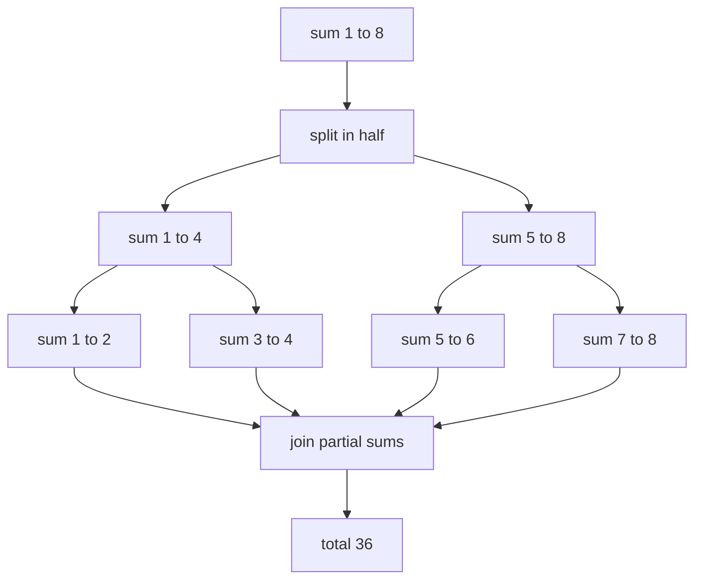
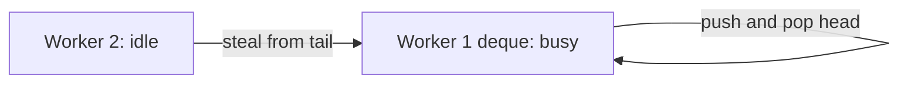

The **Fork/Join framework** parallelizes **divide-and-conquer** work: split a big task into
subtasks (**fork**), run them on a pool, and combine their results (**join**). It powers Java's
**parallel streams**, and its workers use **work-stealing** so idle threads pull work from busy ones
instead of sitting idle.

## Split, compute, join

The recursion: if a task is small enough, compute it directly; otherwise split it in half, fork the
halves, and join their partial results. Summing `1..8` splits down to leaves, then folds back up:



## Writing a RecursiveTask

Extend **`RecursiveTask<V>`** when subtasks return a value (use `RecursiveAction` for `void`). The
`compute()` method decides: base case, or split. Note the idiom — **fork one half, compute the other
inline, then join** — so the current thread never sits idle:

```java
class SumTask extends RecursiveTask<Long> {
    static final int THRESHOLD = 1_000;
    final long[] a; final int lo, hi;
    SumTask(long[] a, int lo, int hi) { this.a = a; this.lo = lo; this.hi = hi; }

    protected Long compute() {
        if (hi - lo <= THRESHOLD) {          // base case: just add
            long s = 0;
            for (int i = lo; i < hi; i++) s += a[i];
            return s;
        }
        int mid = (lo + hi) >>> 1;
        SumTask left  = new SumTask(a, lo, mid);
        SumTask right = new SumTask(a, mid, hi);
        left.fork();                          // schedule left on the pool
        long r = right.compute();             // compute right on this thread
        return left.join() + r;               // wait for left, combine
    }
}
long total = ForkJoinPool.commonPool().invoke(new SumTask(data, 0, data.length));
```

## Work-stealing

Each worker owns a **double-ended queue (deque)**. It pushes and pops its own subtasks from the
**head** (LIFO, cache-friendly). When a worker runs dry, it **steals** from the **tail** of another
worker's deque — so no thread stays idle while work exists:



## Parallel streams

A parallel stream is Fork/Join with no boilerplate — it splits the source, runs the pipeline on the
**commonPool**, and combines results:

````tabs
tabs:
  - label: Sequential
    body: |
      ```java
      long sum = list.stream()
                     .mapToLong(this::score)
                     .sum();
      ```
      One thread. Predictable, and best for small or IO-bound work.
  - label: Parallel
    body: |
      ```java
      long sum = list.parallelStream()
                     .mapToLong(this::score)
                     .sum();
      ```
      Splits across commonPool workers. Wins only for **large, splittable, CPU-bound** sources.
  - label: Explicit RecursiveTask
    body: |
      ```java
      ForkJoinPool pool = new ForkJoinPool(4);
      long sum = pool.invoke(new SumTask(data, 0, data.length));
      ```
      Full control over threshold and pool — use when you need to isolate work from the commonPool.
````

Parallelism pays off only when the source is **large**, cheaply **splittable** (arrays,
`ArrayList` — not `LinkedList` or IO streams), and the per-element work is **CPU-bound** and
**stateless**. Otherwise the split/merge overhead makes it slower than sequential.

:::gotcha
Every parallel stream and default `...Async` task shares **one** `ForkJoinPool.commonPool()`
(sized *cores − 1*). **Blocking inside it** — a DB call, HTTP request, or `sleep` in a parallel
stream — starves that pool and stalls *all other* parallel work in the JVM. Keep commonPool work
CPU-bound and non-blocking; for blocking work, submit to your **own** `ForkJoinPool` or a regular
`ExecutorService`. And never use a stateful/side-effecting lambda in a parallel stream — results
become non-deterministic.
:::

:::senior
Two subtler points. **Order of fork/join matters:** fork the left, compute the right, then
`join()` the left — joining in the wrong order (or forking both then joining the first) can serialize
the work or, in pathological cases, deadlock the pool. Prefer `invokeAll(...)` when splitting into
many subtasks. Second, if you *must* block inside Fork/Join, wrap it in a
**`ForkJoinPool.ManagedBlocker`** so the pool compensates by spinning up a replacement thread instead
of starving. Measure before parallelizing — for most business-sized collections, sequential wins.
:::

## Check yourself

```quiz
title: Fork-join and parallel streams check
questions:
  - q: 'What is work-stealing in the Fork/Join framework?'
    options:
      - text: 'Idle workers take queued subtasks from the tail of a busy worker''s deque, keeping all threads busy'
        correct: true
      - 'The pool steals CPU time from other processes'
      - 'The main thread takes back tasks it submitted'
    explain: 'Each worker has its own deque; it works its own head LIFO and, when empty, steals from another worker''s tail. This balances load without central coordination.'
  - q: 'Why is calling a blocking HTTP request inside a `parallelStream()` dangerous?'
    options:
      - text: 'Parallel streams run on the shared commonPool; blocking its few threads starves all other parallel work in the JVM'
        correct: true
      - 'Parallel streams cannot call methods that do IO'
      - 'It forces the stream back to sequential automatically'
    explain: 'The commonPool has only cores-1 threads and is shared JVM-wide. Blocking them stalls every other parallel stream and default async task. Use a dedicated pool for blocking work.'
  - q: 'A parallel stream is most likely to beat a sequential one when the source is:'
    options:
      - text: 'A large array or ArrayList with CPU-bound, stateless per-element work'
        correct: true
      - 'A small LinkedList with IO-bound work'
      - 'Any collection, since more threads is always faster'
    explain: 'Parallelism helps only when the source splits cheaply (arrays, ArrayList), the data set is large, and the work is CPU-bound and stateless. Otherwise split/merge overhead dominates.'
```

:::key
**Fork/Join** parallelizes **divide-and-conquer**: `compute()` either handles a base case or splits,
**forks** subtasks, and **joins** their results — the idiom is fork one half, compute the other,
join. Workers use **work-stealing** to stay busy. **Parallel streams** ride the same **commonPool**,
so they help only for **large, splittable, CPU-bound, stateless** sources — and you must **never
block inside the commonPool**, or you starve every parallel task in the JVM.
:::
