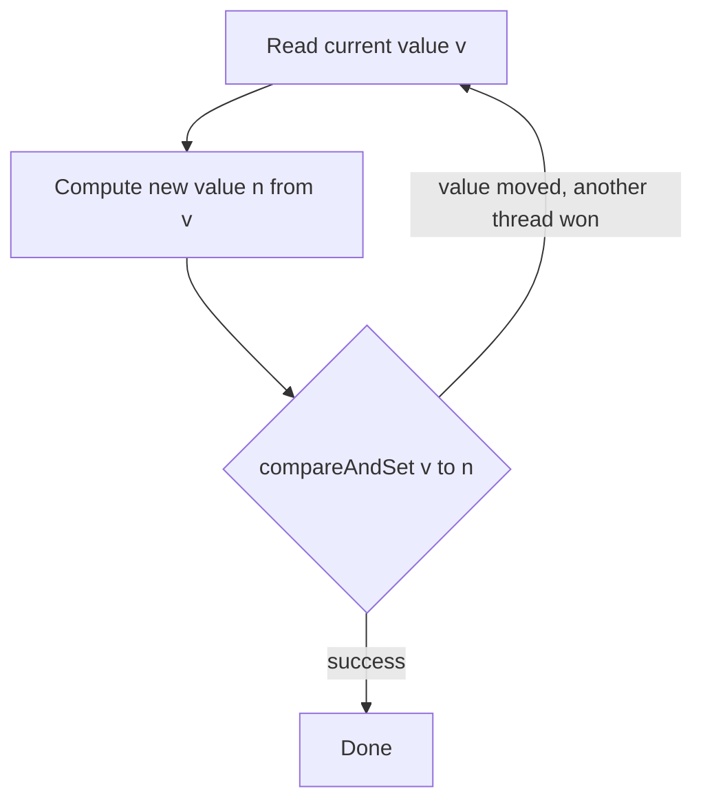

**Compare-and-swap (CAS)** is the atomic read-modify-write primitive that makes lock-free code
possible. It is a single hardware instruction with a contract: *"if this memory still holds the value
I expect, replace it with a new value — atomically — otherwise tell me you failed and change nothing."*

## CAS in one method

`compareAndSet(expected, next)` returns `true` if it swapped, `false` if the value had already moved.
Every atomic update is an **optimistic** loop: read, compute, and publish *only* if nothing changed
underneath you — otherwise retry.

```java
// AtomicInteger.getAndIncrement() is really a CAS retry loop:
int prev, next;
do {
  prev = value;            // 1. read the current value
  next = prev + 1;         // 2. compute the update off that snapshot
} while (!compareAndSet(prev, next));  // 3. publish only if value is unchanged
return prev;
```

No lock is taken. If two threads collide, one CAS wins and the loser simply loops with a fresh read.



## The hardware underneath

CAS is not a library trick — it is a CPU instruction:

- **x86 — `LOCK CMPXCHG`.** One atomic instruction compares the accumulator to memory, swaps on
  equality, and sets the zero flag to report success. It is purely **value-based**.
- **ARM / POWER — LL/SC** (`LDXR`/`STXR`, `lwarx`/`stwcx.`). *Load-linked* reads and arms a
  reservation on the cache line; *store-conditional* writes only if that line was untouched since.
  It can fail *spuriously*, so it always runs in a retry loop.

That difference matters: LL/SC breaks on **any** write to the line, so it can notice an A→B→A churn
that value-CAS cannot. But Java's `Atomic*` API is value-based, so you must assume the value-only
model — which brings us to its most famous trap.

## The ABA problem

CAS only checks *"is the value still A?"* — never *"did the value stay A the whole time?"* If another
thread changes A→B→A while you were paused, your CAS sees `A`, assumes nothing happened, and succeeds
on a stale premise. Step through it:

```walkthrough
title: The ABA problem — a value returns to A and fools CAS
code: |
  String exp = ref.get();          // T1: reads "A", saves exp
  //  ...T1 preempted; T2 runs A -> B -> A...
  ref.compareAndSet(exp, "C");     // T1: sees "A" == exp, so it SUCCEEDS
steps:
  - text: 'Shared `ref` holds **A**. `T1` will save it, get preempted, and `T2` will churn the value.'
    array: ['—', 'A', '—']
    pointers: { 0: 'T1.exp', 1: 'ref', 2: 'T2' }
    line: 1
  - text: '**T1 reads** `ref` and saves `exp = A`. It plans to run `compareAndSet(A, C)` in a moment.'
    array: ['A', 'A', '—']
    highlight: [0]
    pointers: { 0: 'T1.exp', 1: 'ref', 2: 'T2' }
    line: 1
  - text: '**T1 is preempted** before its CAS. Its saved `exp` is now frozen at **A**, blind to what happens next.'
    array: ['A', 'A', '—']
    pointers: { 0: 'T1.exp frozen', 1: 'ref', 2: 'T2' }
    line: 1
  - text: '**T2 runs** `compareAndSet(A, B)` — succeeds. `ref` is now **B**. The world has genuinely changed.'
    array: ['A', 'B', 'B']
    highlight: [1]
    pointers: { 0: 'T1.exp', 1: 'ref', 2: 'T2' }
    line: 2
  - text: '**T2 runs again** `compareAndSet(B, A)` — succeeds. `ref` is back to **A**, but it is a *new* A after real state changes.'
    array: ['A', 'A', 'A']
    highlight: [1]
    pointers: { 0: 'T1.exp', 1: 'ref', 2: 'T2' }
    line: 2
  - text: '**T1 resumes** and runs `compareAndSet(A, C)`. `ref == A == exp`, so CAS **succeeds** — even though the value moved twice underneath it.'
    array: ['A', 'C', 'A']
    highlight: [1]
    pointers: { 0: 'T1.exp', 1: 'ref', 2: 'T2' }
    line: 3
  - text: 'CAS compared the **value**, never the **history**. T1 acted on a stale snapshot. That silent success is the **ABA problem**.'
    array: ['A', 'C', 'A']
    sorted: [1]
    pointers: { 1: 'ref' }
    line: 3
```

For a plain counter, ABA is usually harmless — `5` is `5`. It turns dangerous when the value is a
**pointer**: a node freed and its address reused looks identical, so your CAS relinks freed memory.

## Fixing ABA with a version stamp

Attach a monotonically increasing **stamp** to the reference. Every update bumps the stamp, so an
A→B→A round trip leaves a *different* stamp — and the CAS on `(value, stamp)` fails as it should.

````tabs
tabs:
  - label: AtomicReference — ABA-prone
    body: |
      Compares the value only, so a returned-to-A value slips straight through.
      ```java
      AtomicReference<Node> ref = new AtomicReference<>(a);
      Node cur = ref.get();            // sees A
      // ... another thread does A -> B -> A ...
      ref.compareAndSet(cur, next);    // value is "A" again -> SUCCEEDS (wrongly)
      ```
  - label: AtomicStampedReference — fixed
    body: |
      Pairs the value with an `int` stamp; CAS must match **both**.
      ```java
      AtomicStampedReference<Node> ref =
          new AtomicStampedReference<>(a, 0);       // value A, stamp 0
      int[] hold = new int[1];
      Node cur = ref.get(hold);                     // read value + stamp
      int stamp = hold[0];
      // A -> B -> A bumps the stamp each time: 0 -> 1 -> 2
      ref.compareAndSet(cur, next, stamp, stamp + 1); // stamp 0 != 2 -> FAILS
      ```
      Need only a boolean "touched" flag rather than a full version? Use
      `AtomicMarkableReference` — one bit instead of an `int`.
````

:::gotcha
ABA is **silent** — no exception, no crash, just a CAS that succeeds when it logically should not.
It survives code review because the line `compareAndSet(A, C)` looks perfectly correct in isolation.
The bug lives in the *timeline*, not the statement.
:::

:::senior
Widening the CAS to `(value, stamp)` costs a level of indirection: `AtomicStampedReference` boxes the
pair, so hot paths allocate. On CPUs with a double-width CAS (x86 `LOCK CMPXCHG16B`) you can stamp a
128-bit `(pointer, counter)` in one instruction with no boxing — how high-performance C/C++ lock-free
code defeats ABA. Also note LL/SC hardware resists ABA *for free* by watching the cache line, but the
JVM's value-based `Atomic*` API gives you no such guarantee, so always reason as if ABA is possible.
:::

## Check yourself

```quiz
title: CAS and ABA check
questions:
  - q: 'Why can the ABA problem let a stale `compareAndSet` succeed?'
    options:
      - text: 'CAS compares only the current value; if it returns to the original, CAS cannot tell the state changed and changed back'
        correct: true
      - 'CAS is not actually atomic on multi-core CPUs'
      - 'The JVM caches the expected value with the wrong type'
    explain: 'CAS checks value equality, not history. An A to B to A round trip leaves the same value, so the swap succeeds on a stale assumption.'
  - q: 'Which tool is designed to defeat the ABA problem?'
    options:
      - text: 'AtomicStampedReference — a version stamp that changes on every update'
        correct: true
      - 'Marking the reference `volatile`'
      - 'Using a 64-bit value instead of 32-bit'
    explain: 'The stamp increments on each write, so even when the value returns to A the stamp differs and the CAS on the value plus stamp fails.'
  - q: 'On x86, a compare-and-swap is implemented by which instruction?'
    options:
      - text: 'LOCK CMPXCHG'
        correct: true
      - 'MFENCE'
      - 'A plain XCHG in a spin loop'
    explain: 'LOCK CMPXCHG atomically compares memory to the accumulator and swaps on equality, reporting success via the zero flag. MFENCE is only a barrier.'
```

:::key
**CAS** = *"swap only if the value still equals what I expect."* It is one instruction (`LOCK CMPXCHG`
on x86, LL/SC on ARM/POWER) and the foundation of every lock-free algorithm. Its blind spot is the
**ABA problem**: a value that changes A→B→A looks unchanged, so CAS succeeds on a stale premise —
dangerous when the value is a reused pointer. Fix it with a **version stamp** (`AtomicStampedReference`).
:::
