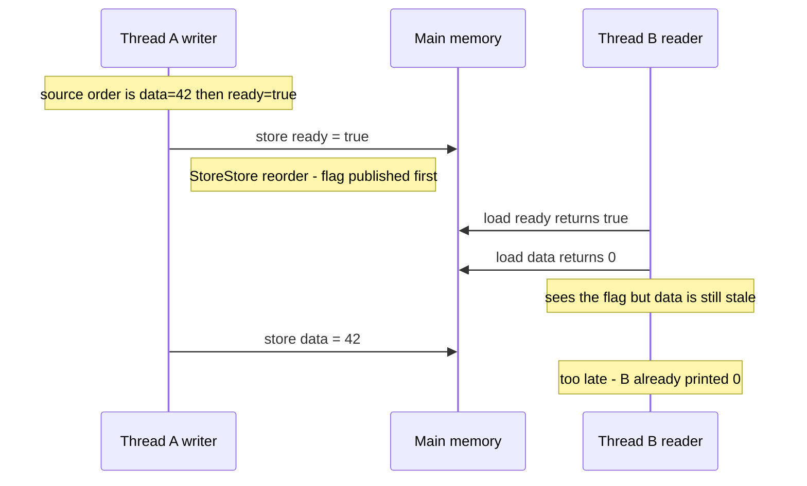
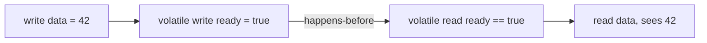

Your source code is a *suggestion*, not an execution order. The compiler, the JIT, and the CPU all
**reorder** memory operations for speed, as long as a **single thread** cannot tell. Across threads,
though, that reordering is visible — and a program with no locks can see writes land out of order. The
tool that tames it is the **happens-before** relationship.

## A publication that breaks

The classic bug: one thread writes data, then flips a plain `boolean` flag to announce it. Another
thread spins on the flag, then reads the data. It looks airtight:

```java
// Thread A (writer)              // Thread B (reader)
data = 42;        // (1)          while (!ready) { }   // (3) spin
ready = true;     // (2)          System.out.println(data);  // (4) -> can print 0
```

With no `volatile`, nothing orders `(1)` before `(2)`. The two stores are independent, so the CPU may
publish `ready` **before** `data` — and B sees the flag flip while `data` is still `0`:



There is no lost update and no torn read here — every individual write is fine. The bug is purely
**ordering and visibility**: B observed A's writes in a different order than A issued them.

## Happens-before: the ordering contract

**Happens-before** is the Java Memory Model's guarantee: *if action X happens-before action Y, then all
of X's memory effects are visible to and ordered before Y.* No happens-before edge between two threads
means **no guarantee** about what one sees of the other. The edges you must know:

- **Program order** — within one thread, each action happens-before the next.
- **Monitor** — unlocking a monitor happens-before any later lock of the *same* monitor.
- **Volatile** — a write to a volatile field happens-before every later read of that field.
- **Thread lifecycle** — `Thread.start()` happens-before the thread's actions; a thread's actions
  happen-before another thread returning from its `join()`.
- **Final fields** — the end of a constructor happens-before a read of a `final` field of a
  properly-constructed object.

Crucially, happens-before is **transitive**. Make `ready` volatile and the chain closes:



`data = 42` is before the volatile write (program order); the volatile write is before the volatile
read (volatile rule); the read of `data` is after (program order). By transitivity, `data = 42`
happens-before `read data` — so B is guaranteed to see `42`.

## Acquire, release, and the fences

A volatile access is really a pair of **one-way barriers**:

- A **volatile write is a *release***: no earlier read or write may move *below* it. It **publishes**
  everything that came before. Implemented with **LoadStore + StoreStore** fences before the store.
- A **volatile read is an *acquire***: no later read or write may move *above* it. It **sees**
  everything published before the matching release. Implemented with **LoadLoad + LoadStore** fences
  after the load.

Together, release/acquire is exactly what the flag needed. `final` fields give a lighter guarantee: a
**freeze** at the end of the constructor so that any thread seeing the reference sees the initialized
finals — which is why **immutable objects are safe to publish without synchronization**.

````tabs
tabs:
  - label: Broken — plain flag
    body: |
      No happens-before edge, so the reader may see `ready` before `data`.
      ```java
      boolean ready;  int data;
      // writer: data = 42; ready = true;      <- stores can reorder
      // reader: while (!ready) {}  use(data)  <- may read data == 0
      ```
  - label: Fixed — volatile
    body: |
      The volatile write (release) publishes `data`; the volatile read (acquire) sees it.
      ```java
      volatile boolean ready;  int data;
      // writer: data = 42; ready = true;      // release: data flushed first
      // reader: while (!ready) {}  use(data)  // acquire: data is guaranteed 42
      ```
  - label: Fixed — final / immutable
    body: |
      Publish an immutable object; final-field semantics make it safe with no volatile.
      ```java
      final class Msg { final int data; Msg(int d) { data = d; } }
      // writer: shared = new Msg(42);   // finals frozen at end of constructor
      // reader: Msg m = shared; if (m != null) use(m.data);  // sees 42
      ```
````

:::gotcha
`volatile` guarantees **ordering and visibility, not atomicity**. `volatile int n; n++;` is still a
read-modify-write and still races — the flag pattern works only because there is a *single writer* and
the reader merely observes. For a multi-writer counter you need `AtomicInteger` or a lock.
:::

:::senior
Not all fences cost the same. x86 is strongly ordered and gives **StoreStore, LoadLoad, and LoadStore
for free**; only **StoreLoad** (a store must be globally visible before a later load) needs a real
barrier — an `mfence` or a lock-prefixed instruction. That is why a volatile *write* is markedly more
expensive than a volatile *read* on x86: the write needs the StoreLoad fence, the read does not. The
same StoreLoad cost is baked into every CAS. On weakly-ordered ARM, *all* four fences cost something,
which is why lock-free code is harder to get right — and slower — there.
:::

## Check yourself

```quiz
title: Reordering and fences check
questions:
  - q: 'What does a happens-before edge from X to Y guarantee?'
    options:
      - text: 'All of X''s memory writes are visible to and ordered before Y'
        correct: true
      - 'X and Y execute on the same CPU core'
      - 'X runs at an earlier wall-clock time than Y'
    explain: 'Happens-before is about visibility and ordering of memory effects, not wall-clock timing or core assignment. Without such an edge there is no guarantee.'
  - q: 'Why can the plain `data` then `ready = true` pattern print stale data?'
    options:
      - text: 'Without volatile the two stores can be reordered or made visible out of order, so the reader sees ready=true before data is written'
        correct: true
      - 'Because boolean writes are not atomic'
      - 'Because the reader thread was given a higher priority'
    explain: 'The stores are independent, so with no happens-before edge the flag can be published before the data, letting the reader observe a stale value.'
  - q: 'A volatile write acts as which kind of memory barrier?'
    options:
      - text: 'A release — no earlier read or write may move after it, so it publishes everything before it'
        correct: true
      - 'An acquire — no later read or write may move before it'
      - 'No barrier at all; volatile only affects the compiler'
    explain: 'A volatile write is a release (StoreStore before it); the matching volatile read is an acquire. Together they form the happens-before edge.'
```

:::key
Hardware and compilers **reorder** memory ops; across threads that reordering breaks naive publication.
**Happens-before** is the contract that fixes it: a **volatile write (release)** publishes everything
before it, a **volatile read (acquire)** sees it, and the edge is **transitive**. `final` fields give
safe publication of immutable objects for free. Remember `volatile` orders but does **not** make
`n++` atomic — and the **StoreLoad** fence is the expensive one.
:::
