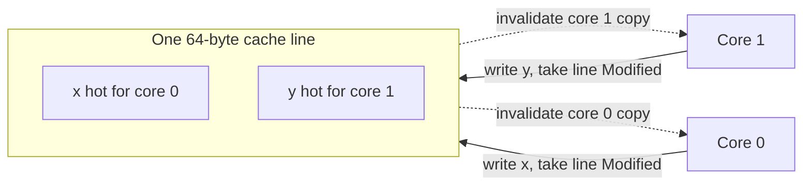
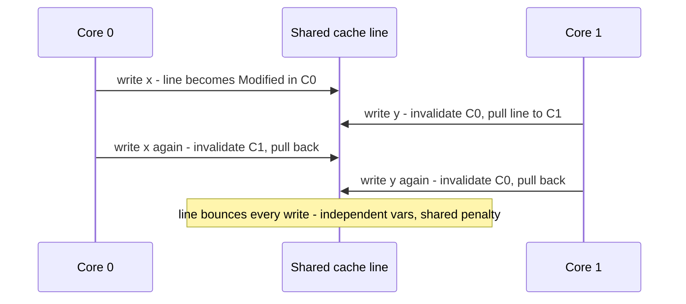

**False sharing** is a performance bug where two threads write two **completely independent** variables
that happen to live in the same **CPU cache line** — so the hardware treats them as shared even though
your program does not. The result is a silent throughput collapse with no correctness symptom at all.

## Caches trade in lines, not variables

CPUs do not move individual bytes between cores — they move whole **cache lines**, typically **64
bytes**. Coherence protocols like **MESI** keep those lines consistent: when any core writes to a
line, every *other* core's copy of that line is marked **Invalid** and must be re-fetched.

Now put two hot variables `x` and `y` in the same 64-byte line. Core 0 hammers `x`, core 1 hammers
`y`. They never touch the *same* variable — but they fight over the *same line*:



Each write steals the line into the writer's cache as *Modified* and invalidates the other core's copy.
So the line **ping-pongs** across the interconnect on every single write:



There is **no logical sharing** — `x` and `y` are unrelated — yet performance is as bad as if the two
threads were contending on one variable. Adding threads makes it *worse*, not better: the tell-tale
sign is a parallel program that scales *negatively*.

## Fixing it — give each hot field its own line

The cure is to guarantee the contended fields land on **separate cache lines** so a write to one never
invalidates the other:

````tabs
tabs:
  - label: Manual padding
    body: |
      Surround the hot field with enough dead bytes to fill a 64-byte line. Classic, but fragile — the
      JVM's field-layout may reorder or repack the fields, so the padding may not sit beside the hot field as intended.
      ```java
      class PaddedCounter {
        volatile long value;             // 8 bytes
        long p1, p2, p3, p4, p5, p6, p7; // 56 bytes of padding -> own 64-byte line
      }
      ```
  - label: "@Contended"
    body: |
      Let the JVM insert the padding for you — the intent is explicit and the JIT will not drop it.
      ```java
      import jdk.internal.vm.annotation.Contended;

      class Counters {
        @Contended volatile long a;   // JVM pads a onto its own line
        @Contended volatile long b;   // and b onto another
      }
      // needs -XX:-RestrictContended to honor it outside the JDK
      ```
  - label: LongAdder
    body: |
      Sidestep it entirely: `LongAdder` keeps multiple internal `Cell`s, each already `@Contended`,
      so concurrent increments hit *different* lines and rarely collide.
      ```java
      LongAdder hits = new LongAdder();
      hits.increment();          // striped across padded Cells
      long total = hits.sum();   // combine when you need the value
      ```
````

The JDK uses `@Contended` heavily in exactly the hot spots you would guess: the `Cell`s inside
`LongAdder`/`Striped64`, and the fork-join work-stealing queues.

:::gotcha
False sharing is **invisible in the source** — `x` and `y` look totally unrelated, so no code review
catches it; it shows up only as a mysterious performance cliff. A classic trap is a `long[] counters`
with one slot per thread: adjacent elements pack into the same line, so "per-thread" counters silently
false-share. You must **pad the stride**, not just split the variable.
:::

:::senior
Do not pad blindly. `@Contended` reserves **128 bytes** by default (`-XX:ContendedPaddingWidth`),
not 64 — deliberately over-padding to defend against the CPU's **adjacent-line prefetcher** pulling in
the neighbor. That is real memory and cache footprint per field, so padding *every* field is
counterproductive: it evicts other useful data and wrecks locality. Pad only the demonstrably hot,
independently-written fields — ideally after `perf c2c` (or a HITM-heavy profile) has *proven* the
false sharing exists. Fields that are always read together should stay packed.
:::

## Check yourself

```quiz
title: False sharing check
questions:
  - q: 'What is false sharing?'
    options:
      - text: 'Two independent variables share one cache line, so writing either invalidates the line in the other core''s cache'
        correct: true
      - 'Two threads writing the same variable with no lock'
      - 'Sharing a variable between two operating-system processes'
    explain: 'The variables are logically unrelated, but because they occupy the same 64-byte line the coherence protocol bounces the line between cores on every write.'
  - q: 'Which reliably eliminates false sharing on a hot counter field?'
    options:
      - text: 'Pad the field so it occupies its own cache line, e.g. with @Contended'
        correct: true
      - 'Mark the field volatile'
      - 'Raise the writing thread''s priority'
    explain: 'Separating the field onto its own line stops writes to neighbors from invalidating it. Volatile changes ordering, not layout, and does nothing for false sharing.'
  - q: 'Why does LongAdder scale better than a single AtomicLong under heavy write contention?'
    options:
      - text: 'It spreads increments across multiple padded Cells, so threads rarely touch the same cache line'
        correct: true
      - 'It avoids using CAS entirely'
      - 'It stores the total in one volatile long with no contention'
    explain: 'LongAdder stripes across several @Contended cells summed on read, so concurrent writers hit different lines instead of fighting over one hot location.'
```

:::key
**False sharing** = independent variables sharing one **64-byte cache line**, so MESI invalidations
ping-pong the line between cores on every write — a throughput collapse with no correctness bug and no
visible cause. Fix it by placing hot, independently-written fields on **separate lines**: manual
padding, **`@Contended`**, or reach for **`LongAdder`**, which stripes across padded cells for you.
Pad the truly hot fields only — over-padding wastes cache.
:::
