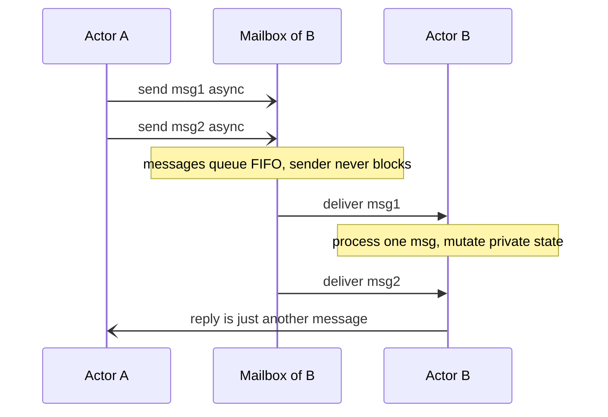
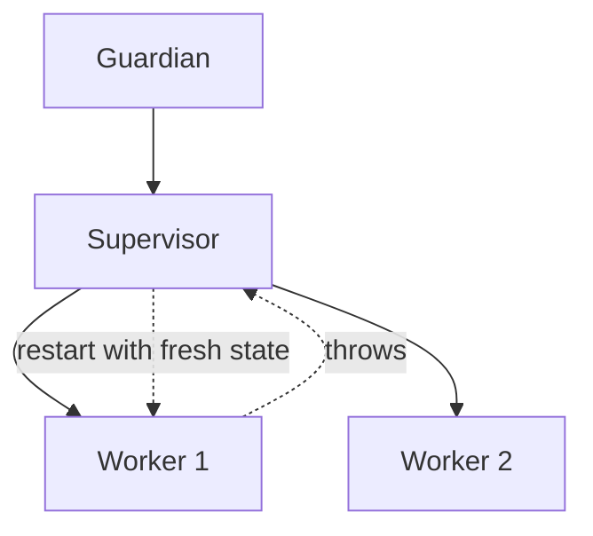

The **actor model** throws out shared memory entirely. An **actor** is a unit of state and behavior that
is completely isolated: it exposes *no* fields, only a **mailbox**. Other actors affect it solely by
sending **asynchronous messages**, and it processes those messages **one at a time**. Because only the
actor ever touches its own state, and only ever from that single-at-a-time loop, **there is nothing to
lock**.

## Actors passing messages

The sender drops a message into the recipient's mailbox and moves on — it never blocks, never waits, and
never reaches into the recipient's memory. A reply is just another message going the other way.



Two guarantees make this safe without locks: **isolation** (state is private to the actor) and
**serial processing** (one message at a time). A race needs two threads touching one piece of state at
once — an actor structurally makes that impossible.

## Lock-based vs actor-based

Compare a shared counter guarded by a lock with the same counter as an actor:

````tabs
tabs:
  - label: Shared state + lock
    body: |
      ```java
      class Counter {
        private int n = 0;
        synchronized void inc() { n++; }        // every caller contends on the monitor
        synchronized int get() { return n; }
      }
      ```
      Threads share the object and **block** on the monitor. Correct, but you must remember to lock every access, and contention becomes a bottleneck.
  - label: Actor (Akka Typed sketch)
    body: |
      ```java
      interface Cmd {}
      enum Inc implements Cmd { INSTANCE }
      record Get(ActorRef<Integer> replyTo) implements Cmd {}

      static Behavior<Cmd> counter(int n) {
        return Behaviors.receive(Cmd.class)
          .onMessage(Inc.class, m -> counter(n + 1))          // new state, no lock
          .onMessage(Get.class, m -> { m.replyTo().tell(n); return Behaviors.same(); })
          .build();
      }
      ```
      The count lives *inside* the actor and changes only by handling a message. No `synchronized`, no shared reference — senders just `tell(Inc.INSTANCE)`.
````

## Supervision — "let it crash"

Actors form a **hierarchy**: a parent *supervises* its children. When a child throws, it doesn't corrupt
shared state (there is none) — the supervisor decides to **restart**, **stop**, or **escalate**. State is
rebuilt from a known-good starting point instead of smeared with defensive `try/catch`.



This is the Erlang/OTP philosophy behind telecom systems with famous nine-nines uptime, and it carries
straight into Akka on the JVM.

:::gotcha
**Unbounded mailboxes hide backpressure.** Sends are async and, by default, mailboxes grow without limit.
If a slow actor receives faster than it processes, its mailbox balloons until you `OutOfMemoryError`. Also
never do a **blocking** call (JDBC, `Thread.sleep`) inside an actor on the default dispatcher — it ties up
a shared dispatcher thread and starves every other actor. Use a bounded mailbox and a dedicated blocking
dispatcher.
:::

:::senior
Message ordering is only guaranteed **pairwise**: messages from A to B arrive in send order, but there is
**no global ordering** across different senders, and delivery is at-most-once by default. So an actor must
be written as a state machine that tolerates interleaved messages from many peers — you trade lock-based
reasoning for protocol/ordering reasoning. That is the actor model's real cost, not its syntax.
:::

## Check yourself

```quiz
title: Actor model check
questions:
  - q: 'Why does an actor never need a lock to protect its own state?'
    options:
      - text: 'Its state is private and it processes only one message at a time'
        correct: true
      - 'Actors run on a single OS thread globally'
      - 'The runtime locks each actor automatically before delivery'
    explain: 'A data race requires concurrent access to shared state. An actor keeps state private and handles one message at a time, so no two threads ever touch it at once.'
  - q: 'What does "let it crash" supervision give you over defensive try/catch everywhere?'
    options:
      - 'Faster message delivery'
      - text: 'A failed actor is restarted from known-good state by its supervisor, isolating the failure'
        correct: true
      - 'Guaranteed exactly-once message delivery'
    explain: 'Because actors share no state, a crash can be contained: the supervisor restarts the child from a clean initial state instead of every method guarding against corruption.'
  - q: 'What is a real risk of the actor model''s asynchronous, unbounded mailboxes?'
    options:
      - 'Deadlock from lock ordering'
      - text: 'A slow actor''s mailbox grows without bound and exhausts memory'
        correct: true
      - 'Torn reads of the actor''s fields'
    explain: 'Async sends never block the sender, so if messages arrive faster than they are processed, an unbounded mailbox keeps growing — you need bounded mailboxes and backpressure.'
```

:::key
The **actor model** = isolated state + async messages + a **mailbox** processed **one message at a time**.
That structurally eliminates data races without locks (Erlang, Akka). **Supervision** hierarchies turn
failures into restarts from clean state. The costs move to **protocol design**: no global message
ordering and unbounded mailboxes that need backpressure.
:::
