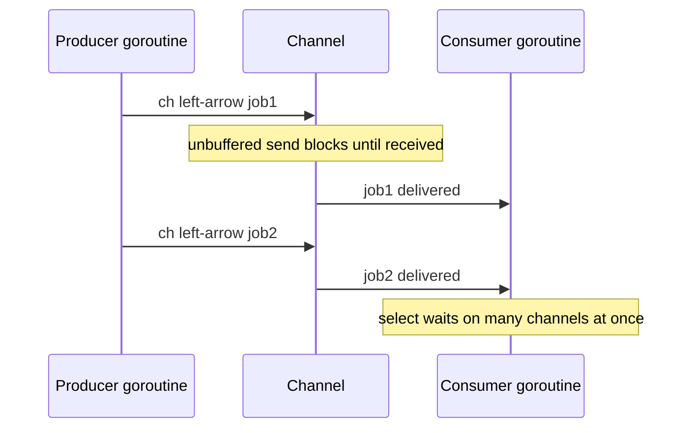

**CSP** — Communicating Sequential Processes, Tony Hoare's model, popularized by **Go** — is the actor
model's close cousin. Independent processes (Go calls them **goroutines**) run concurrently and coordinate
by passing values over **channels**: typed, usually *anonymous* conduits. Its slogan sums up the whole
philosophy: **"Don't communicate by sharing memory; share memory by communicating."**

## Goroutines over a channel

Instead of guarding a shared variable with a lock, one goroutine *hands the value* to another through a
channel. On an **unbuffered** channel the send blocks until a receiver is ready — a synchronous handoff.



A short Go sketch, with `select` multiplexing a result against a timeout:

```go
ch := make(chan int)              // unbuffered channel
go func() { ch <- compute() }()   // a goroutine sends into it

select {                          // wait on whichever is ready first
case v := <-ch:
    use(v)                        // received a value
case <-time.After(time.Second):
    timeout()                     // nothing arrived in time — bail out
}
```

## Actors vs CSP — where do you address the message?

They look alike; the difference is *what you name*. An actor message is addressed to a **named actor**
(you hold its reference); a CSP message is put onto an **anonymous channel** that senders and receivers
share but that belongs to neither.

| | Actor model | CSP |
|--|--|--|
| Addressed to | a **named actor** and its mailbox | an **anonymous channel** |
| Coupling | sender must know the recipient | sender and receiver decoupled by the channel |
| Buffering | mailbox, usually unbounded | channel, often unbuffered or small-bounded |
| Sync | async send, never blocks | unbuffered send **blocks** until received |
| Homes | Erlang, Akka | Go, Clojure core.async, occam |

## The Java analog

Java has no goroutines, but a `BlockingQueue` *is* a channel, and Java 21 virtual threads make spawning
"goroutine-like" tasks cheap:

````tabs
tabs:
  - label: Unbuffered vs buffered
    body: |
      ```go
      unbuf := make(chan int)      // handoff: send blocks until a receiver takes it
      buf   := make(chan int, 100) // send returns while there is spare capacity
      ```
      Unbuffered gives you a rendezvous and natural backpressure; a buffer decouples producer and consumer up to its size.
  - label: Java channels
    body: |
      ```java
      // SynchronousQueue == unbuffered channel; ArrayBlockingQueue == buffered
      BlockingQueue<Task> ch = new SynchronousQueue<>();
      ch.put(task);            // blocks until a consumer take()s   (like ch <- task)
      Task t = ch.take();      // blocks until a producer put()s    (like <-ch)
      ```
      With virtual threads you can run one blocking consumer per task without a thread-pool budget — the closest Java gets to the CSP style.
````

:::gotcha
**An unmatched send is a deadlock, not an error.** Sending on an unbuffered channel with no receiver
blocks that goroutine **forever** — a silent goroutine leak. Worse: sending on a *closed* channel
**panics**, and `range`-ing a channel that is never closed hangs. In Java terms, a `put()` on a
`SynchronousQueue` with no `take()` parks the producer indefinitely. Always know who closes the channel.
:::

:::senior
`select` is the real power tool: one goroutine can multiplex many channels — fan-in results, race a
timeout, or watch a cancellation channel (Go's `context.Context`). And **unbuffered channels give
backpressure for free** — a fast producer blocks when the consumer lags, so the system self-throttles.
An actor's unbounded mailbox does *not* do this, which is exactly why choosing a channel's buffer size is
a deliberate design decision, not a detail.
:::

## Check yourself

```quiz
title: CSP and channels check
questions:
  - q: 'What does "share memory by communicating" mean in CSP?'
    options:
      - text: 'Pass values between processes over channels instead of guarding shared variables with locks'
        correct: true
      - 'Put all shared state in one global lock'
      - 'Use shared memory but only from the main goroutine'
    explain: 'CSP replaces lock-guarded shared state with message passing: ownership of a value moves through a channel, so only one goroutine holds it at a time.'
  - q: 'The key structural difference between an actor and a CSP channel is:'
    options:
      - 'Actors are faster than channels'
      - text: 'An actor message targets a named actor''s mailbox; a channel is anonymous and shared'
        correct: true
      - 'Channels guarantee exactly-once delivery, actors do not'
    explain: 'You send to a specific actor you hold a reference to, whereas a channel is an anonymous conduit that decouples senders from receivers.'
  - q: 'What happens when a goroutine sends on an unbuffered channel with no receiver?'
    options:
      - 'The value is dropped silently'
      - text: 'The send blocks forever — a goroutine leak / deadlock'
        correct: true
      - 'It returns an error code you can check'
    explain: 'An unbuffered send is a rendezvous; with no receiver ever ready, that goroutine blocks indefinitely, leaking it.'
```

:::key
**CSP** coordinates goroutines through typed, usually **anonymous channels** — *share memory by
communicating*. Unbuffered channels are synchronous handoffs that give **backpressure** for free;
**`select`** multiplexes channels for fan-in, timeouts, and cancellation. Versus actors: CSP names the
**channel**, actors name the **recipient**. Java's analog is `BlockingQueue` + virtual threads.
:::
