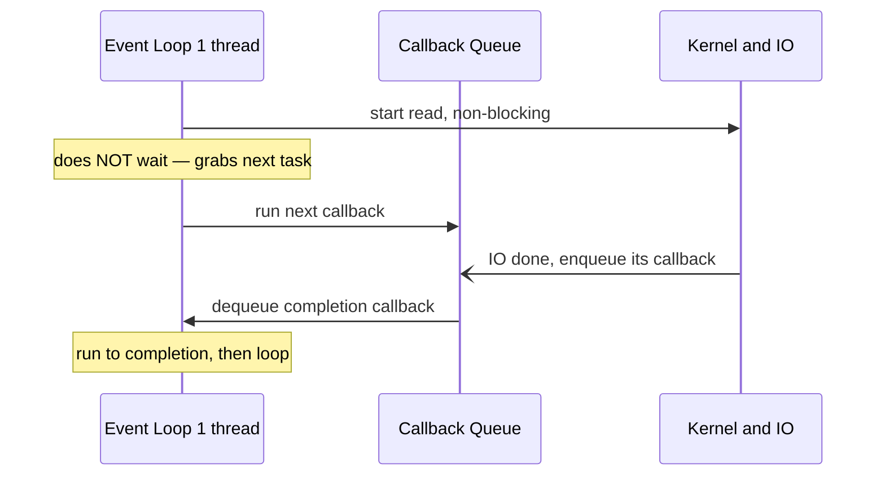

The **event loop** model gets massive I/O concurrency out of a **single thread**. That thread never
blocks: it pulls a **callback** off a queue, runs it to completion, and loops. Slow work — a disk read, a
network call — is handed to the OS/kernel, and its *completion* comes back later as another queued
callback. This is the **JavaScript/Node.js** model, and also how Java's Netty, NIO selectors, and reactive
stacks work under the hood.

## One thread draining a queue

The loop's rule is **run-to-completion**: each callback runs uninterrupted, then the loop picks the next.
Nothing preempts a callback, so within one callback you never see a race — but a callback that takes too
long freezes everything behind it.



Step through the queue to see why one heavy task is fatal:

```walkthrough
title: The single-threaded loop draining callbacks
code: |
  socket.on('data', cb1);   // fast handler
  fs.readFile(f, cb2);      // async IO, non-blocking
  hashPasswordSync(cb3);    // CPU-heavy, synchronous
steps:
  - text: 'The queue holds three ready callbacks. The single loop thread is about to start.'
    array: ['cb1', 'cb2', 'cb3']
    pointers: { 0: 'next' }
    line: 1
  - text: '**Run cb1.** It finishes fast and kicks off an async socket read handed to the kernel.'
    array: ['cb2', 'cb3', 'io']
    highlight: [2]
    pointers: { 0: 'next', 2: 'pending IO' }
    line: 1
  - text: '**Run cb2.** The loop does *not* wait for its file IO — that is off in the kernel. It returns quickly.'
    array: ['cb3', 'io']
    highlight: [1]
    pointers: { 0: 'next', 1: 'pending IO' }
    line: 2
  - text: 'The socket IO completes; the kernel **enqueues** its continuation at the back. Concurrency without extra threads.'
    array: ['cb3', 'io-done']
    highlight: [1]
    pointers: { 0: 'next' }
    line: 2
  - text: '**Run cb3 — the CPU-heavy one.** It runs for 400ms straight. The loop is **blocked**; nothing else can run.'
    array: ['io-done', 'STUCK']
    highlight: [1]
    pointers: { 1: 'loop frozen' }
    line: 3
  - text: 'Every other client waits behind cb3. One slow callback stalled the whole server — that is the cardinal sin.'
    array: ['io-done']
    highlight: [0]
    pointers: { 0: 'starved' }
    line: 3
  - text: '**Fix:** offload CPU work to a worker thread and let it post the result back as a callback. The loop stays responsive.'
    array: ['io-done', 'result']
    sorted: [0, 1]
    pointers: { 1: 'from worker' }
    line: 3
```

## Callbacks to promises to async/await

The model stayed the same; the *syntax* for chaining callbacks got much nicer:

````tabs
tabs:
  - label: Callbacks
    body: |
      ```js
      readFile('a', (e, a) =>
        readFile('b', (e, b) =>
          write(a + b, (e) => done())));   // "callback hell" — nesting deepens
      ```
      The event-loop truth is here, but composition and error handling are painful.
  - label: Promises / async-await
    body: |
      ```js
      async function join() {
        const a = await readFile('a');   // yields to the loop while IO runs
        const b = await readFile('b');
        return a + b;                    // reads like blocking code, runs async
      }
      ```
      `await` suspends the function and *returns control to the loop*; the continuation is re-queued when the promise settles. Same loop, linear code.
  - label: Java equivalent
    body: |
      ```java
      CompletableFuture
        .supplyAsync(() -> readA())
        .thenCombine(supplyAsync(() -> readB()), (a, b) -> a + b)
        .thenAccept(App::use);           // non-blocking composition on a pool
      ```
      `CompletableFuture` and reactive libraries (Reactor, RxJava) bring the same non-blocking, callback-completion style to the JVM.
````

:::gotcha
**Blocking the loop stalls the entire process.** With one thread, a long synchronous loop, a giant
`JSON.parse`, a sync crypto hash, or an accidental `while(true)` freezes *every* connection at once —
there is no other thread to make progress. Move CPU-bound work to `worker_threads` / a thread pool, and
never call synchronous/blocking APIs on the loop.
:::

:::senior
The event loop buys **concurrency, not parallelism**: one core juggling tens of thousands of sockets, but
zero CPU parallelism. Scale CPU with *multiple* loops — Node's `cluster`, one process per core — or worker
threads, not by "adding threads" to a loop that has exactly one. **Reactive streams** add the missing
piece, **backpressure**, so a fast producer can't flood a slow consumer. And note where the industry is
going: Java **virtual threads** give you loop-like scalability while letting you write plain *blocking*
code — no callback coloring at all.
:::

## Check yourself

```quiz
title: Event loop check
questions:
  - q: 'How does a single-threaded event loop serve thousands of connections at once?'
    options:
      - text: 'It offloads IO to the kernel and processes completion callbacks from a queue without blocking'
        correct: true
      - 'It secretly spawns one thread per connection'
      - 'It polls every socket in a busy loop'
    explain: 'Blocking IO is delegated to the OS; when it completes, a callback is queued. The loop just drains ready callbacks, so one thread interleaves many connections.'
  - q: 'What happens if a callback runs a 500ms CPU-bound computation on the event loop?'
    options:
      - 'The runtime moves it to another thread automatically'
      - text: 'Every other queued callback is blocked for 500ms — the whole server stalls'
        correct: true
      - 'Only that one connection is delayed'
    explain: 'Callbacks run to completion on the single loop thread. A long synchronous task blocks the loop, so all pending work waits behind it.'
  - q: 'What does `await` actually do to the event loop?'
    options:
      - 'Blocks the loop thread until the promise resolves'
      - text: 'Suspends the async function and returns control to the loop; the continuation is re-queued when the promise settles'
        correct: true
      - 'Starts a new OS thread for the awaited work'
    explain: 'await is non-blocking: it yields to the loop so other callbacks run, then schedules the rest of the function to resume once the awaited promise settles.'
```

:::key
The **event loop** is one thread draining a **callback queue**, run-to-completion, with blocking IO pushed
to the kernel — huge I/O **concurrency** on a single core. **Promises/async-await** are nicer syntax over
the same loop. The cardinal sin is **blocking the loop** with CPU work; offload it to workers. It gives
concurrency, not parallelism — scale with multiple loops or virtual threads.
:::
