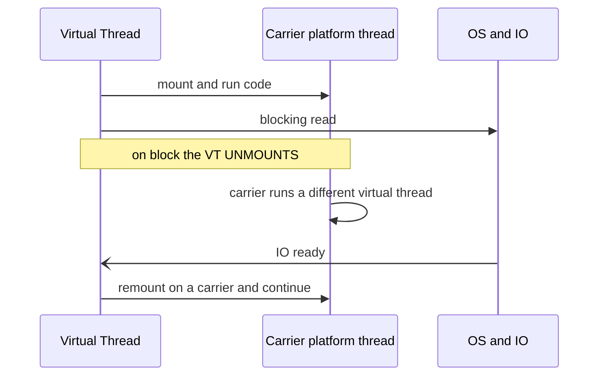

Every runtime answers two questions differently: **how cheap is a "thread,"** and **does blocking or CPU
work actually run in parallel?** Four models — Java **platform threads**, Java 21 **virtual threads**
(Project Loom), **Go goroutines**, and Python's **GIL** — give four very different answers, and one of them
famously can't parallelize CPU at all.

## The runtimes, side by side

| Runtime | Mapping | Cost / how many | Blocking a "thread" | CPU parallelism |
|--|--|--|--|--|
| **Java platform thread** | 1:1 with an OS thread | ~1 MB stack — **thousands** | Blocks the whole OS thread | **Yes**, across cores |
| **Java virtual thread** (Loom) | M:N on carrier threads | ~few hundred bytes — **millions** | Cheap — **unmounts** its carrier | **Yes**, via the carrier pool |
| **Go goroutine** | M:N on OS threads | ~2 KB start, grows — **millions** | Cheap — scheduler **parks** it | **Yes**, up to `GOMAXPROCS` |
| **Python thread** (CPython) | 1:1 with an OS thread | OS-cost — **thousands** | Releases the GIL on IO | **No** — the **GIL** serializes bytecode |

The headline: virtual threads and goroutines make a "thread" so cheap you spawn **one per task** and just
write blocking code. CPython threads are real OS threads, but the **Global Interpreter Lock** lets only one
run Python bytecode at a time, so they never speed up CPU-bound work.

## How a virtual thread blocks cheaply

A virtual thread runs by **mounting** onto a **carrier** (a real platform thread). When it hits a blocking
call, Loom **unmounts** it — the virtual thread's stack is parked on the heap and the carrier is freed to
run some *other* virtual thread. When the IO is ready, the virtual thread remounts and continues. Blocking
costs a park, not a held OS thread.



## Spawning a thread per task

The whole point: stop pooling scarce threads and just make one per task.

````tabs
tabs:
  - label: Java platform threads
    body: |
      ```java
      // Threads are scarce: a bounded pool, and blocking calls hog its threads
      ExecutorService pool = Executors.newFixedThreadPool(200);
      pool.submit(() -> handleBlocking(req));   // only 200 in flight at once
      ```
      Each blocked task holds a ~1 MB OS thread, so you cap the pool and fight over it.
  - label: Java virtual threads
    body: |
      ```java
      // One virtual thread per task; blocking is fine — millions can be in flight
      try (var exec = Executors.newVirtualThreadPerTaskExecutor()) {
        for (var req : requests) exec.submit(() -> handleBlocking(req));
      }
      ```
      Same blocking code, no pool budget. Loom multiplexes millions of them onto a handful of carriers.
  - label: Go goroutine
    body: |
      ```go
      for _, req := range requests {
        go handleBlocking(req)   // ~2 KB each; the runtime schedules millions
      }
      ```
      The `go` keyword is Java's virtual-thread executor a decade earlier.
  - label: Python GIL
    body: |
      ```python
      # Threads DON'T speed up CPU work — the GIL serializes bytecode.
      from multiprocessing import Pool     # use processes for CPU parallelism
      with Pool() as p: p.map(cpu_task, data)
      ```
      Use `threading` for IO-bound waits, `multiprocessing` (or free-threaded 3.13+) for CPU.
````

:::gotcha
**Pinning** is when a virtual thread cannot unmount its carrier. Through **JDK 21–23** the usual cause was
blocking inside a `synchronized` block — but **JDK 24 (JEP 491) fixed that**, so `synchronized` no longer
pins. What *still* pins on current JDKs: blocking inside a **native method or foreign-function (FFM)
downcall**. Enough pinning exhausts the small carrier pool and you hit the platform-thread wall again. On
JDK 21–23 the workaround was a `ReentrantLock` instead of `synchronized`; from JDK 24 that is no longer
needed to avoid pinning. (The Python parallel gotcha: threads help IO-bound code but *never* CPU-bound
work — reach for processes.)
:::

:::senior
**Structured concurrency** (`StructuredTaskScope`, JDK 21+ preview) tames the chaos that ultra-cheap
threads invite. It treats a group of subtasks as one unit with a defined scope: the parent doesn't return
until all children finish, if one fails the siblings are **cancelled**, and errors propagate like a normal
call stack — no leaked, orphaned threads.
```java
try (var scope = new StructuredTaskScope.ShutdownOnFailure()) {
  var user  = scope.fork(() -> fetchUser(id));
  var order = scope.fork(() -> fetchOrder(id));
  scope.join().throwIfFailed();          // both done, or the whole scope fails
  return new Page(user.get(), order.get());
}
```
It's the disciplined answer to "cheap threads make fire-and-forget too easy" — Go reaches for `errgroup`
and `context` cancellation for the same reason. *(Still a preview: the `new StructuredTaskScope.ShutdownOnFailure()`
form shown is the JDK 21 shape; by JDK 25 the API moved to `StructuredTaskScope.open(...)` with configurable
**joiners** — same concept, evolving surface.)*
:::

## Check yourself

```quiz
title: Virtual threads and the GIL check
questions:
  - q: 'What is the key advantage of a Java 21 virtual thread over a platform thread?'
    options:
      - text: 'Blocking is cheap — it unmounts its carrier, so you can run millions concurrently'
        correct: true
      - 'It runs bytecode faster than a platform thread'
      - 'It bypasses the Java memory model'
    explain: 'Virtual threads are M:N scheduled onto carrier threads; a blocking call unmounts the virtual thread instead of holding an OS thread, so millions can be in flight with plain blocking code.'
  - q: 'Why do CPython threads fail to speed up a CPU-bound computation?'
    options:
      - 'Threads are simulated, not real OS threads'
      - text: 'The GIL lets only one thread execute Python bytecode at a time'
        correct: true
      - 'Python threads run at low OS priority'
    explain: 'CPython''s Global Interpreter Lock serializes bytecode execution, so threads interleave but never run Python code in parallel — use multiprocessing for CPU-bound work.'
  - q: 'On current JDKs (24+), what can still pin a virtual thread to its carrier?'
    options:
      - 'Blocking inside a `synchronized` block'
      - text: 'Blocking inside a native method or foreign-function (FFM) call'
        correct: true
      - 'Calling `Thread.sleep`'
    explain: 'JDK 24 (JEP 491) removed pinning by `synchronized`; native/FFM calls still pin because the runtime cannot unmount across a native frame. `Thread.sleep` unmounts the virtual thread normally.'
```

:::key
Cheap concurrency comes from **M:N scheduling**: Java **virtual threads** (Loom) and **Go goroutines**
multiplex millions of tasks onto a few OS threads, so you write blocking code without a pool. **Platform
threads** are 1:1 and scarce. Python threads are real but the **GIL** serializes bytecode — no CPU
parallelism (use processes). Watch **pinning** with `synchronized`, and use **structured concurrency** to
keep cheap threads from leaking.
:::
