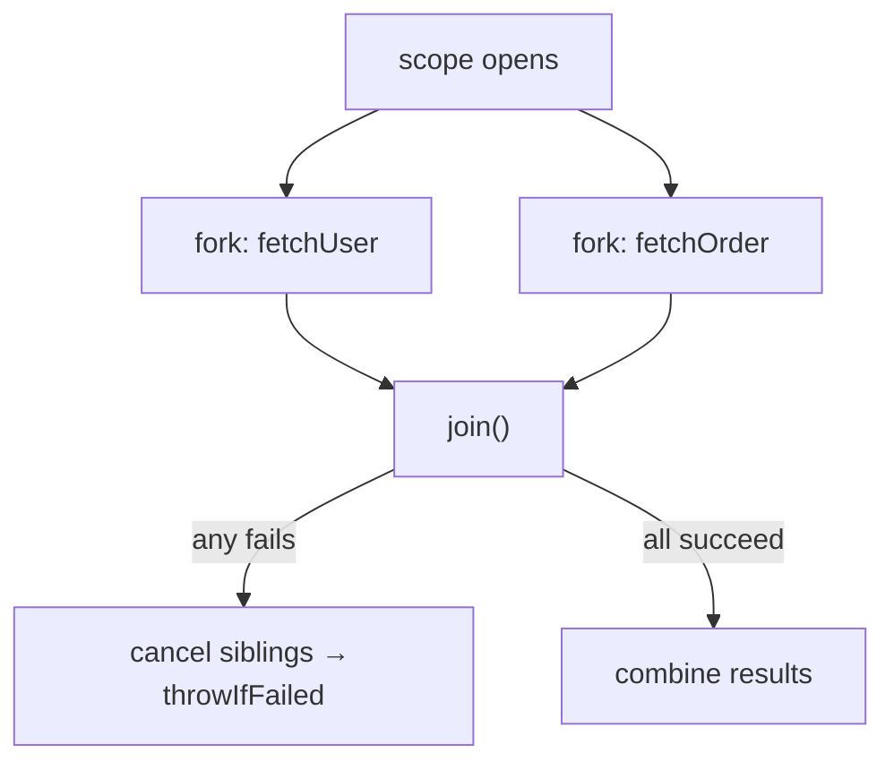

Firing tasks at a raw `ExecutorService` is **unstructured**: forks outlive the method that made them, a failure in one leaves its siblings running, and cancellation is manual bookkeeping. **Structured concurrency** (a preview feature through Java 21–25; JEP 505 is the fifth preview in JDK 25) fixes this by binding a group of subtasks to a **lexical scope** — they start together and are all done, or all cancelled, before the block exits.

## The problem it solves

```java
// Unstructured: if fetchOrder() throws, fetchUser() keeps running (a leak),
// and there is no automatic cancellation or single place to handle failure.
Future<User>  user  = executor.submit(() -> fetchUser(id));
Future<Order> order = executor.submit(() -> fetchOrder(id));
return new Response(user.get(), order.get());   // get() blocks; errors are tangled
```

## The structured version

`StructuredTaskScope` makes the fork/join lifetime explicit. `ShutdownOnFailure` **short-circuits**: the first subtask to fail cancels the others, and `join()` returns only when all have finished or been cancelled.

```java
try (var scope = new StructuredTaskScope.ShutdownOnFailure()) {
    Subtask<User>  user  = scope.fork(() -> fetchUser(id));   // each on its own virtual thread
    Subtask<Order> order = scope.fork(() -> fetchOrder(id));

    scope.join();             // wait for both
    scope.throwIfFailed();    // propagate the first failure, having cancelled the rest

    return new Response(user.get(), order.get());  // both succeeded
}   // scope closes → all subtasks guaranteed complete/cancelled
```

- **`ShutdownOnFailure`** — invoke-all semantics: need every result, abort on the first error.
- **`ShutdownOnSuccess`** — race semantics: take the **first** successful result, cancel the losers.



## Why now: virtual threads

Structured concurrency assumes threads are **cheap** — each subtask gets its own [virtual thread](/multithreading/topic/models/virtual-threads), so "one thread per task" scales to thousands of concurrent calls. The two features ship together: virtual threads make thread-per-task affordable; structured concurrency makes it *safe*.

:::gotcha
The whole point is **no leaks**: because the scope is a try-with-resources block, a subtask can never outlive it. Contrast the unstructured version, where an early `return` or exception silently abandons still-running `Future`s. If you find yourself passing an `ExecutorService` around and manually cancelling, you want a scope.
:::

:::senior
This is a **preview** feature and the exact API has been evolving across releases (the `ShutdownOnFailure`/`ShutdownOnSuccess` shape shown here is the widely-taught form; newer previews express the same idea through a configurable *joiner*). Interviewers care about the **concept** — task hierarchy that maps to code structure, giving reliable error propagation and cancellation — plus its pairing with virtual threads and [`ScopedValue`](/multithreading/topic/shared-state/threadlocal) for passing context down into subtasks. Name the concept confidently; note the API is finalizing.
:::

## Check yourself

```quiz
title: Structured concurrency check
questions:
  - q: 'What core problem does structured concurrency solve versus submitting to a raw ExecutorService?'
    options:
      - text: 'Subtasks are bound to a scope, so failure cancels siblings and no task can outlive the block — reliable error handling and no leaks'
        correct: true
      - 'It makes tasks run faster on one core'
      - 'It removes the need for any threads'
    explain: 'Unstructured forks can leak past the method and require manual cancellation. A StructuredTaskScope ties the subtasks lifetime to a lexical block with automatic propagation and cancellation.'
  - q: 'ShutdownOnFailure vs ShutdownOnSuccess — what is the difference?'
    options:
      - text: 'OnFailure needs all results and aborts on the first error; OnSuccess races and takes the first success, cancelling the rest'
        correct: true
      - 'OnFailure ignores errors; OnSuccess ignores successes'
      - 'They are aliases for the same policy'
    explain: 'OnFailure is invoke-all (fail fast); OnSuccess is invoke-any (first winner), each cancelling the now-unneeded siblings.'
  - q: 'Why does structured concurrency pair naturally with virtual threads?'
    options:
      - text: 'Cheap virtual threads make one-thread-per-subtask scale, and the scope makes that safe'
        correct: true
      - 'Virtual threads are required to compile the code'
      - 'It disables the platform thread pool'
    explain: 'Each subtask runs on its own virtual thread; because those are lightweight, thread-per-task is affordable, and the scope provides the safety (cancellation, error propagation).'
```

:::key
**Structured concurrency** binds a group of subtasks to a lexical scope (`StructuredTaskScope`): they finish or are cancelled together, so errors propagate and nothing leaks. `ShutdownOnFailure` = need-all/fail-fast; `ShutdownOnSuccess` = first-winner. It's the safe partner to **virtual threads** (thread-per-task) and uses **`ScopedValue`** for context — a preview API whose concept matters more than its finalizing surface.
:::
