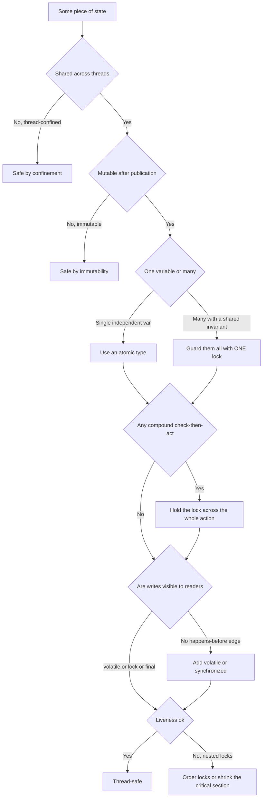

Interviewers rarely ask "recite the memory model." They hand you a snippet and ask **"is this
thread-safe?"** The winning move is not a memorized answer but a **repeatable method**: locate the
state, decide whether it is shared and mutable, pick the cheapest strategy that protects it, then
check the two things beginners forget — **compound actions** and **visibility** — before finally
reasoning about **liveness**. This module is the checklist you run in your head, out loud.

## The decision tree

Walk every field through these questions in order. The first "safe" exit wins; if you reach the
bottom you must pick and defend a strategy.



The four strategies in the middle row, cheapest first — **you always prefer the one higher up**,
because a lock you never take can never deadlock:

````tabs
tabs:
  - label: Confinement
    body: |
      If the state never escapes one thread, no synchronization is needed. Local variables are
      **stack-confined** for free; `ThreadLocal` gives one instance per thread.
      ```java
      void process() {
          List<Row> batch = new ArrayList<>(); // local: one per call, never shared
          load(batch);
          write(batch);
      }
      // Per-thread instance of a non-thread-safe helper:
      static final ThreadLocal<SimpleDateFormat> FMT =
          ThreadLocal.withInitial(() -> new SimpleDateFormat("yyyy-MM-dd"));
      ```
  - label: Immutability
    body: |
      An object that never changes after safe construction is thread-safe with **zero** locking.
      Final class, final fields, no setters, defensive copies of any mutable inputs.
      ```java
      final class Point {
          private final int x, y;
          Point(int x, int y) { this.x = x; this.y = y; }
          Point moveBy(int dx, int dy) { return new Point(x + dx, y + dy); } // returns a new one
      }
      ```
  - label: Atomic
    body: |
      For a **single** independent variable, a lock-free atomic does read-modify-write in one
      hardware step — no blocking. Publish a whole immutable snapshot with `AtomicReference`.
      ```java
      AtomicLong hits = new AtomicLong();
      hits.incrementAndGet();                 // atomic ++

      AtomicReference<Config> cfg = new AtomicReference<>(initial);
      cfg.set(newImmutableConfig);            // swap a fresh snapshot atomically
      ```
  - label: Lock
    body: |
      When an invariant spans **several** variables, one lock must guard all of them so no thread
      sees a half-updated set.
      ```java
      private final Object lock = new Object();
      private int low, high;                  // invariant: low <= high
      void setRange(int l, int h) {
          synchronized (lock) { low = l; high = h; } // both under the same lock
      }
      ```
````

## Run the framework on a real snippet

A page-hit counter servlet. One servlet instance serves every request, so its fields are shared
across request threads. Watch the six checkpoints resolve:

```walkthrough
title: Is this HitServlet thread-safe
code: |
  class HitServlet {
    private long hits;                 // field
    void service() { hits++; }         // read-modify-write
    long getHits() { return hits; }
  }
steps:
  - text: 'Six checkpoints, all unresolved. The state in question is the field `hits`.'
    array: ['?', '?', '?', '?', '?', '?']
    pointers: { 0: 'shared', 1: 'mutable', 2: 'strategy', 3: 'compound', 4: 'visible', 5: 'live' }
    line: 2
  - text: '**Shared?** One servlet instance handles every request on many threads, so `hits` is shared. **Yes.**'
    array: ['yes', '?', '?', '?', '?', '?']
    highlight: [0]
    pointers: { 0: 'shared', 1: 'mutable', 2: 'strategy', 3: 'compound', 4: 'visible', 5: 'live' }
    line: 2
  - text: '**Mutable?** `hits++` writes the field on every call. **Yes** — so confinement and immutability are both out.'
    array: ['yes', 'yes', '?', '?', '?', '?']
    highlight: [1]
    pointers: { 0: 'shared', 1: 'mutable', 2: 'strategy', 3: 'compound', 4: 'visible', 5: 'live' }
    line: 3
  - text: '**One variable or many?** Just `hits`, a single independent counter. Pick the cheapest guard: an **atomic**.'
    array: ['yes', 'yes', 'atomic', '?', '?', '?']
    highlight: [2]
    pointers: { 0: 'shared', 1: 'mutable', 2: 'strategy', 3: 'compound', 4: 'visible', 5: 'live' }
    line: 3
  - text: '**Compound action?** Incrementing is a single step and `AtomicLong.incrementAndGet` is atomic. No multi-step invariant here. **No.**'
    array: ['yes', 'yes', 'atomic', 'no', '?', '?']
    highlight: [3]
    pointers: { 0: 'shared', 1: 'mutable', 2: 'strategy', 3: 'compound', 4: 'visible', 5: 'live' }
    line: 3
  - text: '**Visible?** An atomic write establishes happens-before, so `getHits` sees the latest value — no stale cache. **Ok.**'
    array: ['yes', 'yes', 'atomic', 'no', 'ok', '?']
    highlight: [4]
    pointers: { 0: 'shared', 1: 'mutable', 2: 'strategy', 3: 'compound', 4: 'visible', 5: 'live' }
    line: 4
  - text: '**Liveness?** A lock-free CAS never blocks and holds no lock, so there is nothing to deadlock on. **Ok.**'
    array: ['yes', 'yes', 'atomic', 'no', 'ok', 'ok']
    highlight: [5]
    pointers: { 0: 'shared', 1: 'mutable', 2: 'strategy', 3: 'compound', 4: 'visible', 5: 'live' }
    line: 2
  - text: 'Verdict: replace `long hits` with `AtomicLong` and every checkpoint is green — **thread-safe**.'
    array: ['✓', '✓', '✓', '✓', '✓', '✓']
    sorted: [0, 1, 2, 3, 4, 5]
    pointers: { 0: 'shared', 1: 'mutable', 2: 'strategy', 3: 'compound', 4: 'visible', 5: 'live' }
    line: 2
```

:::gotcha
The framework judges an **invariant**, not a field. Two fields that are each an `AtomicInteger` are
individually safe, yet if the invariant is "`a + b == 100`" a reader can still observe them
mid-update. The moment a rule spans **two** variables, per-field atomics are not enough — you need
one lock (or one atomic reference to an immutable pair). Always name the invariant first.
:::

:::senior
Notice the tree is ordered by cost, and you exit as early as you can. Staff engineers push state
**up** the tree: make it thread-confined or immutable so the whole question evaporates, and reach
for locks only for genuine compound invariants. "What is the smallest amount of shared mutable
state I can get away with?" is a better opening question than "which lock do I use?"
:::

## Check yourself

```quiz
title: Framework check
questions:
  - q: 'What is the very first question the framework asks about a piece of state?'
    options:
      - text: 'Is it shared across threads at all?'
        correct: true
      - 'Which lock is fastest?'
      - 'Is the field marked volatile?'
    explain: 'State that is never shared (thread-confined) needs no synchronization, so "is it shared?" is the first exit — it can end the analysis immediately.'
  - q: 'A class exposes two AtomicIntegers, a and b, with the invariant a == b. Is it thread-safe?'
    options:
      - 'Yes, both fields are atomic'
      - text: 'No — the invariant spans two variables, so a reader can see them mid-update; they need one lock'
        correct: true
      - 'Yes, as long as both are also volatile'
    explain: 'Per-field atomicity does not protect a compound invariant across fields. Guard the pair with a single lock or hold one atomic reference to an immutable snapshot.'
  - q: 'You have decided a single shared counter needs protection. Which strategy does the framework prefer here?'
    options:
      - 'A synchronized block, because it is the most general'
      - text: 'An atomic type — it is a single independent variable, and atomics avoid blocking'
        correct: true
      - 'A ThreadLocal, so each thread gets its own copy'
    explain: 'For one independent variable the tree routes you to a lock-free atomic; a ThreadLocal would defeat the point of a shared count, and a lock is heavier than needed.'
```

:::key
Answer "is this thread-safe?" by running a fixed tree: **shared?** then **mutable?** then pick the
cheapest guard — **confinement, immutability, atomic, or lock** — then verify **compound actions**
are held together and **writes are visible** (happens-before), and finally check **liveness** (no
deadlock or starvation). Name the invariant, prefer the highest strategy you can, and defend the
choice.
:::
