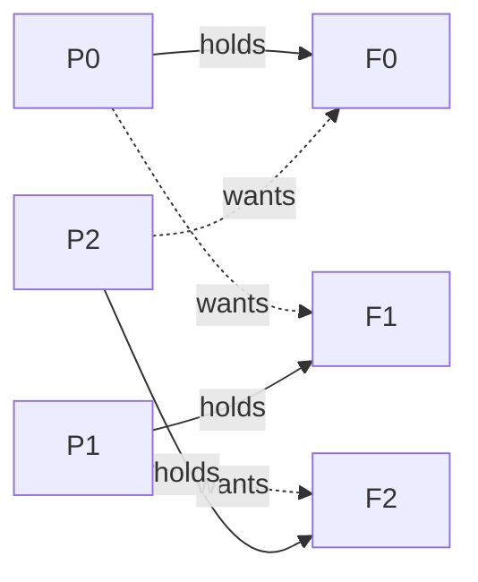

A handful of **classic problems** recur in interviews because each isolates one core skill: breaking
a deadlock (**dining philosophers**), applying backpressure (**bounded producer-consumer**),
ordering threads (**print-in-order / FooBar**), and safe lazy initialization (**the singleton**).
Memorize the idiomatic Java for each — then be ready to explain *why* it works.

## The four you should be able to write cold

````tabs
tabs:
  - label: Dining philosophers
    body: |
      Five philosophers, five forks, each needs both neighbors. The naive "grab left, then right"
      deadlocks: everyone holds their left fork and waits forever. Break the **circular wait** by
      imposing a global lock order — always take the lower-numbered fork first.
      ```java
      void dine(int p) {
          int a = p, b = (p + 1) % N;
          Lock first  = forks[Math.min(a, b)];   // global ordering
          Lock second = forks[Math.max(a, b)];
          first.lock();
          try {
              second.lock();
              try { eat(); }
              finally { second.unlock(); }
          } finally { first.unlock(); }
      }
      ```
  - label: Producer-consumer
    body: |
      A **bounded** buffer gives you backpressure for free: producers block when it is full,
      consumers block when it is empty. Do not hand-roll `wait/notify` unless asked — reach for a
      `BlockingQueue`.
      ```java
      BlockingQueue<Task> q = new ArrayBlockingQueue<>(1000); // bounded!

      // producer
      q.put(task);        // blocks while full  -> natural throttling
      // consumer
      Task t = q.take();  // blocks while empty
      ```
      Bounding the queue is the whole point: an unbounded queue just moves an overload into an
      out-of-memory error.
  - label: Print in order
    body: |
      Three threads must print `first`, `second`, `third` in that order no matter who is scheduled
      first. Two **semaphores** with zero initial permits force the handoff.
      ```java
      Semaphore s2 = new Semaphore(0), s3 = new Semaphore(0);

      void first()  { print("first");  s2.release(); }
      void second() { s2.acquire(); print("second"); s3.release(); }
      void third()  { s3.acquire(); print("third"); }
      ```
  - label: Thread-safe singleton
    body: |
      Prefer the **initialization-on-demand holder**: lazy, no locking, and the JVM guarantees the
      class initializes exactly once. An `enum` is even simpler and serialization-safe.
      ```java
      public final class Registry {
          private Registry() {}
          private static class Holder { static final Registry INSTANCE = new Registry(); }
          public static Registry get() { return Holder.INSTANCE; } // loads Holder lazily, once
      }

      public enum Config { INSTANCE; }   // simplest correct singleton
      ```
````

## Walkthrough: the print-in-order handoff

`second()` and `third()` may be scheduled first, but each blocks on an empty semaphore until the
previous stage releases a permit. Step through one interleaving where the threads start in *reverse*
order and the output still comes out right:

```walkthrough
title: Print in order with two semaphores
code: |
  first():  print("first");  s2.release();
  second(): s2.acquire();    print("second"); s3.release();
  third():  s3.acquire();    print("third");
steps:
  - text: 'Both semaphores start at **0 permits**. Output is empty. Any thread may run first.'
    array: [0, 0, '—']
    pointers: { 0: 's2', 1: 's3', 2: 'output' }
    line: 3
  - text: '`third()` is scheduled first. `s3.acquire()` finds **0 permits**, so the thread parks — blocked.'
    array: [0, 0, '—']
    highlight: [1]
    pointers: { 0: 's2', 1: 's3', 2: 'output' }
    line: 3
  - text: '`second()` runs next. `s2.acquire()` also finds **0 permits** — it parks too. Two threads waiting.'
    array: [0, 0, '—']
    highlight: [0]
    pointers: { 0: 's2', 1: 's3', 2: 'output' }
    line: 2
  - text: '`first()` has no gate. It prints **first**. Output so far: `first`.'
    array: [0, 0, 'first']
    highlight: [2]
    pointers: { 0: 's2', 1: 's3', 2: 'output' }
    line: 1
  - text: '`first()` calls `s2.release()`, raising `s2` to **1** and unparking `second()`.'
    array: [1, 0, 'first']
    highlight: [0]
    pointers: { 0: 's2', 1: 's3', 2: 'output' }
    line: 1
  - text: '`second()` resumes: `s2.acquire()` takes the permit back to **0**, prints **second**.'
    array: [0, 0, 'first, second']
    highlight: [2]
    pointers: { 0: 's2', 1: 's3', 2: 'output' }
    line: 2
  - text: '`second()` calls `s3.release()` to **1**, unparking `third()`, which acquires it back to 0 and prints **third**.'
    array: [0, 0, 'first, second, third']
    highlight: [2]
    pointers: { 0: 's2', 1: 's3', 2: 'output' }
    line: 3
  - text: 'Correct order **first, second, third** — guaranteed regardless of who started. The permits encode the ordering.'
    array: [0, 0, 'first, second, third']
    sorted: [2]
    pointers: { 0: 's2', 1: 's3', 2: 'output' }
    line: 3
```

## Why the naive philosophers deadlock

If every philosopher grabs their own fork then reaches for the neighbor's, the "holds one, wants the
next" edges form a **cycle** — the textbook circular wait:



Global fork ordering breaks the cycle: the highest-numbered philosopher reaches for the lower fork
first, so someone always gets both and progress is made.

:::gotcha
`notify()` versus `notifyAll()` bites hand-rolled producer-consumer code. With multiple waiting
threads and a single `notify()`, the JVM may wake a thread that cannot make progress while the one
that could stays asleep — a **lost wakeup** that hangs the system. Use a `BlockingQueue`, or if you
must hand-roll, use `notifyAll()` and re-check the condition in a `while` loop.
:::

:::senior
Every classic has multiple correct answers, and the interviewer wants the trade-off. Philosophers:
resource ordering (shown), an arbitrator/`Semaphore` that seats at most N-1, or `tryLock` with
backoff — the last risks **livelock**. Singleton: double-checked locking works but needs a
`volatile` field and is easy to get wrong; the holder idiom and `enum` are strictly better. Naming
the alternative and its cost is what separates a senior answer from a memorized one.
:::

## Check yourself

```quiz
title: Classic problems check
questions:
  - q: 'How does "always acquire the lower-numbered fork first" prevent the dining-philosophers deadlock?'
    options:
      - text: 'It imposes a global lock order, which breaks the circular-wait condition'
        correct: true
      - 'It makes the locks reentrant so a philosopher can double-lock'
      - 'It gives each philosopher a private copy of both forks'
    explain: 'A consistent global ordering means the cycle of "holds one, waits for the next" can never close, so at least one philosopher always acquires both forks.'
  - q: 'Why is a bounded BlockingQueue the idiomatic answer to producer-consumer?'
    options:
      - 'It never blocks, so it is the fastest option'
      - text: 'It provides backpressure: put blocks when full and take blocks when empty, so producers cannot outrun consumers'
        correct: true
      - 'It guarantees FIFO across multiple producers on every JVM'
    explain: 'Bounding the buffer throttles producers to the consumer rate; an unbounded queue would just convert overload into unbounded memory growth.'
  - q: 'In the two-semaphore print-in-order solution, why do the semaphores start at 0 permits?'
    options:
      - 'To make the threads spin instead of park'
      - text: 'So second and third block until the previous stage releases a permit, enforcing the order'
        correct: true
      - 'Because semaphores cannot be created with a positive count'
    explain: 'Zero permits means an acquire blocks immediately; each stage only proceeds once the prior stage releases, which encodes the required ordering regardless of scheduling.'
```

:::key
Know four classics cold: **dining philosophers** (break circular wait with a global lock order),
**bounded producer-consumer** (`BlockingQueue` for backpressure), **print-in-order** (zero-permit
semaphores force the handoff), and the **thread-safe singleton** (holder idiom or `enum`). For each,
be ready to state *why* it works and name one alternative with its trade-off.
:::
