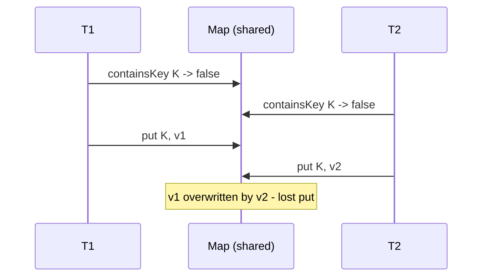

Most concurrency interview questions are really **spot-the-bug** questions. The same handful of
mistakes appear over and over, and each has a tell-tale **symptom** and a one-line **fix**. Learn to
name them on sight — the point is not just to fix the snippet but to say *which* classic it is and
*why* it breaks.

## The bug catalog

| Bug / smell | Symptom | Fix |
|--|--|--|
| Non-atomic **check-then-act** (`if (!map.containsKey) map.put`) | Lost updates, duplicate work; rare and load-dependent | One atomic op: `putIfAbsent`, `computeIfAbsent`, or a lock around both steps |
| **`if` instead of `while`** around `wait()` | Thread proceeds when the condition is false; corruption after `notifyAll` or a spurious wakeup | Always re-check in a `while (!condition) wait();` loop |
| **`unlock()` not in `finally`** | An exception in the body leaks the lock; later threads block forever | `lock.lock(); try { ... } finally { lock.unlock(); }` |
| **Mutable shared `static`** (e.g. `static SimpleDateFormat`) | Intermittent garbage output, exceptions under load | Make it immutable, `ThreadLocal`, or confine/synchronize access |
| **Double-checked locking without `volatile`** | Rarely returns a half-constructed object; almost impossible to reproduce | Mark the field `volatile`, or use the holder idiom |
| **Calling alien code while holding a lock** | Deadlock or unbounded stalls when the callback grabs another lock | Copy state under the lock, invoke the callback *after* releasing it |
| **Unbounded pool / queue** (`newCachedThreadPool`, `new LinkedBlockingQueue<>()`) | Latency creep, then `OutOfMemoryError` under a spike | Bound the queue and pool; pick an explicit rejection policy |

## Walkthrough: why `if` must be `while`

The buffer holds one item, two consumers are waiting, and the consumer used `if` instead of `while`.
Watch the second consumer sail past a false condition:

```walkthrough
title: The if-instead-of-while bug
code: |
  synchronized (lock) {
    if (count == 0)          // BUG: should be while
        lock.wait();
    item = buffer.remove();  // assumes count > 0
  }
steps:
  - text: 'Buffer is empty, `count = 0`. Both **C1** and **C2** run the `if`, see 0, and call `wait()` — releasing the lock and parking.'
    array: [0, 'wait', 'wait']
    highlight: [1, 2]
    pointers: { 0: 'count', 1: 'C1', 2: 'C2' }
    line: 2
  - text: 'A producer adds **one** item, `count = 1`, and calls `notifyAll()` to be safe.'
    array: [1, 'wait', 'wait']
    highlight: [0]
    pointers: { 0: 'count', 1: 'C1', 2: 'C2' }
    line: 3
  - text: '`notifyAll()` wakes **both** consumers. They now contend for the lock; **C1** reacquires it first.'
    array: [1, 'woke', 'ready']
    highlight: [1]
    pointers: { 0: 'count', 1: 'C1', 2: 'C2' }
    line: 3
  - text: 'C1 was parked **inside** the `if`, so on wake it does **not** re-check. It removes an item: `count -> 0`.'
    array: [0, 'got item', 'ready']
    highlight: [1]
    pointers: { 0: 'count', 1: 'C1', 2: 'C2' }
    line: 4
  - text: 'C1 releases the lock. **C2** now reacquires it — also resuming past the `if`, with no re-check.'
    array: [0, 'done', 'running']
    highlight: [2]
    pointers: { 0: 'count', 1: 'C1', 2: 'C2' }
    line: 4
  - text: 'C2 calls `buffer.remove()` on an **empty** buffer. `count` is already 0 — underflow, a null, or an exception. **Bug.**'
    array: ['✗', 'done', 'empty read']
    highlight: [2]
    pointers: { 0: 'count', 1: 'C1', 2: 'C2' }
    line: 4
  - text: 'Fix: change `if` to `while`. On wake C2 re-checks `count == 0`, sees 0, and waits again. A `while` loop tolerates `notifyAll`, missed signals, and spurious wakeups.'
    array: [0, 'ok', 'waits again']
    sorted: [0]
    pointers: { 0: 'count', 1: 'C1', 2: 'C2' }
    line: 2
```

## Check-then-act, seen on the wire

The non-atomic `containsKey` then `put` is the most-planted bug of all. Two threads each check, each
see "absent," and each write — one write silently wins:



The fix is to collapse the two steps into **one atomic operation**. Buggy versus fixed for three of
the catalog entries:

````tabs
tabs:
  - label: Check-then-act
    body: |
      ```java
      // BUG: both threads can pass containsKey before either put runs
      if (!map.containsKey(k)) map.put(k, expensiveValue());

      // FIX: one atomic operation; the lambda runs at most once per key
      map.computeIfAbsent(k, key -> expensiveValue());
      ```
  - label: Unlock in finally
    body: |
      ```java
      // BUG: if doWork() throws, unlock() never runs -> lock leaked forever
      lock.lock();
      doWork();
      lock.unlock();

      // FIX: release in finally, no matter what
      lock.lock();
      try { doWork(); }
      finally { lock.unlock(); }
      ```
  - label: Double-checked locking
    body: |
      ```java
      // BUG: without volatile, a thread can see a non-null but half-initialized instance
      private static Singleton inst;                    // missing volatile
      static Singleton get() {
          if (inst == null)
              synchronized (Singleton.class) {
                  if (inst == null) inst = new Singleton();
              }
          return inst;
      }

      // FIX: volatile forbids the reordering that publishes a half-built object
      private static volatile Singleton inst;
      ```
````

:::gotcha
Double-checked locking is subtle: `inst = new Singleton()` is *allocate, then run the constructor,
then assign the reference* — and without `volatile` the JVM may make the reference visible **before**
the constructor finishes. Another thread sees a non-null `inst`, skips the lock, and touches a
half-built object. `volatile` inserts the happens-before edge that forbids that reordering. Simpler:
use the holder idiom and avoid DCL entirely.
:::

:::senior
The nastiest smell is **calling alien code while holding a lock** — a listener, a callback, an
overridable method, or `equals`/`hashCode` on a user object. That code may take another lock (deadlock
if the order differs from yours) or block indefinitely (your lock is held the whole time). The rule:
do the minimum under the lock, snapshot what you need, release, *then* invoke the callback. The same
discipline explains why `CopyOnWriteArrayList` iterates a frozen snapshot with no lock held.
:::

## Check yourself

```quiz
title: Common bugs check
questions:
  - q: 'Why is `if (!map.containsKey(k)) map.put(k, v)` a bug under concurrency?'
    options:
      - text: 'The check and the act are not atomic — two threads can both see "absent" and both write'
        correct: true
      - 'containsKey is O(n) and too slow'
      - 'put throws when the key already exists'
    explain: 'It is a non-atomic check-then-act. Collapse it into one atomic call such as putIfAbsent or computeIfAbsent.'
  - q: 'A consumer wraps wait() in an `if (empty)` rather than `while (empty)`. What can go wrong?'
    options:
      - 'Nothing; if and while are equivalent for wait'
      - text: 'After notifyAll or a spurious wakeup it can proceed while the condition is still false'
        correct: true
      - 'The thread can never be notified at all'
    explain: 'wait() must always be re-checked in a loop: notifyAll can wake several waiters and spurious wakeups happen, so a single if lets a thread run on a false condition.'
  - q: 'What is the specific danger of double-checked locking without a volatile field?'
    options:
      - 'The lock is acquired twice, causing a deadlock'
      - text: 'A thread can observe a non-null reference to a not-yet-fully-constructed object due to reordering'
        correct: true
      - 'The singleton is created more than once'
    explain: 'Reference assignment can become visible before the constructor completes; volatile establishes the happens-before that prevents publishing a half-initialized object.'
```

:::key
Interview bugs cluster: non-atomic **check-then-act** (use an atomic op), **`if` not `while`** around
`wait()` (loop and re-check), **`unlock()` outside `finally`** (leaked lock), mutable shared
**`static`**, **DCL without `volatile`** (half-built object), **alien calls under a lock** (deadlock),
and **unbounded pools/queues** (OOM). Name the pattern, state the symptom, apply the one-line fix.
:::
