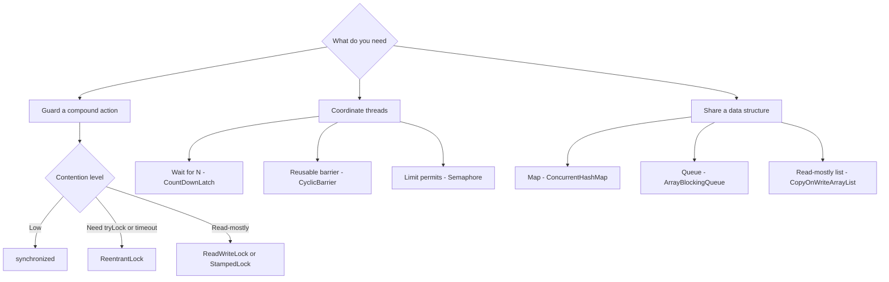

This is the **one-page review** for the night before an interview. Flip the flashcards until every
term is instant recall, then use the decision tables to answer "which one do I reach for?" without
hesitating. Definitions first, tools second.

## Flip the terms

Tap each card to reveal the answer; shuffle to test yourself out of order. If any term makes you
pause, go back to its module before the interview.

```flashcards
title: Concurrency key terms
cards:
  - front: 'Happens-before'
    back: 'A JMM ordering guarantee: if A happens-before B, then A''s memory writes are **visible** to B and appear to precede it. Created by program order, `synchronized` release then acquire, `volatile` write then read, `Thread.start`/`join`, and `final`-field freezes.'
  - front: 'Monitor'
    back: 'The intrinsic lock plus wait-set that every Java object carries. `synchronized` acquires the object''s monitor; `wait`/`notify` use its wait-set. Only one thread holds the monitor at a time.'
  - front: 'Reentrancy'
    back: 'A thread that already holds a lock can re-acquire it without deadlocking; a per-thread hold count tracks the nesting. `synchronized` and `ReentrantLock` are reentrant, so one synchronized method can call another on the same object.'
  - front: 'CAS (compare-and-swap)'
    back: 'An atomic CPU primitive: "if this word still equals `expected`, set it to `new` and report success." The basis of lock-free code. Under contention it fails and **retries** instead of blocking.'
  - front: 'ABA problem'
    back: 'A CAS hazard: a value goes A then B then back to A, so CAS sees "still A" and succeeds even though it changed underneath. Fix with a version stamp — `AtomicStampedReference` — or a monotonic counter.'
  - front: 'volatile vs synchronized'
    back: '`volatile` gives **visibility and ordering** for a single field but no mutual exclusion and no atomic read-modify-write. `synchronized` gives visibility **and** mutual exclusion but threads can block. Volatile for flags and publication; synchronized for compound actions.'
  - front: 'The 4 deadlock conditions'
    back: 'Coffman conditions, all four required at once: **mutual exclusion**, **hold-and-wait**, **no preemption**, and **circular wait**. Break any one — usually circular wait, via a global lock order — to prevent deadlock.'
  - front: 'Daemon thread'
    back: 'A background thread that does **not** keep the JVM alive; once only daemon threads remain, the JVM exits and their `finally` blocks may not run. Set `setDaemon(true)` before `start()`. GC and timer threads are daemons.'
  - front: 'Race condition vs data race'
    back: 'A **data race** is unsynchronized concurrent access to a field where at least one access writes, with no happens-before — a JMM violation. A **race condition** is a correctness bug caused by timing/interleaving. You can have either without the other.'
  - front: 'Liveness'
    back: 'The property that the program eventually makes progress. Liveness failures: **deadlock** (all blocked waiting on each other), **livelock** (busy retrying but no progress), and **starvation** (a thread never gets the resource).'
  - front: 'Safe publication'
    back: 'Making an object visible to other threads so they see it **fully constructed** and up to date. Achieved via a static initializer, a `volatile`/`AtomicReference` field, a `final` field, or a value guarded by a lock. Unsafe publication can leak a half-built object.'
  - front: 'Memory visibility'
    back: 'Whether one thread''s writes are seen by another. Without a happens-before edge a reader may keep seeing a **stale** cached value indefinitely. `volatile`, locks, and `final` supply the needed visibility.'
  - front: 'Spurious wakeup'
    back: 'A waiting thread can return from `wait()`/`await()` without being notified. Therefore always re-test the condition in a **`while` loop**, never a single `if`.'
  - front: 'False sharing'
    back: 'Two independent variables sit on the same CPU cache line, so writing one invalidates the other across cores — a silent slowdown. Mitigate with padding or `@Contended`; `LongAdder` avoids it with per-thread cells.'
```

## Which lock?

| You need | Reach for |
|--|--|
| Simple block-structured mutual exclusion | `synchronized` |
| `tryLock`, timeout, interruptible, fairness | `ReentrantLock` |
| Many readers, rare writers | `ReentrantReadWriteLock` |
| Read-mostly with optimistic reads | `StampedLock.tryOptimisticRead` |
| A single independent variable | `Atomic*` / CAS — no lock at all |

## Which concurrent collection?

| You need | Reach for |
|--|--|
| Concurrent map | `ConcurrentHashMap` |
| Sorted concurrent map | `ConcurrentSkipListMap` |
| Bounded blocking queue (producer-consumer) | `ArrayBlockingQueue` |
| Direct handoff, no buffering | `SynchronousQueue` |
| List read constantly, written rarely | `CopyOnWriteArrayList` |
| Non-blocking FIFO queue | `ConcurrentLinkedQueue` |

## Which synchronizer?

| Your goal | Reach for |
|--|--|
| Wait for N one-time events to finish | `CountDownLatch` (single use) |
| Reusable barrier for a fixed group | `CyclicBarrier` |
| Cap the number of concurrent users | `Semaphore` |
| Hand one value between two threads | `Exchanger` |
| Async compose and combine results | `CompletableFuture` |
| Split-and-join parallel work | Fork/Join or `Phaser` |

A quick decision map for the three families:



## One-liners you can paste from memory

````tabs
tabs:
  - label: Atomics
    body: |
      ```java
      AtomicInteger n = new AtomicInteger();
      n.incrementAndGet();
      n.updateAndGet(x -> x * 2);
      AtomicReference<Node> head = new AtomicReference<>();
      head.compareAndSet(old, next);   // the CAS at the heart of lock-free code
      ```
  - label: Locks
    body: |
      ```java
      ReentrantLock lock = new ReentrantLock();
      lock.lock();
      try { /* critical section */ } finally { lock.unlock(); }

      if (lock.tryLock(1, TimeUnit.SECONDS)) {  // bounded wait avoids deadlock
          try { /* ... */ } finally { lock.unlock(); }
      }
      ```
  - label: Executors
    body: |
      ```java
      ExecutorService pool = Executors.newFixedThreadPool(8); // bounded, not cached
      Future<Integer> f = pool.submit(() -> compute());
      pool.shutdown();

      // Java 21+: cheap thread-per-task, do NOT pool virtual threads
      try (var vt = Executors.newVirtualThreadPerTaskExecutor()) {
          vt.submit(task);
      }
      ```
  - label: Coordination
    body: |
      ```java
      CountDownLatch ready = new CountDownLatch(3);
      ready.countDown();   // each worker signals it is done
      ready.await();       // main blocks until all three have

      Semaphore permits = new Semaphore(10);
      permits.acquire();
      try { useResource(); } finally { permits.release(); }
      ```
````

:::gotcha
Do not reach for `volatile` on a counter. It fixes *visibility*, but `count++` is still a
read-modify-write — three steps — so two threads can still lose an update. Visibility is not
atomicity. Use an `AtomicInteger` (or `LongAdder` under heavy contention) instead.
:::

:::senior
When choosing, walk *down* the cost ladder and stop at the first thing that works: **confinement**
and **immutability** need no synchronization, **atomics** are lock-free, and **locks** are the
heaviest and the only ones that can deadlock. Virtual threads (Java 21) flip an old rule — blocking
is cheap again, so size pools for CPU-bound work only and give each task its own virtual thread
instead of pooling them.
:::

## Check yourself

```quiz
title: Cheat sheet check
questions:
  - q: 'You need producer-consumer with backpressure. Which collection is the idiomatic pick?'
    options:
      - text: 'ArrayBlockingQueue — a bounded blocking queue'
        correct: true
      - 'CopyOnWriteArrayList'
      - 'ConcurrentHashMap'
    explain: 'A bounded BlockingQueue blocks producers when full and consumers when empty, giving backpressure for free. CopyOnWriteArrayList is for read-mostly lists; ConcurrentHashMap is a map.'
  - q: 'A field is read and written by many threads but each update is a full replacement of a single reference. Cheapest correct tool?'
    options:
      - 'A synchronized block around every access'
      - text: 'An AtomicReference with compareAndSet or set'
        correct: true
      - 'A ReentrantReadWriteLock'
    explain: 'A single independent variable is exactly the atomics case — lock-free and non-blocking. A lock would be heavier than necessary here.'
  - q: 'Which are the four conditions that must all hold for a deadlock?'
    options:
      - 'Volatility, atomicity, reentrancy, fairness'
      - text: 'Mutual exclusion, hold-and-wait, no preemption, circular wait'
        correct: true
      - 'Starvation, livelock, priority inversion, contention'
    explain: 'These are the Coffman conditions; breaking any single one — most often circular wait via a global lock order — prevents deadlock.'
```

:::key
Own the vocabulary — **happens-before, CAS, the four deadlock conditions, volatile vs synchronized,
safe publication** — because interviewers test recall speed. Then pick tools by the tables: **atomics
or the right lock** for mutual exclusion, a **concurrent collection** for shared data, and the right
**synchronizer** for coordination. Prefer the cheapest correct option: confinement over immutability
over atomics over locks.
:::
