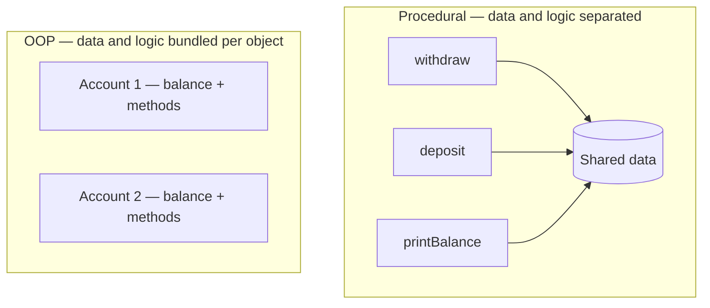
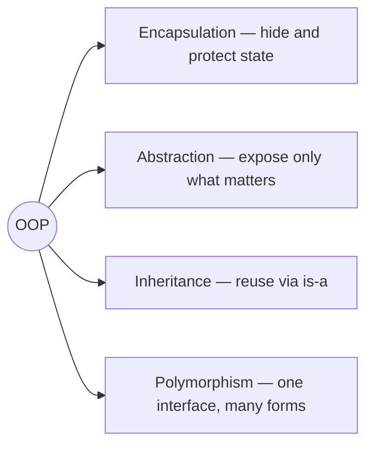

**Object-Oriented Programming (OOP)** organises a program around **objects** — self-contained
bundles of *data* (state) and the *code* that acts on that data (behaviour) — instead of a long
list of procedures operating on loose, shared data.

## Two ways to structure the same program

The procedural style keeps **data** and the **functions** that touch it apart; anyone can reach
into the data. OOP wraps them together so each object owns and guards its own state.



:::note
In the procedural picture every function can mutate the shared data — a bug anywhere can corrupt
it. In OOP each `Account` object protects its own `balance` behind its own methods.
:::

## Procedural vs OOP at a glance

| | Procedural | Object-Oriented |
|--|--|--|
| Unit of code | Functions / procedures | Objects (instances of classes) |
| Data & logic | Kept **separate** | **Bundled** together |
| Data access | Often global / shared | Encapsulated, guarded by methods |
| Reuse | Copy functions, pass data | Inheritance, composition, polymorphism |
| Scales via | More functions | More objects & clear boundaries |
| Typical example | C, early Basic | Java, C#, Python (classes) |

## Same task, two styles

````tabs
tabs:
  - label: Procedural
    body: |
      Data is a loose variable; a function mutates it. Nothing stops other code touching `balance`.
      ```java
      double balance = 100.0;

      static double deposit(double bal, double amt) {
        return bal + amt;            // caller must re-assign
      }
      balance = deposit(balance, 50); // 150.0
      ```
  - label: Object-Oriented
    body: |
      State lives *inside* the object; behaviour is a method that guards it.
      ```java
      class Account {
        private double balance = 100.0;      // owned & protected

        void deposit(double amt) {           // behaviour acts on own state
          if (amt > 0) balance += amt;
        }
      }
      new Account().deposit(50);             // object updates itself
      ```
````

## Messages, not just data with functions

Alan Kay — who coined the term — insisted the big idea is **messaging**, not classes. When you
write `account.withdraw(50)`, you are not "calling a function on a struct"; you are sending the
object a request and letting *it* decide what happens. Which code runs is chosen by the
**receiver** at runtime (late binding), so a `SavingsAccount` and an `OverdraftAccount` can react
differently to the same message. That receiver-decides property is what makes OOP more than
syntax — it is the foundation of polymorphism and of every plugin architecture built on it.

**Tell, don't ask** follows directly: instead of pulling data out of an object and deciding for it
(`if (acc.getBalance() >= amt) { acc.setBalance(...); }`), tell the object what you want
(`acc.withdraw(amt)`) and let it enforce its own rules — the invariant is guarded in one place
instead of at every call site.

## The paradigm rests on four pillars

Every OOP language is built from these ideas — each gets its own topic later in the track.



## OOP in the wild — the JDK is the best example

You already rely on the paradigm every day:

| Idea | JDK / framework example |
|--|--|
| One interface, many implementations | `List` → `ArrayList`, `LinkedList`, `CopyOnWriteArrayList` |
| Encapsulated state behind behaviour | `String` — immutable, never exposes a setter |
| Substitutable families | `InputStream` → file, socket, and in-memory streams are interchangeable |
| Objects assembled, not hard-wired | Spring wires collaborating beans via dependency injection |

Code written against `List` in 2004 ran unchanged against `CopyOnWriteArrayList` when Java 5 added
it — that is the payoff: new behaviour without touching existing callers.

## The misconception interviewers probe

Using a language with classes does not make code object-oriented. A codebase where "entities" are
bags of getters and setters and all the logic sits in `XxxService` classes is **procedural code in
OOP syntax** — data and behaviour separated again, exactly what the paradigm set out to fix. This
style has a name: the **anemic domain model**. In code review it shows up as *feature envy* — a
service pulling three getters off an object to make a decision the object should make itself.

:::gotcha
"Java is object-oriented, therefore my Java code is OO" — no. The real question behind *"what is
OOP?"* is whether you can tell **using classes** apart from **using objects**: state guarded by
the behaviour that owns it, and callers that tell objects what to do rather than inspect them with
getters and `instanceof` chains.
:::

## When OOP is the wrong tool

OOP shines when a system has **long-lived state plus rules that guard it** — accounts, orders,
sessions, game entities. It is a poor fit for straight-line data transformation (parse → map →
aggregate → write), where a functional pipeline (`stream().map().filter()`) is shorter and
clearer. Modern Java admits this: **records** (Java 16) exist precisely because some things *are*
just data, and forcing behaviour onto them adds ceremony, not safety.

:::senior
A strong answer names the trade-off instead of cheerleading: OOP buys strong boundaries and
substitutability at the cost of indirection; functional style buys clear data flow at the cost of
scattered state handling. Real Java codebases mix both — objects at the boundaries guarding
invariants, functional pipelines inside methods. Dogmatic "everything must be a class" produces as
much bad code as global mutable state ever did.
:::

:::key
OOP models a program as **collaborating objects** that own their data and expose behaviour. Its
goal is managing complexity: strong boundaries, reuse, and code that maps onto real-world concepts.
:::

## Terminology

```flashcards
title: OOP vocabulary
cards:
  - front: 'Paradigm'
    back: 'A *style* of structuring programs. OOP, procedural, and functional are paradigms.'
  - front: 'Object'
    back: 'A runtime bundle of **state** (data) and **behaviour** (methods) that owns and guards its own data.'
  - front: 'Encapsulation'
    back: 'Hiding internal state and exposing a controlled interface — the core reason OOP tames complexity.'
  - front: 'Procedural programming'
    back: 'Organising code as functions/procedures operating on separate, often shared, data.'
```

## Check yourself

```quiz
title: What is OOP?
questions:
  - q: 'The defining idea of OOP is to…'
    options:
      - text: 'bundle data together with the behaviour that operates on it'
        correct: true
      - 'avoid using functions entirely'
      - 'make every variable global for easy access'
    explain: 'OOP unites state and behaviour inside objects, unlike the procedural split of data vs functions.'
  - q: 'In the procedural style, data and the functions that use it are…'
    options:
      - text: 'kept separate, with data often shared'
        correct: true
      - 'always bundled into classes'
      - 'compiled but never executed'
    explain: 'Procedural code separates data from procedures; shared data is a common source of bugs.'
  - q: 'Which is NOT one of the four pillars of OOP?'
    options:
      - 'Encapsulation'
      - 'Polymorphism'
      - text: 'Compilation'
        correct: true
    explain: 'The four pillars are encapsulation, abstraction, inheritance, and polymorphism.'
```
