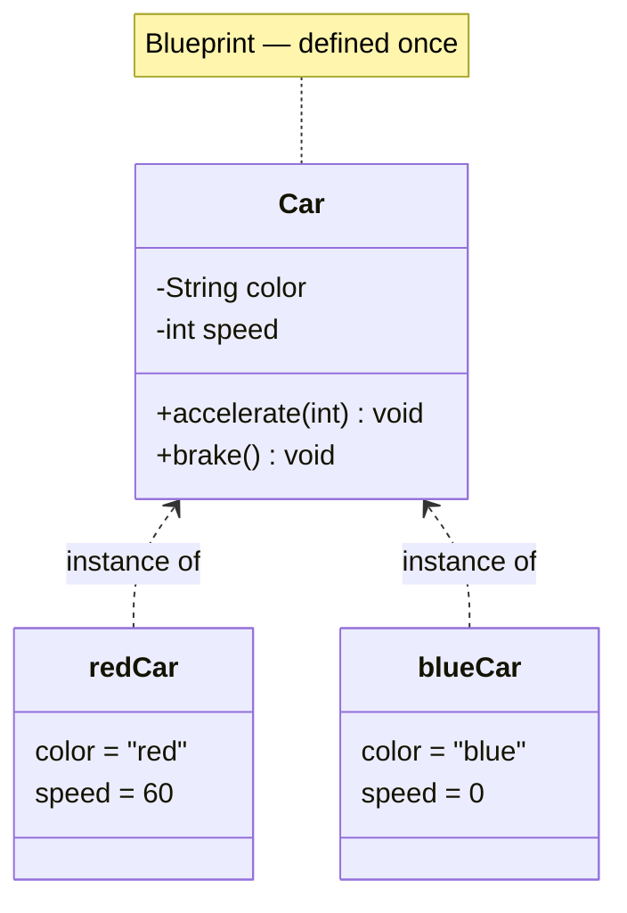

A **class** is a *blueprint* — it describes what every object of that type will have and do.
An **object** is a concrete *instance* built from that blueprint, with its own values.

:::key
**Class = blueprint (a definition, written once). Object = instance (a thing in memory, created
many times with `new`).** This distinction is the #1 warm-up question in OOP interviews.
:::

## Blueprint vs instances

One `Car` class defines *shape*; each `new Car(...)` is a distinct object with its own state.



## State + behaviour

Every object combines two things the class declares:

| Aspect | Class declares | Object holds |
|--|--|--|
| **State** (fields) | *what* data exists (`color`, `speed`) | the actual **values** (`"red"`, `60`) |
| **Behaviour** (methods) | *what* it can do (`accelerate`) | runs against **its own** state |
| **Identity** | — | a unique place in memory |

```java
class Car {
  String color;                 // state: shared shape...
  int speed;

  void accelerate(int by) {     // behaviour: acts on THIS object's speed
    speed += by;
  }
}
```

## Watch two objects come from one class

Both objects share the **class** (the blueprint) but each carries its **own independent state** —
mutating one never touches the other.

```walkthrough
title: One class → two independent objects
code: |
  Car red = new Car();      // object #1
  red.color = "red";
  red.accelerate(60);       // red.speed = 60

  Car blue = new Car();     // object #2
  blue.color = "blue";      // blue.speed stays 0
steps:
  - text: '`new Car()` builds object #1 in memory. Its fields start at defaults: color=null, speed=0.'
    array: ['red: null / 0', '—']
    highlight: [0]
    line: 1
  - text: 'Set object #1''s own `color` to "red".'
    array: ['red: red / 0', '—']
    highlight: [0]
    line: 2
  - text: '`accelerate(60)` runs on object #1 only → its speed becomes 60.'
    array: ['red: red / 60', '—']
    highlight: [0]
    pointers: { 0: 'red' }
    line: 3
  - text: '`new Car()` builds a *separate* object #2 with fresh defaults.'
    array: ['red: red / 60', 'blue: null / 0']
    highlight: [1]
    line: 5
  - text: 'Setting object #2''s color leaves object #1 untouched — distinct identities, distinct state.'
    array: ['red: red / 60', 'blue: blue / 0']
    highlight: [1]
    pointers: { 0: 'red', 1: 'blue' }
    line: 6
```

## Object identity

Two objects can hold *equal* values yet still be **different objects** — each `new` creates a new
identity (a new address in the heap).

```java
Car a = new Car();
Car b = new Car();   // same fields, but a != b — two identities
Car c = a;           // NOT a new object — c points at the same one as a
```

:::gotcha
`new` always produces a **brand-new object** with its own identity. Copying a variable
(`Car c = a;`) copies the *reference*, not the object — `a` and `c` name the **same** instance.
The stack/heap details are covered in **Objects in Memory**.
:::

## Check yourself

```quiz
title: Classes vs objects
questions:
  - q: 'Which statement is correct?'
    options:
      - text: 'A class is a blueprint; an object is an instance created from it'
        correct: true
      - 'An object is a blueprint; a class is an instance of it'
      - 'A class and an object are two names for the same thing'
    explain: 'The class defines the shape once; each object is a concrete instance with its own state.'
  - q: 'After `Car a = new Car(); Car b = new Car();` with identical fields, `a` and `b` are…'
    options:
      - text: 'two distinct objects with separate identities'
        correct: true
      - 'the same object'
      - 'a compile error'
    explain: 'Each `new` allocates a fresh object with its own identity, even when the field values match.'
  - q: 'What does an object bundle together?'
    options:
      - text: 'State (fields) and behaviour (methods)'
        correct: true
      - 'Only data, never methods'
      - 'Only methods, never data'
    explain: 'An object holds its own state and the behaviour that operates on that state.'
```
