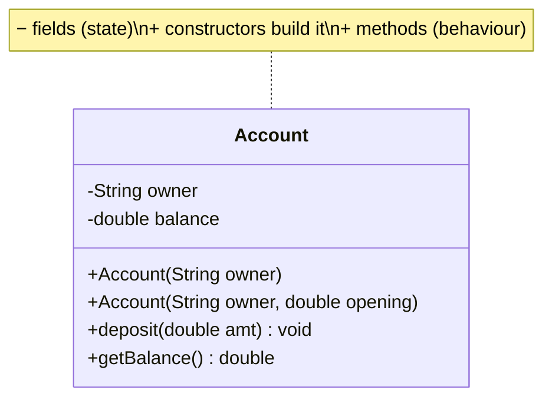
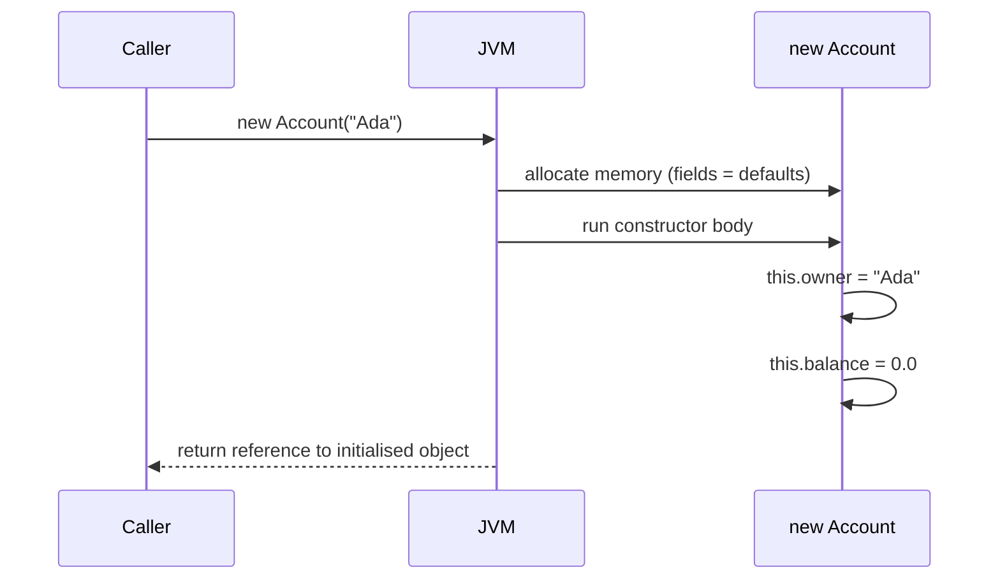

A class is built from three kinds of members: **fields** (state), **methods** (behaviour), and
**constructors** (how an object is born). The `this` keyword lets an object refer to itself.

## Anatomy of a class



## The three members

| Member | Purpose | Runs when… |
|--|--|--|
| **Field** | Stores an object's **state** | Lives for the object's lifetime |
| **Method** | Defines **behaviour** over that state | You call it |
| **Constructor** | **Initialises** a new object | You use `new` |

```java
class Account {
  private String owner;        // field
  private double balance;      // field

  Account(String owner) {      // constructor
    this.owner = owner;        // 'this.owner' = field, 'owner' = parameter
    this.balance = 0.0;
  }

  void deposit(double amt) {   // method — behaviour
    if (amt > 0) this.balance += amt;
  }
}
```

## `this` — the object talking about itself

`this` is a reference to *the current object*. It disambiguates a field from a same-named
parameter, and lets one constructor call another.

:::tip
`this.owner = owner;` reads as "**my** field `owner` = the parameter `owner`". Without `this`,
`owner = owner;` would just assign the parameter to itself — a classic silent bug.
:::

## Constructor overloading

A class can have **several constructors** with different parameter lists. One can delegate to
another with `this(...)` — keeping initialisation logic in a single place.

````tabs
tabs:
  - label: Overloaded constructors
    body: |
      Two ways to build an `Account`; the short one **delegates** to the full one via `this(...)`.
      ```java
      class Account {
        private String owner;
        private double balance;

        Account(String owner) {          // no opening balance
          this(owner, 0.0);              // delegate ↓
        }
        Account(String owner, double opening) {  // full constructor
          this.owner = owner;
          this.balance = opening;
        }
      }
      ```
  - label: Using them
    body: |
      The compiler picks the constructor by the arguments you pass (compile-time selection).
      ```java
      Account a = new Account("Ada");        // balance 0.0
      Account b = new Account("Bo", 500.0);  // balance 500.0
      ```
````

:::note
If you write **no** constructor at all, Java supplies a hidden **default no-arg constructor**. The
moment you declare *any* constructor, that freebie disappears.
:::

## How construction actually unfolds



:::senior
Order of a `new`: memory is allocated and fields set to **defaults** (`0`, `false`, `null`),
*then* field initialisers and the constructor body run. So a field is briefly its default before
your constructor overwrites it — relevant if a method is called mid-construction.
:::

## Constructor chaining across a hierarchy

With inheritance the order gets stricter: **every constructor first runs its parent's
constructor** — explicitly via `super(...)` or implicitly — so initialisation flows from the top
of the hierarchy down. Step through exactly what runs when:

```walkthrough
title: 'new Car() — what runs, in what order'
code: |
  class Vehicle {
    int wheels = 4;                       // Vehicle field initialiser
    Vehicle() { System.out.println("Vehicle ctor"); }
  }

  class Car extends Vehicle {
    String brand = "generic";             // Car field initialiser
    Car() {
      super();                            // inserted by compiler if omitted
      System.out.println("Car ctor");
    }
  }

  Car c = new Car();
steps:
  - text: '`new Car()` allocates the WHOLE object — inherited fields included — and zeroes it: `wheels=0`, `brand=null`. No constructor code has run yet.'
    line: 14
  - text: '`Car()` starts, but its first action is `super()` — a constructor always chains to its parent before running its own body.'
    line: 9
  - text: 'Inside `Vehicle()`: first Vehicle''s field initialisers run → `wheels = 4`. Field initialisers execute as part of their class''s constructor, right after its own super-call.'
    line: 2
  - text: 'Then Vehicle''s constructor body prints `"Vehicle ctor"`. The Vehicle layer of the object is now fully initialised.'
    line: 3
  - text: 'Control returns to `Car()`. Now CAR''s field initialisers run → `brand = "generic"`. Until this moment, `brand` was still `null`.'
    line: 7
  - text: 'Finally Car''s constructor body prints `"Car ctor"`. Full order: allocate + defaults → super chain → each class''s field inits → its body, top-down.'
    line: 10
```

:::gotcha
Never call an **overridable method** from a constructor. If `Vehicle()`'s body calls a method that
`Car` overrides, the override runs at step 4 — **before** `Car`'s fields are initialised (step 5)
— so it sees `brand == null`. This produces `NullPointerException`s that appear only for
subclasses and only during construction. Keep constructor-called methods `private` or `final`.
:::

### The rules interviews check

- `this(...)` or `super(...)` must be the **first statement** of a constructor, and you can have
  at most one of them.
- Write neither and the compiler inserts `super()` — which **fails to compile** if the parent has
  no accessible no-arg constructor. This is the classic "why won't my subclass compile?" question.
- A `final` field must be assigned **exactly once** — at its declaration, in an instance
  initialiser block, or in *every* constructor.
- Constructors are not inherited and cannot be `abstract`, `static`, or `final`.
- Since Java 16, a **record** (`record Point(int x, int y) {}`) generates the constructor,
  accessors, `equals`, `hashCode`, and `toString` — the modern cure for data-class boilerplate.

:::key
Fields hold state, methods act on it, constructors initialise it. On `new`: memory is zeroed →
constructors chain **top-down** (super first) → each class runs its field initialisers, then its
constructor body. `this` disambiguates fields from parameters; `this(...)` delegates between
overloads; both `this(...)` and `super(...)` must come first.
:::

## Check yourself

```quiz
title: Class members
questions:
  - q: 'What is a constructor''s job?'
    options:
      - text: 'To initialise a newly created object'
        correct: true
      - 'To destroy an object when it is no longer used'
      - 'To store the object''s state permanently'
    explain: 'A constructor runs on `new` to set up the object''s initial state.'
  - q: 'In `this.owner = owner;`, what does `this.owner` refer to?'
    options:
      - text: 'The current object''s field named owner'
        correct: true
      - 'The constructor parameter named owner'
      - 'A local variable that shadows both'
    explain: '`this` is the current object, so `this.owner` is its field, distinct from the parameter.'
  - q: 'What makes two constructors valid overloads of each other?'
    options:
      - text: 'Different parameter lists'
        correct: true
      - 'Different return types'
      - 'Different names'
    explain: 'Constructors share the class name and have no return type; they must differ by parameters.'
```
