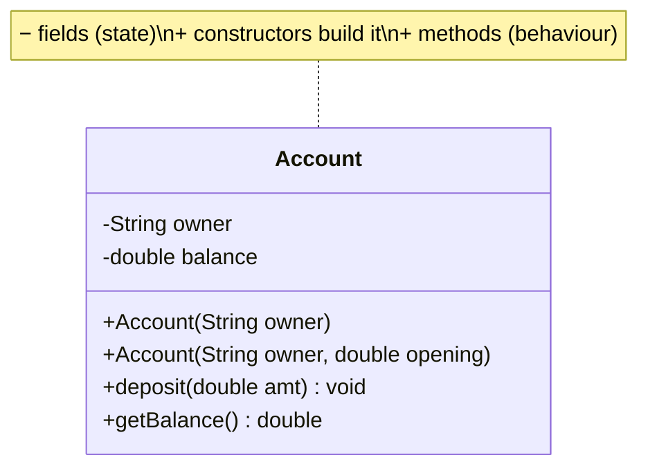
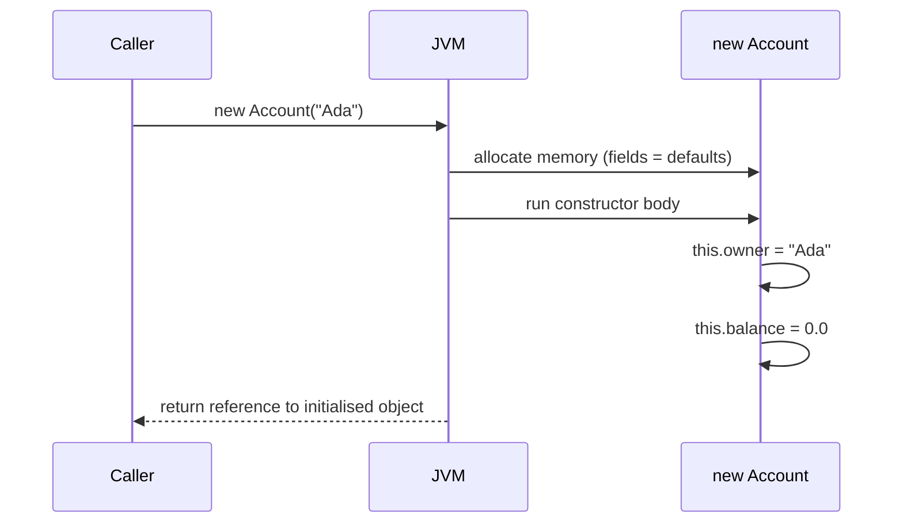

A class is built from three kinds of members: **fields** (state), **methods** (behaviour), and
**constructors** (how an object is born). The `this` keyword lets an object refer to itself.

## Anatomy of a class



## The three members

| Member | Purpose | Runs when… |
|--|--|--|
| **Field** | Stores an object's **state** | Lives for the object's lifetime |
| **Method** | Defines **behaviour** over that state | You call it |
| **Constructor** | **Initialises** a new object | You use `new` |

```java
class Account {
  private String owner;        // field
  private double balance;      // field

  Account(String owner) {      // constructor
    this.owner = owner;        // 'this.owner' = field, 'owner' = parameter
    this.balance = 0.0;
  }

  void deposit(double amt) {   // method — behaviour
    if (amt > 0) this.balance += amt;
  }
}
```

## `this` — the object talking about itself

`this` is a reference to *the current object*. It disambiguates a field from a same-named
parameter, and lets one constructor call another.

:::tip
`this.owner = owner;` reads as "**my** field `owner` = the parameter `owner`". Without `this`,
`owner = owner;` would just assign the parameter to itself — a classic silent bug.
:::

## Constructor overloading

A class can have **several constructors** with different parameter lists. One can delegate to
another with `this(...)` — keeping initialisation logic in a single place.

````tabs
tabs:
  - label: Overloaded constructors
    body: |
      Two ways to build an `Account`; the short one **delegates** to the full one via `this(...)`.
      ```java
      class Account {
        private String owner;
        private double balance;

        Account(String owner) {          // no opening balance
          this(owner, 0.0);              // delegate ↓
        }
        Account(String owner, double opening) {  // full constructor
          this.owner = owner;
          this.balance = opening;
        }
      }
      ```
  - label: Using them
    body: |
      The compiler picks the constructor by the arguments you pass (compile-time selection).
      ```java
      Account a = new Account("Ada");        // balance 0.0
      Account b = new Account("Bo", 500.0);  // balance 500.0
      ```
````

:::note
If you write **no** constructor at all, Java supplies a hidden **default no-arg constructor**. The
moment you declare *any* constructor, that freebie disappears.
:::

## How construction actually unfolds



:::senior
Order of a `new`: memory is allocated and fields set to **defaults** (`0`, `false`, `null`),
*then* field initialisers and the constructor body run. So a field is briefly its default before
your constructor overwrites it — relevant if a method is called mid-construction.
:::

## Check yourself

```quiz
title: Class members
questions:
  - q: 'What is a constructor''s job?'
    options:
      - text: 'To initialise a newly created object'
        correct: true
      - 'To destroy an object when it is no longer used'
      - 'To store the object''s state permanently'
    explain: 'A constructor runs on `new` to set up the object''s initial state.'
  - q: 'In `this.owner = owner;`, what does `this.owner` refer to?'
    options:
      - text: 'The current object''s field named owner'
        correct: true
      - 'The constructor parameter named owner'
      - 'A local variable that shadows both'
    explain: '`this` is the current object, so `this.owner` is its field, distinct from the parameter.'
  - q: 'What makes two constructors valid overloads of each other?'
    options:
      - text: 'Different parameter lists'
        correct: true
      - 'Different return types'
      - 'Different names'
    explain: 'Constructors share the class name and have no return type; they must differ by parameters.'
```
