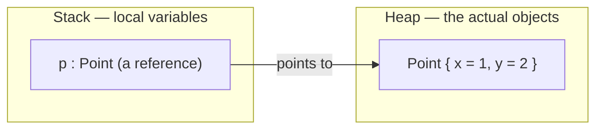
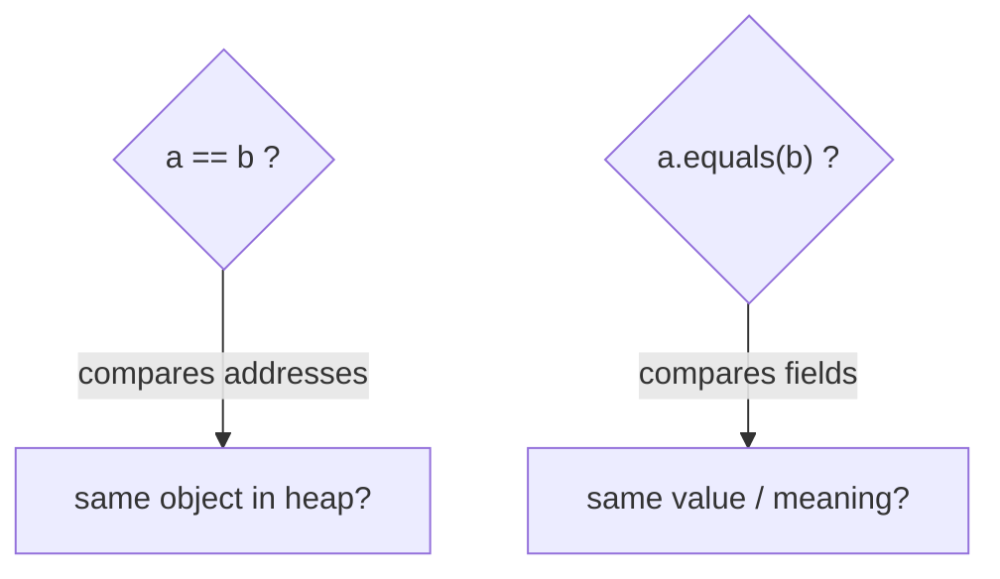

A variable of a class type does **not** hold the object — it holds a **reference** (an address)
pointing to the object, which lives on the **heap**. Understanding this explains aliasing,
`==` vs `.equals()`, and a whole class of interview traps.

## The reference vs the object



| | Reference (variable) | Object |
|--|--|--|
| Lives on | the **stack** (for locals) | the **heap** |
| Holds | an address / pointer | the real field data |
| Created by | assignment | `new` |
| Copying it | copies the **pointer** | needs explicit cloning |

## Aliasing: two references, one object

Assigning one reference to another copies the **pointer**, not the object. Both names now point
at the *same* heap object — mutating through one is visible through the other.

```walkthrough
title: Aliasing — mutate through one name, see it through the other
code: |
  Point a = new Point(1, 2);  // create object on heap
  Point b = a;                // copy the REFERENCE, not the object
  b.x = 99;                   // mutate through b
  System.out.println(a.x);    // prints 99 — same object!
steps:
  - text: '`new Point(1,2)` allocates one object on the heap; `a` points to it.'
    array: ['heap: {x:1, y:2}']
    highlight: [0]
    pointers: { 0: 'a' }
    line: 1
  - text: '`Point b = a;` copies the pointer. Now `a` and `b` reference the SAME object — no new object made.'
    array: ['heap: {x:1, y:2}']
    highlight: [0]
    pointers: { 0: 'a,b' }
    line: 2
  - text: '`b.x = 99` mutates the one shared object.'
    array: ['heap: {x:99, y:2}']
    highlight: [0]
    pointers: { 0: 'a,b' }
    line: 3
  - text: 'Reading `a.x` sees 99 — because `a` and `b` are the same object. This is **aliasing**.'
    array: ['heap: {x:99, y:2}']
    highlight: [0]
    pointers: { 0: 'a,b' }
    line: 4
```

:::gotcha
`Point b = a;` does **not** copy the object. To get an independent copy you must build a new one
(e.g. `new Point(a.x, a.y)`). Forgetting this is how a change "mysteriously" leaks across the code.
:::

## Identity vs equality: `==` vs `.equals()`

- `==` compares **references** — *are these the very same object?* (identity)
- `.equals()` compares **contents** — *do these objects mean the same thing?* (equality) — **if** the
  class overrides it.



````tabs
tabs:
  - label: == (identity)
    body: |
      Two separate `new` objects are never `==`, even with identical fields.
      ```java
      String a = new String("hi");
      String b = new String("hi");
      a == b;        // false — two distinct objects
      a.equals(b);   // true  — same characters
      ```
  - label: .equals() (equality)
    body: |
      A class must **override** `equals` for content comparison; the default `Object.equals` is just `==`.
      ```java
      class Point {
        int x, y;
        @Override public boolean equals(Object o) {
          return o instanceof Point p && p.x == x && p.y == y;
        }
      }
      ```
````

:::note
String **literals** are interned in a shared pool, so `"hi" == "hi"` happens to be `true` — while
`new String("hi") == "hi"` is `false`. Never compare strings with `==`: interning makes the bug
*intermittent* rather than reliably broken, which is worse.
:::

:::senior
Always override `hashCode()` whenever you override `equals()` — objects that are `equals` **must**
share a `hashCode`, or they misbehave as `HashMap`/`HashSet` keys. Also note `==` on primitives
compares *values*; the identity-vs-content distinction is only about **reference** types.
:::

## Java is pass-by-value — always

When you pass an object to a method, Java copies the **reference**, not the object. The parameter
becomes one more alias to the same heap object. Consequence: a method **can mutate the caller's
object** through that alias, but **cannot re-point the caller's variable**:

```java
static void mutate(Point p)  { p.x = 99; }            // caller sees this — shared object
static void replace(Point p) { p = new Point(0, 0); } // re-points only the LOCAL copy

Point a = new Point(1, 2);
mutate(a);    // a.x == 99 now
replace(a);   // a still points at the same object — unchanged
```

:::gotcha
"Java passes objects by reference" is the classic wrong answer. Java is **pass-by-value, always**
— for reference types, the value being copied *is the reference*. The proof interviewers expect:
you cannot write a `swap(a, b)` method in Java that swaps the caller's two variables.
:::

## Who cleans up the heap

There is no `delete` in Java. An object lives as long as **any reference can reach it**; once the
last alias is gone (reassigned, out of scope), it becomes unreachable and the **garbage
collector** reclaims it eventually. Setting a variable to `null` does not destroy the object — it
drops one alias; other aliases keep the object alive. That is exactly how memory leaks happen in a
garbage-collected language: a forgotten reference (say, in a static `Map` used as a cache) keeps
whole object graphs reachable forever.

:::key
A variable holds a **reference**; the object lives on the **heap**. `==` asks "same object?"
(identity); `.equals()` asks "same value?" (equality) — but only if overridden. Assigning
references creates **aliases** to one shared object.
:::

## Check yourself

```quiz
title: Objects in memory
questions:
  - q: 'After `Point b = a;`, how many objects exist and what does `b` hold?'
    options:
      - text: 'One object; `b` holds a copy of the reference to it (an alias)'
        correct: true
      - 'Two objects; `b` is an independent deep copy'
      - 'Zero objects until `b` is used'
    explain: 'Assigning a reference copies the pointer, not the object — `a` and `b` alias one heap object.'
  - q: 'For two objects created with separate `new`, `==` returns…'
    options:
      - text: 'false — they are distinct objects with different addresses'
        correct: true
      - 'true if their fields match'
      - 'true always'
    explain: '`==` compares references (identity); each `new` is a different object regardless of field values.'
  - q: 'When you override `equals()`, you should also override…'
    options:
      - text: '`hashCode()`'
        correct: true
      - '`toString()`'
      - 'the constructor'
    explain: 'The equals/hashCode contract: equal objects must have equal hash codes, or hash-based collections break.'
```
