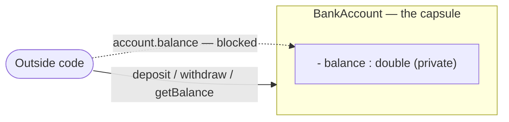
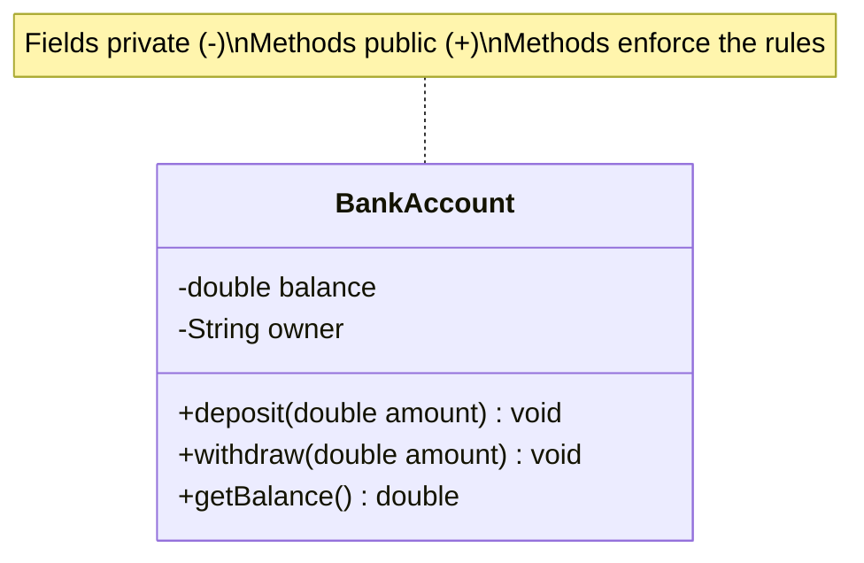
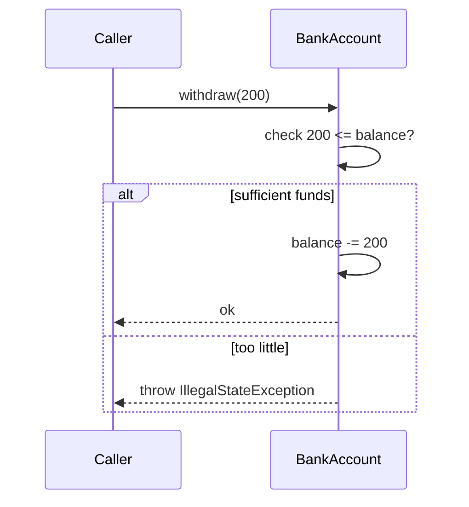

**Encapsulation** = bundle *state* + *behavior* into one unit, then **hide the state** behind
a controlled surface. Callers touch the object only through methods you approve — like a pill
capsule: the medicine (data) is sealed inside, you interact with the shell.

## The capsule



The field is walled off; only the public methods reach in. Direct access is blocked.

## Private data, public gate



In UML, `-` means **private**, `+` means **public**. The dash fields can't be seen from
outside; the plus methods are the only door in.

## Access modifiers — the four walls

| Modifier | Same class | Same package | Subclass | World | Use for |
|----------|:---------:|:------------:|:--------:|:-----:|---------|
| `private` | ✅ | ❌ | ❌ | ❌ | fields, helper methods |
| *(default)* | ✅ | ✅ | ❌ | ❌ | package-internal API |
| `protected` | ✅ | ✅ | ✅ | ❌ | members subclasses extend |
| `public` | ✅ | ✅ | ✅ | ✅ | the intended surface |

:::key
Rule of thumb: **fields `private`, methods as public as they need to be — and no more.**
Start restrictive; widening access later is safe, narrowing it breaks callers.
:::

## Protecting an invariant

A raw `public double balance` lets anyone write `account.balance = -9999`. Encapsulation lets
the method **reject** illegal states, so a bad value can never exist.

````tabs
tabs:
  - label: ❌ Exposed field
    body: |
      No guard — the object can be corrupted from anywhere.
      ```java
      class BankAccount {
        public double balance;   // wide open
      }
      acct.balance = -5000;      // nonsense, but allowed
      ```
  - label: ✅ Encapsulated
    body: |
      The setter is the gatekeeper — the invariant `balance >= 0` always holds.
      ```java
      class BankAccount {
        private double balance;                 // hidden

        public void deposit(double amount) {
          if (amount <= 0)
            throw new IllegalArgumentException("must be positive");
          balance += amount;
        }
        public double getBalance() { return balance; }
      }
      ```
````

## Getters & setters are not automatic

A getter/setter pair that just forwards a field adds nothing — you've exposed the field with
extra steps. Encapsulation is about the **logic in the gate**, not the ceremony.



:::senior
Prefer **immutability** where you can: make fields `private final`, set them once in the
constructor, and drop setters entirely. An object that can't change can't be corrupted and is
automatically thread-safe. Expose derived views (copies, unmodifiable collections) instead of
handing out references to internal mutable state.
:::

:::gotcha
`getList()` that returns your internal `List` reference **breaks encapsulation** — callers can
mutate it behind your back. Return `List.copyOf(list)` or `Collections.unmodifiableList(list)`.
:::

## Encapsulation in the JDK — and in code review

`String` is the canonical example: its `char` data is private and final, there is no setter, and
every "mutation" (`toUpperCase()`, `substring()`) returns a **new** string — which is why strings
are safe to share across threads and safe as `HashMap` keys. `LocalDate` and the rest of
`java.time` follow the same discipline, precisely because their mutable predecessors (`Date`,
`Calendar`) caused decades of aliasing bugs. At the language level, Java 9+ **modules** extend the
idea one level up: a package can be internal to a module, hiding entire classes the way `private`
hides fields.

In code review, encapsulation problems rarely look like `public double balance`. They look like:

- a getter returning an internal `List`/`Map`/array reference (the leak above),
- a setter with no validation on a field that clearly has rules (`setAge(-3)` accepted),
- **feature envy** — a caller doing `if (order.getStatus() == PAID && order.getItems().size() > 0)`
  and then mutating the order from outside, instead of `order.ship()` owning those rules.

## Encapsulation vs Abstraction

A canonical interview trap — they're related but distinct. Encapsulation is about **hiding
data**; abstraction is about **hiding complexity**.

| | Encapsulation | Abstraction |
|--|--------------|-------------|
| Hides | **data / internal state** | **implementation complexity** |
| Question it answers | *"How do I protect the data?"* | *"What does this thing do?"* |
| Level | implementation detail | design / interface level |
| Tools in Java | `private`, getters/setters, access modifiers | `abstract` classes, `interface`s |
| Analogy | the pill capsule sealing the medicine | the car's pedal — press to go, engine hidden |

:::note
One line for the interview: **Encapsulation wraps and *hides the data*; abstraction *hides the
complexity* and shows only what matters.** You often use both together — an `interface`
(abstraction) whose implementing class keeps its fields `private` (encapsulation).
:::

## Check yourself

```quiz
title: Encapsulation check
questions:
  - q: 'What is the primary goal of encapsulation?'
    options:
      - text: 'Hide internal state and expose a controlled interface that protects invariants'
        correct: true
      - 'Let subclasses reuse a parent''s code'
      - 'Choose a method to call at runtime'
    explain: 'Encapsulation bundles data with behavior and restricts direct access so the object controls its own state.'
  - q: 'Which access modifier allows a subclass in another package to access a member, but not unrelated code?'
    options:
      - '`private`'
      - text: '`protected`'
        correct: true
      - '`public`'
    explain: '`protected` is visible in the same package and to subclasses everywhere; `private` is class-only, `public` is everyone.'
  - q: 'A `getItems()` method returns the class''s internal `List` directly. Why is this a leak?'
    options:
      - 'It is slower than copying'
      - text: 'Callers can mutate the internal list, bypassing the object''s control'
        correct: true
      - 'It will not compile'
    explain: 'Handing out a reference to mutable internal state breaks encapsulation. Return a copy or an unmodifiable view.'
  - q: 'Encapsulation hides ____ ; abstraction hides ____.'
    options:
      - 'complexity ; data'
      - text: 'data ; complexity'
        correct: true
      - 'methods ; fields'
    explain: 'Encapsulation hides the *data* (state); abstraction hides the *complexity* (implementation), exposing only what the caller needs.'
```

## Terminology

```flashcards
title: Encapsulation terms
cards:
  - front: 'Encapsulation'
    back: 'Bundling data + methods into one unit and **hiding the state** behind a controlled interface.'
  - front: 'Invariant'
    back: 'A condition that must always hold for an object (e.g. `balance >= 0`). Encapsulation enforces it.'
  - front: '`private`'
    back: 'Accessible **only within the same class**. The default home for fields.'
  - front: '`protected`'
    back: 'Accessible in the same package **and** by subclasses anywhere.'
  - front: 'Getter / Setter'
    back: 'Accessor / mutator methods — the *gate* through which controlled access to a field happens.'
  - front: 'Data hiding'
    back: 'The mechanism (access modifiers) that makes encapsulation enforceable at compile time.'
```

:::key
Encapsulation = **data hiding + a guarded interface**. Fields `private`, expose behavior not
state, put the rules in the gate, and prefer immutability. It hides *data*; abstraction hides
*complexity*.
:::
