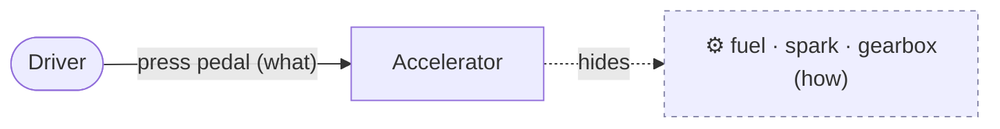
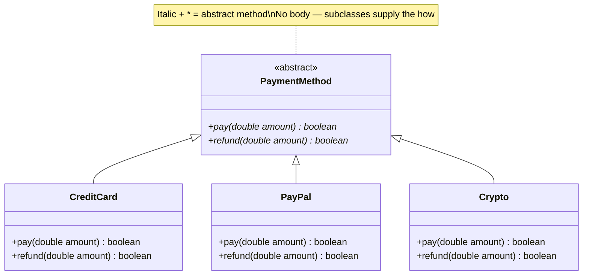
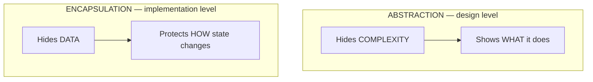

**Abstraction** = show the **what**, hide the **how**. You press a car's accelerator to *go
faster* — you don't think about fuel injection, spark timing, or the transmission. The pedal
is the abstraction; the engine is the hidden complexity.

## The pedal, not the engine



The driver programs against a *simple contract* — "go faster" — insulated from the messy
internals. Swap a petrol engine for electric and the pedal still works.

## Abstract type + concrete implementations

An abstract type says *what* operations exist; subclasses decide *how*.



Checkout code says `method.pay(amount)` and doesn't care which one — that's abstraction paying
off: **new payment types plug in without touching the caller.**

## Two tools for abstraction

Java gives you two ways to define an abstract contract. Picking between them is a classic
interview question.

````tabs
tabs:
  - label: abstract class
    body: |
      Use when implementations **share state or code** and form an **is-a** hierarchy.
      Can hold fields, constructors, and concrete methods alongside abstract ones.
      ```java
      abstract class PaymentMethod {
        protected String txnId;              // shared state

        abstract boolean pay(double amount); // the "what"

        void log(String msg) {               // shared "how"
          System.out.println(txnId + ": " + msg);
        }
      }
      ```
      A class `extends` **one** abstract class.
  - label: interface
    body: |
      Use to declare a **capability / role** that unrelated types can fulfil.
      Pure contract (plus optional `default` methods since Java 8).
      ```java
      interface Payable {
        boolean pay(double amount);          // implicitly public abstract

        default boolean refund(double a) {   // optional shared default
          return false;
        }
      }
      ```
      A class `implements` **many** interfaces — the escape hatch from single inheritance.
````

| | abstract class | interface |
|--|---------------|-----------|
| Inherit how many | **one** (single) | **many** |
| Fields | instance fields ok | only `static final` constants |
| Constructor | yes | no |
| Method bodies | yes (concrete + abstract) | `default` / `static` / `private` |
| Models | **is-a** (shared identity) | **can-do** (capability) |
| Pick when | subclasses share state/code | unrelated types share a role |

:::tip
Default to an **interface** — it's more flexible (a class can implement many). Reach for an
**abstract class** only when you have real shared state or implementation to inherit.
:::

## Abstraction vs Encapsulation

The most-asked follow-up. Both hide things — but *different* things, at *different* levels.



| | Abstraction | Encapsulation |
|--|-------------|---------------|
| Hides | **complexity / implementation** | **data / internal state** |
| Answers | *"What does it do?"* | *"How is the data protected?"* |
| Level | design / interface | implementation |
| Achieved with | `abstract` classes, `interface`s | `private` fields, getters/setters |
| Analogy | the accelerator pedal | the sealed pill capsule |

:::note
Interview one-liner: **Abstraction hides *complexity* (what vs how) at the design level;
encapsulation hides *data* (protects state) at the implementation level.** They complement
each other — an `interface` (abstraction) is implemented by a class with `private` fields
(encapsulation).
:::

## Check yourself

```quiz
title: Abstraction check
questions:
  - q: 'Abstraction is primarily about hiding ____ .'
    options:
      - 'the data / fields of an object'
      - text: 'the implementation complexity, exposing only what an object does'
        correct: true
      - 'the class from the compiler'
    explain: 'Abstraction exposes the *what* (a simple contract) and hides the *how* (the complex implementation).'
  - q: 'You need a contract that both a `Robot` and a `Human` can fulfil, though they share no common ancestor. Best tool?'
    options:
      - 'An abstract class'
      - text: 'An interface'
        correct: true
      - 'A final class'
    explain: 'Interfaces model a capability that *unrelated* types can implement, and a class can implement many.'
  - q: 'Which is TRUE of an abstract class but NOT a (classic) interface?'
    options:
      - text: 'It can hold instance fields and a constructor'
        correct: true
      - 'It can declare abstract methods'
      - 'It can be extended/implemented by subclasses'
    explain: 'Abstract classes can carry instance state and constructors; interfaces cannot (only `static final` constants).'
  - q: 'Abstraction vs encapsulation — pick the correct pairing.'
    options:
      - 'Abstraction hides data; encapsulation hides complexity'
      - text: 'Abstraction hides complexity; encapsulation hides data'
        correct: true
      - 'They are two names for the same thing'
    explain: 'Abstraction hides *complexity* (design level); encapsulation hides *data* (implementation level).'
```

## Terminology

```flashcards
title: Abstraction terms
cards:
  - front: 'Abstraction'
    back: 'Exposing **what** an object does while hiding **how** it does it.'
  - front: 'Abstract class'
    back: 'A partially-implemented class (`abstract`) that **cannot be instantiated**; may mix abstract and concrete methods and hold state.'
  - front: 'Interface'
    back: 'A pure contract of capabilities; a class may `implement` **many**.'
  - front: 'Abstract method'
    back: 'A method with a signature but **no body** — subclasses must supply the implementation.'
  - front: '`default` method'
    back: 'An interface method *with* a body (Java 8+), letting interfaces evolve without breaking implementers.'
  - front: 'Abstraction vs Encapsulation'
    back: 'Abstraction hides **complexity** (design); encapsulation hides **data** (implementation).'
```

:::key
Abstraction = model the essential **what**, suppress the **how**. Use **interfaces** for
capabilities (many, flexible) and **abstract classes** for shared state/code (one, is-a). It
hides *complexity*; encapsulation hides *data*.
:::
