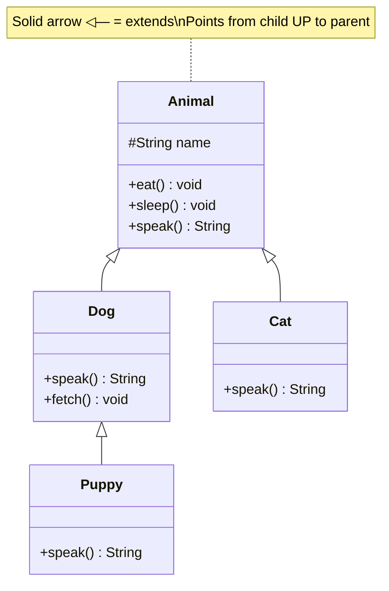
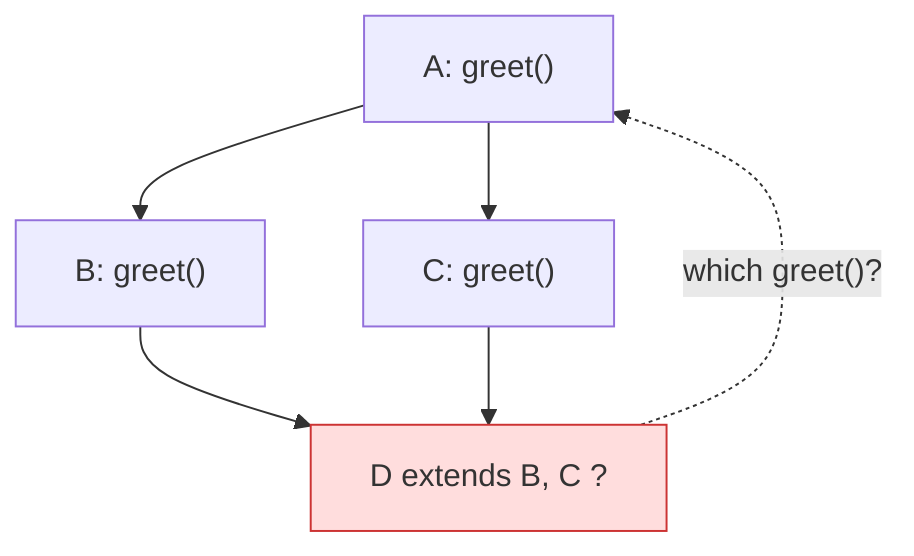

**Inheritance** lets a subclass acquire the fields and methods of a superclass, then add or
override behavior. It models an **is-a** relationship: a `Dog` *is an* `Animal`, so it gets
everything an `Animal` has for free.

## An is-a hierarchy



The hollow-triangle arrow `<|--` is UML for **inheritance** and always points *up* to the
parent. `Puppy` inherits from `Dog`, which inherits from `Animal` — a three-level chain.

## `extends` and `super`

`extends` establishes the link; `super` reaches back to the parent's constructor or an
overridden method.

```java
class Animal {
  protected String name;
  Animal(String name) { this.name = name; }
  String speak() { return "..."; }
}

class Dog extends Animal {          // Dog is-a Animal
  Dog(String name) {
    super(name);                    // call Animal's constructor first
  }
  @Override
  String speak() {
    return super.speak() + " Woof!"; // reuse parent, then extend
  }
}
```

:::note
`super(...)` must appear **before the constructor uses the new instance** (through JDK 24 it had to be the literal first statement; JDK 25’s JEP 513 allows prologue statements before it). If you omit it, Java
inserts an implicit `super()` — which fails to compile if the parent has no no-arg constructor.
:::

## How a method call resolves — walking UP the chain

When you call `puppy.sleep()`, the JVM starts at the object's real class and climbs the
hierarchy until it finds the method.

```walkthrough
title: Resolving puppy.speak() vs puppy.sleep()
code: |
  Animal a = new Puppy();   // Puppy extends Dog extends Animal
  a.speak();                // Puppy defines it
  a.sleep();                // only Animal defines it
steps:
  - text: 'Call `speak()`. The JVM starts at the **actual class** `Puppy` and checks: does Puppy have `speak()`?'
    array: ['Puppy', 'Dog', 'Animal']
    highlight: [0]
    pointers: { 0: 'start' }
    line: 2
  - text: 'Yes — `Puppy.speak()` is found immediately. Search stops here; it runs.'
    array: ['Puppy', 'Dog', 'Animal']
    sorted: [0]
    line: 2
  - text: 'Now call `sleep()`. Start again at `Puppy` — no `sleep()` here. Climb UP to `Dog`.'
    array: ['Puppy', 'Dog', 'Animal']
    highlight: [0]
    pointers: { 0: 'miss' }
    line: 3
  - text: '`Dog` has no `sleep()` either. Keep climbing UP to `Animal`.'
    array: ['Puppy', 'Dog', 'Animal']
    highlight: [1]
    pointers: { 1: 'miss' }
    line: 3
  - text: '`Animal.sleep()` found — the inherited method runs. This upward search is **method resolution**.'
    array: ['Puppy', 'Dog', 'Animal']
    highlight: [2]
    sorted: [2]
    pointers: { 2: 'found' }
    line: 3
```

## is-a vs has-a

Not every relationship is inheritance. If B *is a kind of* A → inherit. If A merely *contains*
a B → **compose** (has-a). Overusing inheritance is a classic design smell.

| | is-a (inheritance) | has-a (composition) |
|--|--------------------|---------------------|
| Keyword | `extends` / `implements` | a field of another type |
| Meaning | `Dog` **is an** `Animal` | `Car` **has an** `Engine` |
| Coupling | tight — bound to parent's internals | loose — talks via the field's API |
| Change impact | parent change ripples to all children | contained behind the field |
| Reuse style | inherit behavior | delegate to the part |

:::senior
**Favor composition over inheritance.** Inheritance exposes you to the *fragile base class*
problem: a change in the parent can silently break every subclass. Reach for `extends` only
when the is-a relationship is real and stable; otherwise hold the collaborator as a field and
delegate.
:::

## Why no multiple class inheritance?

Java lets a class `extend` **one** class but `implement` **many** interfaces. Multiple *class*
inheritance is banned to avoid the **diamond problem** — ambiguity over which parent's method
or state to inherit.



:::gotcha
Interfaces sidestep the diamond: they carried no state historically, and when two interfaces
give conflicting `default` methods, Java **forces you to override** and pick explicitly with
`InterfaceName.super.method()`. No silent ambiguity.
:::

## Check yourself

```quiz
title: Inheritance check
questions:
  - q: 'Inheritance models which relationship?'
    options:
      - 'has-a'
      - text: 'is-a'
        correct: true
      - 'uses-a'
    explain: 'A subclass *is a* kind of its superclass. A `has-a` relationship calls for composition instead.'
  - q: 'What does `super(name)` do in a subclass constructor?'
    options:
      - 'Creates a second object'
      - text: 'Invokes the superclass constructor (must be the first statement)'
        correct: true
      - 'Calls the subclass''s own constructor recursively'
    explain: '`super(...)` chains to the parent constructor so the inherited state is initialized first; it must be the first statement.'
  - q: 'Calling `puppy.sleep()` where only `Animal` defines `sleep()`: how is it resolved?'
    options:
      - 'Compile error — Puppy has no sleep()'
      - text: 'The JVM climbs UP the chain Puppy → Dog → Animal and runs Animal.sleep()'
        correct: true
      - 'It runs a default empty method'
    explain: 'Method resolution walks up the inheritance chain from the actual class until it finds the method.'
  - q: 'Why does Java forbid extending more than one class?'
    options:
      - 'To save memory'
      - text: 'To avoid the diamond problem — ambiguous inherited state/behavior'
        correct: true
      - 'Because the JVM cannot store two vtables'
    explain: 'Multiple class inheritance creates ambiguity (the diamond problem). Java allows multiple *interfaces* instead, which resolve conflicts explicitly.'
```

## Terminology

```flashcards
title: Inheritance terms
cards:
  - front: 'Superclass / base class'
    back: 'The parent being extended — provides fields and methods to inherit.'
  - front: 'Subclass / derived class'
    back: 'The child that `extends` a parent, inheriting its members and optionally overriding them.'
  - front: '`extends`'
    back: 'Declares class inheritance (an **is-a** relationship). One parent only in Java.'
  - front: '`super`'
    back: 'Reference to the parent — `super(...)` calls its constructor, `super.m()` calls its method.'
  - front: 'is-a vs has-a'
    back: '**is-a** → inheritance (`Dog` is an `Animal`). **has-a** → composition (`Car` has an `Engine`).'
  - front: 'Diamond problem'
    back: 'Ambiguity from inheriting the same member via two paths — why Java bans multiple *class* inheritance.'
```

:::key
Inheritance = **is-a + code reuse** via `extends`/`super`. Calls resolve by walking **up** the
chain from the real class. Single class inheritance (many interfaces) avoids the diamond
problem — and **favor composition** when the relationship isn't a true is-a.
:::
