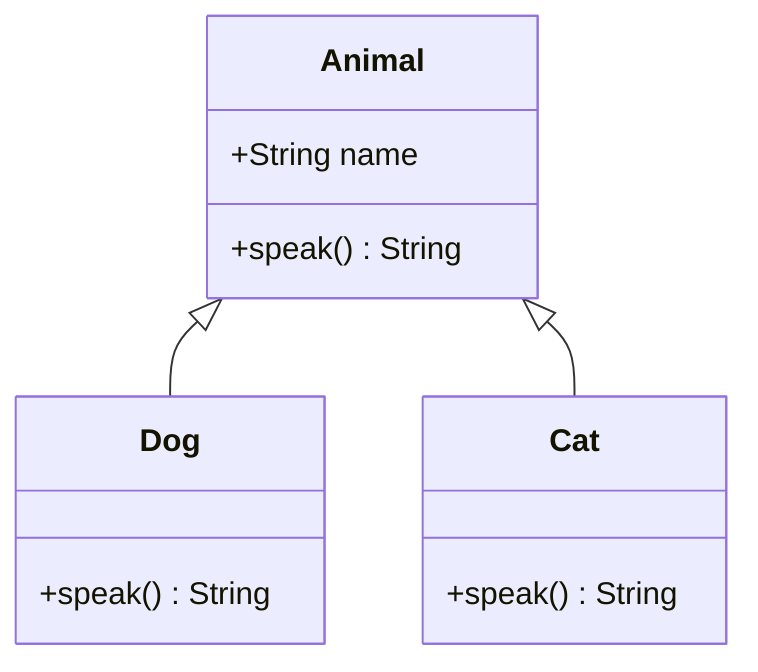

**Polymorphism** means "many forms": the *same* call can behave differently depending on the
actual object. It's the pillar that makes code extensible — and a guaranteed interview question.

## One interface, many forms

Every subclass supplies its own version of `speak()`, but callers just say `animal.speak()`.



## Two kinds of polymorphism

| | Overloading | Overriding |
|--|--|--|
| A.k.a. | compile-time · static · early binding | runtime · dynamic · late binding |
| Lives in | the **same** class | a **subclass** |
| Signature | **different** parameters | **identical** |
| Resolved | at **compile time** (declared types) | at **runtime** (object's real type) |

## Overriding vs overloading

````tabs
tabs:
  - label: Overriding (runtime)
    body: |
      Same signature, **redefined in a subclass**. Chosen at runtime by the object's real type.
      ```java
      class Animal { String speak() { return "..."; } }
      class Dog extends Animal {
        @Override String speak() { return "Woof!"; }  // overrides
      }
      ```
  - label: Overloading (compile-time)
    body: |
      Same name, **different parameters**, same class. Chosen by the compiler from argument types.
      ```java
      int    add(int a, int b)       { return a + b; }
      double add(double a, double b) { return a + b; }  // overloads
      ```
````

## Watch dynamic dispatch

```walkthrough
title: Which speak() actually runs?
code: |
  Animal a = new Dog();   // reference type Animal, object type Dog
  a.speak();              // prints "Woof!"
steps:
  - text: 'The **reference type** is `Animal`. The compiler only checks that `Animal` *has* a `speak()` — it does, so it compiles.'
    line: 1
  - text: 'At runtime the real **object** is a `Dog`, not an `Animal`.'
    line: 1
  - text: 'The runtime looks up `speak()` in the **Dog** method table, not Animal — this is **late binding**.'
    line: 2
  - text: '`Dog.speak()` runs → prints **"Woof!"**. Same call site, different behavior per object.'
    line: 2
```

:::gotcha
Only **instance methods** are polymorphic. `static` methods are bound at compile time (that's *hiding*, not overriding), and `private` methods aren't inherited at all, and **fields are resolved by the reference type** — `((Animal) dog).name` reads `Animal`'s field, not `Dog`'s.
:::

:::senior
Under the hood each class has a **vtable** (virtual method table); an object header points to its class's vtable, so a virtual call is just an indexed jump. That's why dispatch is cheap — and why a `final` (non-virtual) method can be inlined by the JIT.
:::

## Check yourself

```quiz
title: Polymorphism check
questions:
  - q: 'With `Dog` overriding `speak()`: `Animal a = new Dog(); a.speak();` runs which version?'
    options:
      - text: '`Dog.speak()` — chosen at runtime by the object type'
        correct: true
      - '`Animal.speak()` — chosen by the reference type'
      - 'a compile error'
    explain: 'Dynamic dispatch picks the override from the **actual object** (`Dog`), not the reference type (`Animal`).'
  - q: 'Which is resolved at **compile time**?'
    options:
      - 'Overriding'
      - text: 'Overloading'
        correct: true
    explain: 'Overloading is chosen by the compiler from argument types (static binding). Overriding is resolved at runtime (dynamic binding).'
  - q: 'Can a subclass truly *override* a `static` method?'
    options:
      - 'Yes, identical to instance methods'
      - text: 'No — a static method is *hidden*, bound by the reference type'
        correct: true
    explain: 'Static methods belong to the class, not the instance. Redefining one **hides** it; the called version depends on the reference type at compile time — no polymorphism.'
```

:::key
Polymorphism = one interface, many implementations. **Overloading** (same name, different params) is compile-time; **overriding** (same signature, subclass) is runtime via dynamic dispatch. `static`/`private` methods and **fields** are not polymorphic.
:::
