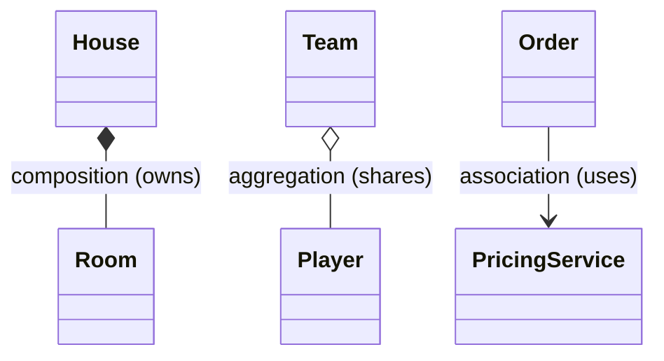

Objects rarely live alone — they **hold references** to other objects. That "has-a" link
comes in three strengths. The whole game is *ownership of lifecycle*: when the whole dies,
does the part die with it?

## The three arrows at a glance



- `*--` **Composition** — a filled diamond. The part *cannot* exist without the whole. Destroy the `House`, the `Room`s go too.
- `o--` **Aggregation** — a hollow diamond. The part lives on its own. Disband the `Team`, the `Player`s keep existing.
- `-->` **Association** — a plain arrow. One object simply *knows about* / *uses* another.

## Lifecycle & ownership — the decisive table

| | Association | Aggregation | Composition |
|--|--|--|--|
| UML arrow | `-->` | `o--` (hollow ◇) | `*--` (filled ◆) |
| Meaning | "uses / knows" | "has (shared)" | "owns (exclusive)" |
| Part lifecycle | independent | independent | **tied to the whole** |
| Ownership | none | shared | **exclusive** |
| Part shared across wholes? | n/a | **yes** | **no** |
| Java clue | field/param reference | reference passed **in** | part `new`-ed **inside** |
| Example | `Order` → `PricingService` | `Team` ◇— `Player` | `House` ◆— `Room` |

:::key
The one question to always ask: **"If I delete the whole, should the part be deleted too?"**
Yes → **composition**. No (it existed before and lives after) → **aggregation**.
:::

## In code: who creates the part?

The tell is *where the part is born*. Composition builds its parts internally; aggregation
receives them from outside.

````tabs
tabs:
  - label: Composition (owned)
    body: |
      `House` **creates** its `Room`s. They share the house's lifetime and no one else holds them.
      ```java
      class House {
          private final List<Room> rooms = new ArrayList<>();
          House() {
              rooms.add(new Room("Kitchen")); // born inside
              rooms.add(new Room("Bedroom")); // dies with the House
          }
      }
      ```
  - label: Aggregation (shared)
    body: |
      A `Player` is created **elsewhere** and handed to the `Team`. It outlives the team.
      ```java
      class Team {
          private final List<Player> players;
          Team(List<Player> players) {   // passed in from outside
              this.players = players;    // shared — same Player can join another Team
          }
      }
      ```
  - label: Association (uses)
    body: |
      `Order` just **uses** a `PricingService` to do a job — no ownership at all.
      ```java
      class Order {
          double total(PricingService pricing) { // knows it only for this call
              return pricing.quote(this);
          }
      }
      ```
````

:::gotcha
Aggregation vs composition is a **design intent**, not a syntax feature — Java has no keyword
for it. The *only* thing that distinguishes them is the **lifecycle contract** you promise:
does the part outlive the whole, and can it be shared?
:::

## Where you meet each one in real code

- **Composition** — `HashMap` and its internal `Node[] table`: created inside, never handed out,
  dies with the map. `String` and its backing array. Your `Invoice` and its `InvoiceLine`s.
- **Aggregation** — a Spring service holding an injected `Clock` or `MeterRegistry`: the
  container built it, many beans share it, and it outlives any one of them. Injected singletons
  are aggregation almost by definition.
- **Association** — a collaborator used per call and forgotten: `order.total(pricingService)`.

Composition's "exclusive, lifecycle-bound" promise has two practical consequences reviewers
check:

- **Don't leak the part.** A getter returning the internal `List<Room>` reference silently turns
  composition into aggregation — outsiders now hold your parts. Return `List.copyOf(rooms)` or an
  unmodifiable view.
- **Copying the whole means copying the parts.** A composed object needs a **deep** copy; an
  aggregating object shares its parts, so a shallow copy is correct. Aggregation vs composition
  is the deep-vs-shallow-copy question in disguise.

:::senior
Strong answers connect the arrows to **navigability and change cost**: every association is a
dependency direction — `Order --> PricingService` means pricing changes can break `Order`, never
the reverse. Bidirectional links double the coupling and invite serialization cycles and
stale-side bugs, so keep associations one-way unless the use case truly needs both directions.
In JPA the distinction becomes physical: composition maps to `CascadeType.ALL` +
`orphanRemoval = true`; aggregation must **not** cascade deletes, or disbanding a `Team` erases
`Player` rows other teams still reference.
:::

## Arrow recall

```flashcards
title: 'UML relationship arrows'
cards:
  - front: '`A --> B` — plain arrow'
    back: '**Association** — A uses / knows B (holds a reference). No lifecycle claim.'
  - front: '`A o-- B` — hollow diamond'
    back: '**Aggregation** — A has B; B is shared and outlives A. The diamond sits on the WHOLE.'
  - front: '`A *-- B` — filled diamond'
    back: '**Composition** — A owns B exclusively; B dies with A. The delete test answers yes.'
  - front: '`A ..> B` — dashed arrow'
    back: '**Dependency** — A temporarily uses B (parameter, local, return type). Weaker than association: no field held.'
  - front: '`A <|-- B` — hollow triangle, solid line'
    back: '**Inheritance** — B extends A. The triangle always points at the parent.'
  - front: '`A <|.. B` — hollow triangle, dashed line'
    back: '**Realization** — B implements interface A.'
```

## Check yourself

```quiz
title: Has-a relationships
questions:
  - q: 'A `University` has `Department`s that are destroyed when the university closes and belong to no other university. Which relationship?'
    options:
      - text: 'Composition — exclusive ownership, shared lifecycle'
        correct: true
      - 'Aggregation — the departments are shared'
      - 'Association — the university merely uses them'
    explain: 'The parts cannot exist without the whole and are not shared → composition (filled diamond `*--`).'
  - q: 'The canonical distinction between aggregation and composition is:'
    options:
      - 'Aggregation uses interfaces, composition uses classes'
      - text: 'Lifecycle & ownership — aggregation shares parts that outlive the whole; composition owns parts that die with it'
        correct: true
      - 'Composition allows multiple inheritance'
    explain: 'Both are "has-a"; the difference is whether the part is independently-lived and shared (aggregation) or owned and lifecycle-bound (composition).'
  - q: 'In UML, a **filled diamond** (`*--`) denotes:'
    options:
      - 'Aggregation'
      - text: 'Composition'
        correct: true
      - 'Inheritance'
    explain: 'Filled diamond = composition; hollow diamond (`o--`) = aggregation.'
```

:::key
**Association** = uses/knows (`-->`). **Aggregation** = has-a, shared, independent lifecycle
(`o--`, hollow ◇). **Composition** = owns, exclusive, shared lifecycle (`*--`, filled ◆).
Decide with the delete test.
:::
