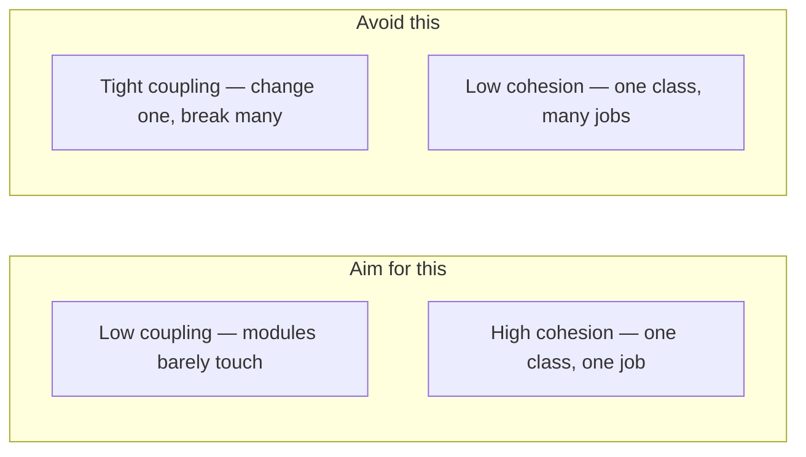
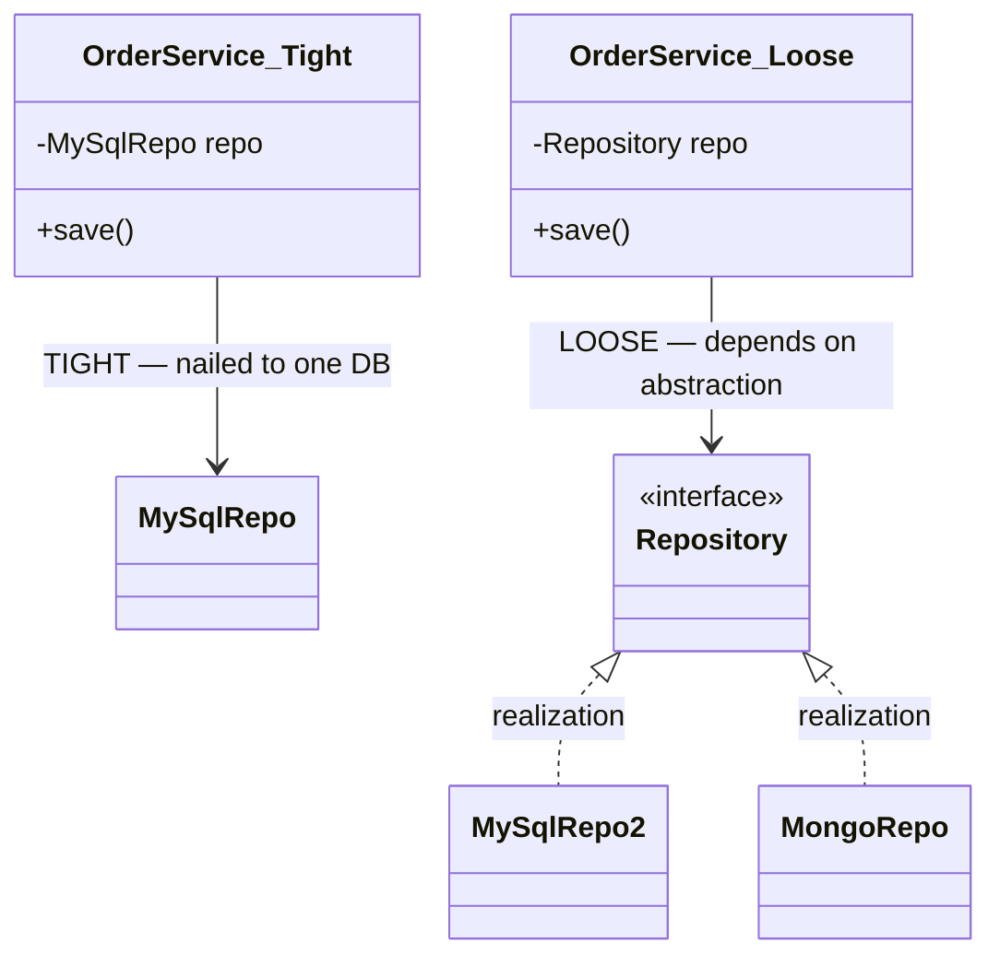

Every design is judged on two axes. You want the connections *between* classes to be
**loose** (low coupling) and the responsibilities *inside* each class to be **tightly
related** (high cohesion). The mantra: **low coupling, high cohesion**.

## Two dials, opposite goals



## Coupling: tight vs loose

Coupling is *how much one class must know about another's internals*. Depending on a concrete
class welds them together; depending on an **interface** lets you swap implementations.



| | Tight coupling | Loose coupling |
|--|--|--|
| Depends on | concrete classes | **abstractions / interfaces** |
| Swap an implementation | edit callers | inject a new one |
| Testability | hard (real deps) | easy (**mock** the interface) |
| Ripple of a change | wide | contained |

## Cohesion: high vs low

Cohesion is *how focused a class is*. A high-cohesion class does **one thing**; a low-cohesion
"god class" bundles unrelated jobs and becomes a change magnet.

| | Low cohesion 👎 | High cohesion 👍 |
|--|--|--|
| Responsibilities | many, unrelated | **one, focused** |
| Symptom | `Utils`, `Manager`, `Helper` blobs | small, named classes |
| Reuse | hard — drags baggage | easy |
| Aligns with | — | **Single Responsibility Principle** |

## The Law of Demeter — "don't talk to strangers"

A method should only call methods on: **itself**, its **parameters**, objects it **creates**,
and its **direct fields**. Chaining through the object graph creates hidden coupling.

````tabs
tabs:
  - label: Violation 👎
    body: |
      Reaching through three objects couples the caller to the whole chain — change any link and this breaks.
      ```java
      // train wreck: knows Customer → Wallet → Money internals
      int cents = order.getCustomer().getWallet().getMoney().getCents();
      ```
  - label: Obeys the law 👍
    body: |
      Ask the direct neighbor to do the work; hide the graph behind it.
      ```java
      int cents = order.availableCents(); // Order delegates internally
      ```
````

:::gotcha
A string of `.getX().getY().getZ()` is a **train wreck** — the classic Law of Demeter
smell. Each `.` past the first is a new object you've quietly coupled yourself to.
:::

### Not every chain is a violation

The law is about reaching through *object structure*, not about counting dots. A fluent builder
(`builder.name("Ada").age(36).build()`) returns **itself** on each call — one object, no
strangers. A stream pipeline (`list.stream().filter(...).map(...)`) transforms values rather than
navigating a graph. Flagging those in review as Demeter violations is a classic junior mistake;
the real smell is **navigating another object's composition** (`order.getCustomer().getWallet()`),
because it freezes that internal structure into every caller.

## Grading coupling — not all edges are equal

The classic taxonomy, worst to best — useful vocabulary in design reviews:

| Grade | Meaning | Example |
|--|--|--|
| Content | reaching into another module's internals | reflection hacks, `public` mutable fields |
| Common | sharing global mutable state | a static config map several classes write |
| Control | passing a flag that switches the callee's logic | `render(data, true /* isAdmin */)` |
| Stamp | passing a fat object where a piece is needed | passing `HttpServletRequest` to compute a total |
| Data | passing exactly the values needed | `total(List<LineItem> items)` |

Interviewers rarely ask for the list; they ask you to **recognise** the middle grades in code:
a boolean parameter (control coupling → split the method), or a method that takes the whole
request object to read one header (stamp coupling → pass the header). Naming the grade while
refactoring is what makes the answer senior.

:::senior
Coupling and cohesion are two sides of the same coin: **push cohesion up and coupling tends
to fall.** When each class owns exactly one responsibility, there's simply less reason for it
to reach into anyone else.
:::

## Terminology recall

```flashcards
title: Coupling & cohesion terms
cards:
  - front: 'Coupling'
    back: 'Degree of **interdependence between** classes. Goal: **low/loose**.'
  - front: 'Cohesion'
    back: 'Degree to which a class''s elements belong together (**one responsibility**). Goal: **high**.'
  - front: 'Tight coupling'
    back: 'Depends on **concrete** types → changes ripple, hard to test.'
  - front: 'Loose coupling'
    back: 'Depends on **abstractions** → swap/mock freely.'
  - front: 'Law of Demeter'
    back: '"Don''t talk to strangers." Call methods only on self, params, created objects, and direct fields — **no `a.getB().getC()` chains**.'
  - front: 'God class'
    back: 'A **low-cohesion** class doing many unrelated jobs; a change magnet.'
```

## Check yourself

```quiz
title: Coupling & cohesion
questions:
  - q: 'The design goal is:'
    options:
      - 'High coupling, high cohesion'
      - text: 'Low coupling, high cohesion'
        correct: true
      - 'Low coupling, low cohesion'
    explain: 'Loose connections between modules, tightly-focused responsibilities within each.'
  - q: 'Depending on a `Repository` **interface** instead of a `MySqlRepo` class primarily:'
    options:
      - text: 'Reduces coupling — you can swap or mock implementations'
        correct: true
      - 'Increases cohesion of the repository'
      - 'Has no design impact'
    explain: 'Programming to an abstraction decouples the caller from the concrete implementation.'
  - q: 'Which line violates the Law of Demeter?'
    options:
      - '`order.total()`'
      - text: '`order.getCustomer().getWallet().getBalance()`'
        correct: true
      - '`this.validate(order)`'
    explain: 'The chain reaches through Customer and Wallet — a train wreck coupling the caller to intermediate structure.'
```

:::key
**Low coupling** (depend on abstractions) + **high cohesion** (one responsibility per class)
= maintainable code. The **Law of Demeter** enforces loose coupling by banning deep
`getX().getY()` chains.
:::
