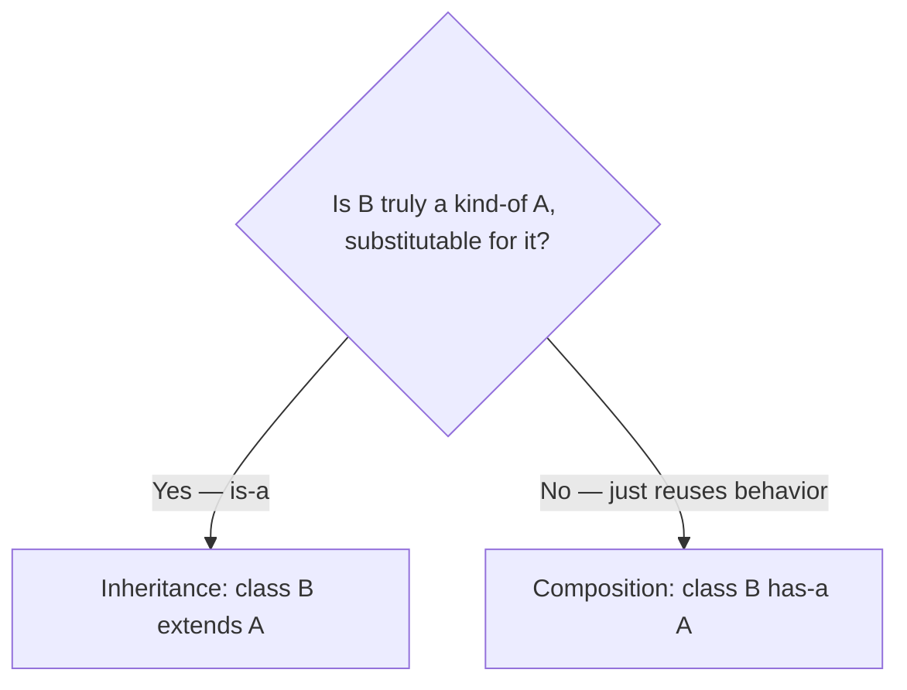
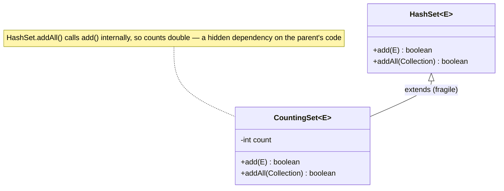

Inheritance is the first tool everyone reaches for — and often the wrong one. The classic
advice, from *Design Patterns* (GoF) and *Effective Java*, is **"favor composition over
inheritance."** Inheritance welds a subclass to its parent's implementation; composition
assembles behavior from swappable parts.

## Is-a vs has-a — the decision



:::tip
Sanity check: say it out loud. "A `Car` **is an** `Engine`" is nonsense → **has-a** (composition).
"A `Dog` **is an** `Animal`" is fine → **is-a** (inheritance may fit).
:::

## The fragile base class problem

With inheritance the subclass depends on *how* the parent is implemented. A harmless-looking
change in the base can silently break every subclass — they are fragile.



## Same feature, two designs

The classic trap (Effective Java, Item 18): subclass `HashSet` to count insertions. Because
`HashSet.addAll()` calls `add()` internally (via `AbstractCollection`), the count is
**double-counted** — a hidden implementation dependency. (`ArrayList.addAll` uses `arraycopy` and
would *not* trip this — which is exactly why the example needs a set.) Composition avoids it by
forwarding through the public API only.

````tabs
tabs:
  - label: Inheritance 👎 (fragile)
    body: |
      ```mermaid
      classDiagram
        class HashSet
        class CountingSet
        HashSet <|-- CountingSet
      ```
      `CountingSet` is bound to internal calls it can't see.
      ```java
      class CountingSet<E> extends HashSet<E> {
          int count = 0;
          @Override public boolean add(E e) {
              count++;                 // +1
              return super.add(e);
          }
          @Override public boolean addAll(Collection<? extends E> c) {
              count += c.size();       // +N ...
              return super.addAll(c);  // ... but super.addAll calls add() → +N again = DOUBLE
          }
      }
      ```
  - label: Composition 👍 (robust)
    body: |
      ```mermaid
      classDiagram
        class Set {
          <<interface>>
        }
        class CountingSet
        class HashSet
        Set <|.. CountingSet
        CountingSet o-- Set : wraps
      ```
      `CountingSet` **wraps** a `Set` and forwards — it can't see internals, so no double count.
      ```java
      class CountingSet<E> implements Set<E> {
          private final Set<E> inner;   // has-a, not is-a
          private int count = 0;
          CountingSet(Set<E> inner) { this.inner = inner; }
          public boolean add(E e) { count++; return inner.add(e); }
          public boolean addAll(Collection<? extends E> c) {
              count += c.size();
              return inner.addAll(c);    // inner.add is invisible to us — counted once
          }
          // ...forward the rest to inner
      }
      ```
````

## Why composition usually wins

| Concern | Inheritance | Composition |
|--|--|--|
| Coupling to internals | **tight** (sees `protected`, call order) | loose (public API only) |
| Change behavior at runtime | no — fixed at compile time | **yes — swap the part** |
| Multiple behaviors | blocked (single inheritance) | mix many parts |
| Fragile base class risk | **high** | none |
| Right when | true **is-a** + substitutability | reuse / "**has-a**" |

:::senior
This is the engine behind the **Strategy** and **Decorator** patterns and dependency
injection: hold a collaborator behind an interface and swap it. Inheritance still wins when
you genuinely need **polymorphic substitutability** (Liskov) — a `SavingsAccount` really *is*
an `Account`.
:::

## The cost of composition — and when inheritance wins

Composition is not free. `CountingSet` must forward every one of `Set`'s dozen-plus methods —
boilerplate inheritance would have given you silently. Real codebases absorb it with forwarding
base classes (Guava's `ForwardingSet`) or IDE-generated delegates. Wrappers also carry one
genuine limitation, the **SELF problem**: if the wrapped object registers `this` somewhere (as a
listener, in a callback), it hands out the *inner* object — and the wrapper's overrides are
bypassed from then on.

Inheritance remains the right call when:

- the subtype is genuinely **substitutable** (LSP holds — `SavingsAccount` is an `Account`),
- the base was **designed for extension** — Template Method skeletons like `HttpServlet.doGet`
  or `AbstractList`, which documents exactly which methods to override,
- you control both classes and document the self-use patterns (Effective Java's bar: *design and
  document for inheritance, or else prohibit it* — mark the class `final`).

:::gotcha
"Favor composition" does not mean "never inherit". The standard follow-up is *"so when is
inheritance right?"* — have the three-part answer ready: true is-a with substitutability, a base
designed and documented for extension, or a framework extension point. Answering "never" is as
wrong as subclassing `HashSet` to count insertions.
:::

## Check yourself

```quiz
title: Composition over inheritance
questions:
  - q: 'The "fragile base class problem" is:'
    options:
      - 'A base class that cannot be instantiated'
      - text: 'Subclasses break when the base class''s internal implementation changes, because they depend on it'
        correct: true
      - 'A class with too many fields'
    explain: 'Inheritance exposes the subclass to the parent''s implementation details (like which methods call which), so base changes ripple unexpectedly.'
  - q: 'You want a `Stack` that reuses `ArrayList` storage but should NOT expose `add(index, e)`. Best design?'
    options:
      - '`class Stack extends ArrayList` — inherit everything'
      - text: 'Composition — `Stack` has-a `ArrayList` and exposes only push/pop'
        correct: true
      - 'Copy ArrayList''s source into Stack'
    explain: 'A Stack is not substitutable for a List (it shouldn''t offer arbitrary index inserts). Composition exposes only the intended API.'
  - q: 'Inheritance is the right choice when:'
    options:
      - 'You just want to reuse some methods'
      - text: 'The subtype genuinely is-a supertype and is substitutable for it (Liskov)'
        correct: true
      - 'Always — it is more object-oriented'
    explain: 'Use inheritance for true is-a relationships with substitutability; otherwise prefer composition (has-a).'
```

:::key
**Favor composition over inheritance.** Inheritance = **is-a** + substitutability; reuse
alone is **has-a** → compose. Composition dodges the **fragile base class problem** and lets
you swap behavior at runtime.
:::
