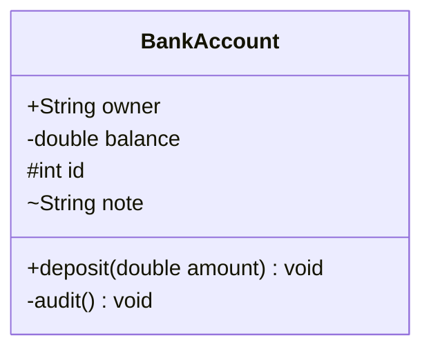
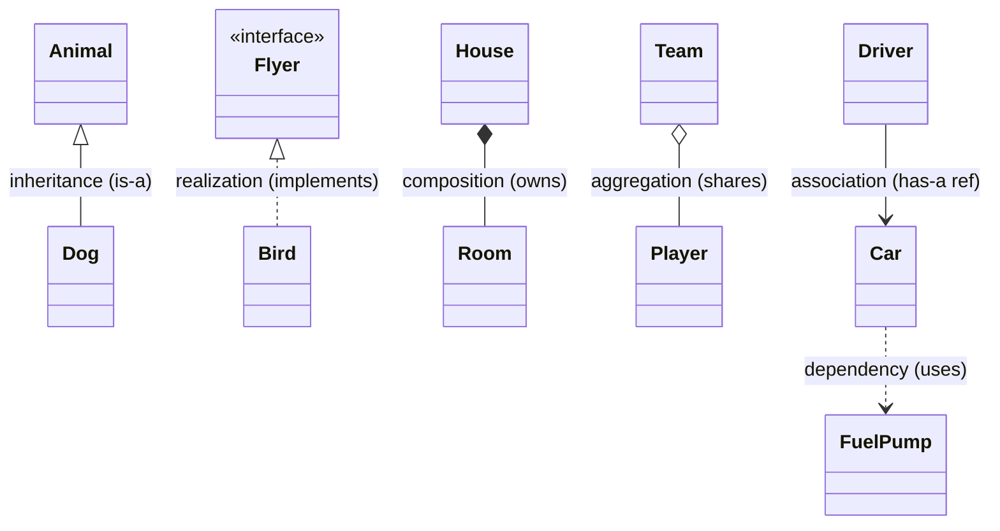
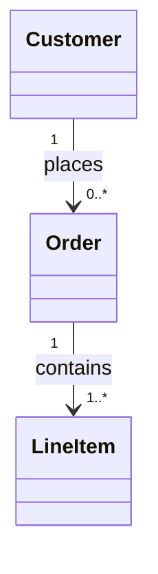

A UML class diagram is the shared vocabulary of design. Once you can decode the **box**
(visibility), the **arrows** (relationships), and the **numbers** (multiplicity), any design
doc becomes readable at a glance.

## Anatomy of a class box

Three compartments: **name**, **attributes**, **operations**. A leading symbol sets visibility.



| Symbol | Visibility | Meaning |
|--|--|--|
| `+` | public | visible everywhere |
| `-` | private | inside the class only |
| `#` | protected | class + subclasses |
| `~` | package | same package |
| _italic_ / `<<abstract>>` | abstract | no implementation |
| underline | static | belongs to the class |

## Every relationship arrow — one reference diagram

Read the arrows from the strength of the bond: inheritance/realization (type), then the
has-a family (composition ▸ aggregation ▸ association), then dependency (weakest).



| Arrow | Name | Reads as | Lifecycle |
|--|--|--|--|
| `<\|--` (solid, hollow ▲) | Inheritance | "is-a" (extends) | — |
| `<\|..` (dashed, hollow ▲) | Realization | "implements" | — |
| `*--` (filled ◆) | Composition | "owns exclusively" | part dies with whole |
| `o--` (hollow ◇) | Aggregation | "has, shared" | part is independent |
| `-->` (solid arrow) | Association | "has a reference to" | independent |
| `..>` (dashed arrow) | Dependency | "uses / depends on" | transient (param, local, return) |

:::note
**Association vs Dependency:** an association is a *lasting* link (usually a field). A
dependency is *fleeting* — a type that only appears as a method parameter, local variable, or
return type. Solid line = structural, dashed line = transient.
:::

## Multiplicity — how many?

Numbers at each end say how many instances participate in the link.



| Notation | Means |
|--|--|
| `1` | exactly one |
| `0..1` | optional (zero or one) |
| `*` or `0..*` | zero or more |
| `1..*` | one or more |
| `n..m` | between n and m |

Read `Order "1" --> "1..*" LineItem` as: *one order contains one or more line items*.

## The two direction mistakes everyone makes

1. **Inheritance arrows point UP** — from child to parent: `Animal <|-- Dog` puts the triangle
   at `Animal`. Drawn the other way, the diagram claims the parent extends the child.
2. **The diamond sits on the WHOLE** — `House *-- Room` puts the filled diamond on `House`, the
   owner. A diamond on the part asserts the room owns the house.

:::gotcha
Whiteboard arrow-direction errors read as "has never used the notation outside a course". Two
rules catch nearly every slip — **triangle at the parent, diamond at the owner** — and saying the
sentence aloud while drawing ("Dog IS-AN Animal", "House OWNS Rooms") makes them automatic.
:::

:::senior
In a design interview, draw **minimal UML**: class name, the two or three members that matter,
correct arrows. Full three-compartment boxes listing every getter burn whiteboard minutes for
zero credit. What earns credit is choosing the *right arrow* — `OrderService ..> EmailClient`
(transient dependency, inject it) says something different from `Order *-- OrderLine` (ownership,
with cascade-delete consequences). UML is a communication tool, not a deliverable: precision on
relationships, brevity everywhere else.
:::

## UML notation deck

```flashcards
title: UML notation recall
cards:
  - front: '`+` before a member'
    back: '**public** visibility.'
  - front: '`-` before a member'
    back: '**private** visibility.'
  - front: '`#` before a member'
    back: '**protected** visibility.'
  - front: 'Solid line, **hollow triangle** (`<|--`)'
    back: '**Inheritance** — subclass *is-a* superclass (extends).'
  - front: 'Dashed line, **hollow triangle** (`<|..`)'
    back: '**Realization** — class *implements* an interface.'
  - front: '**Filled diamond** (`*--`)'
    back: '**Composition** — exclusive ownership; part dies with the whole.'
  - front: '**Hollow diamond** (`o--`)'
    back: '**Aggregation** — shared has-a; part lives independently.'
  - front: 'Solid arrow (`-->`)'
    back: '**Association** — a lasting reference (usually a field).'
  - front: 'Dashed arrow (`..>`)'
    back: '**Dependency** — transient use (parameter, local, return type).'
  - front: 'Multiplicity `1..*`'
    back: '**One or more** instances at that end.'
```

## Check yourself

```quiz
title: Reading UML
questions:
  - q: 'A **dashed line with a hollow triangle** points from `Bird` to `Flyer` (an interface). This is:'
    options:
      - 'Inheritance'
      - text: 'Realization — Bird implements the Flyer interface'
        correct: true
      - 'Dependency'
    explain: 'Dashed + hollow triangle = realization (implements). Solid + hollow triangle would be inheritance (extends).'
  - q: 'A `-` prefix on `balance` means the member is:'
    options:
      - 'public'
      - text: 'private'
        correct: true
      - 'protected'
    explain: '`+` public, `-` private, `#` protected, `~` package.'
  - q: '`Order "1" --> "1..*" LineItem` reads as:'
    options:
      - 'Each line item has many orders'
      - text: 'One order is associated with one or more line items'
        correct: true
      - 'Orders and line items are optional'
    explain: 'Multiplicity is read at each end: 1 order to 1..* (one-or-more) line items.'
  - q: 'Which arrow shows the *weakest*, most transient relationship (e.g. a type used only as a method parameter)?'
    options:
      - '`*--` composition'
      - '`-->` association'
      - text: '`..>` dependency (dashed arrow)'
        correct: true
    explain: 'A dashed dependency arrow marks transient use — parameter, local, or return type — not a stored reference.'
```

:::key
Decode a class box by **visibility** (`+ - # ~`), the link by its **arrow** (`<|--` extends,
`<|..` implements, `*--` owns, `o--` shares, `-->` references, `..>` uses), and the counts by
**multiplicity** (`1`, `0..1`, `*`, `1..*`).
:::
