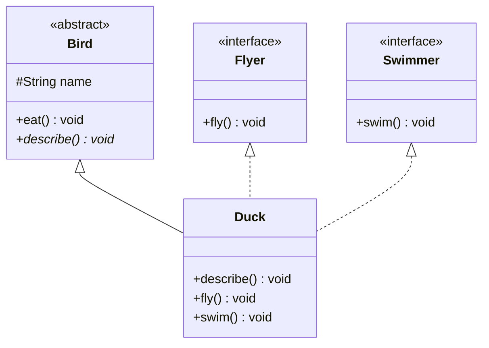

Both let you program to an abstraction, but they answer different questions: an **interface** says *"what can it do?"* (a capability contract); an **abstract class** says *"what is it?"* (a partial base type).

## The two abstractions side by side



*Solid arrow `<|--` = `extends` (abstract base). Dashed arrow `<|..` = `implements` (interface realization). A `Duck` **is a** `Bird` but **can do** flying and swimming.*

## Which do I reach for?

| | Interface | Abstract class |
|--|--|--|
| Answers | "**Can it do** X?" (capability) | "**Is it a** kind of X?" (identity) |
| Inherit how many? | **many** (`implements A, B, C`) | **one** (`extends A`) |
| State (fields) | only `static final` constants | instance fields, any access |
| Constructors | none | yes (called via `super(...)`) |
| Method bodies | `default` / `static` / `private` only | any concrete or `abstract` method |
| Members | implicitly `public` | any access modifier (`protected`, etc.) |
| Best for | unrelated types sharing a role | closely related types sharing code |

## Multiple inheritance — of type, not state

Java forbids extending two classes (to dodge the diamond problem for **state**), but a class may implement **any number of interfaces** — you inherit multiple *contracts* without inheriting conflicting *fields*.

````tabs
tabs:
  - label: Interface (contract)
    body: |
      No constructor, no instance state. A type can implement many.
      ```java
      interface Payable {
        double pay();                 // implicitly public abstract
        default String receipt() {    // shared behavior, no state
          return "Paid: " + pay();
        }
      }
      class Invoice implements Payable, Comparable<Invoice> {
        public double pay() { return 42.0; }
        public int compareTo(Invoice o) { return 0; }
      }
      ```
  - label: Abstract class (partial base)
    body: |
      Has state and a constructor; a subclass extends exactly one.
      ```java
      abstract class Shape {
        protected final String name;      // instance state
        Shape(String name) { this.name = name; }
        abstract double area();           // subclass MUST supply
        void print() {                    // shared concrete method
          System.out.println(name + ": " + area());
        }
      }
      class Circle extends Shape {
        private final double r;
        Circle(double r) { super("circle"); this.r = r; }
        double area() { return Math.PI * r * r; }
      }
      ```
````

## The JDK's answer: use both together

The collections framework pairs every interface with a **skeletal implementation** — `List` +
`AbstractList`, `Map` + `AbstractMap`, `Set` + `AbstractSet` (Effective Java, Item 20). The
interface defines the contract everyone codes against; the abstract class absorbs the
boilerplate for implementers. A read-only list takes two methods:

```java
List<Integer> range = new AbstractList<>() {
  public Integer get(int i) { return i; }    // the interesting bit
  public int size()         { return 100; }  // iterator, equals, etc. inherited
};
```

Callers never see `AbstractList` in a signature — the abstract class is an implementation
convenience; the interface is the API. That division also answers the modern follow-up *"since
default methods exist, why keep abstract classes at all?"* — because interfaces still cannot hold
**instance state**, declare **constructors**, or offer **protected** helper methods for
subclasses only; skeletal classes can.

## Default methods — evolving an interface

Before Java 8, adding a method to an interface broke every implementer. **`default` methods** ship a body on the interface, so old implementers keep compiling.

:::gotcha
If a class inherits **two** `default` methods with the same signature (from two interfaces), the compiler forces you to resolve the clash explicitly with `Interface.super.method()` — this is the interface flavor of the diamond problem.
:::

:::senior
A `default` method cannot access instance state (interfaces have none), and it can be overridden. Use it to add convenience methods (like `List.sort`) — not to smuggle in a base class. When you need shared *state*, an abstract class is the honest tool.
:::

## Check yourself

```quiz
title: Interface vs abstract class
questions:
  - q: 'Can a Java class extend two classes to inherit from both?'
    options:
      - text: 'No — single inheritance of classes; implement multiple interfaces instead'
        correct: true
      - 'Yes, with `extends A, B`'
      - 'Only if both are abstract'
    explain: 'Java allows single class inheritance but **multiple interface** implementation — inheritance of type, not state.'
  - q: 'What are `default` methods on an interface for?'
    options:
      - text: 'Adding a method body so existing implementers keep compiling'
        correct: true
      - 'Marking a method as the default constructor'
      - 'Making the method run by default before others'
    explain: 'Default methods let interfaces evolve without breaking every class that already implements them (e.g. `List.sort`).'
  - q: 'You have several **unrelated** classes that all need a `serialize()` capability. Which fits best?'
    options:
      - text: 'An interface — they share a role, not an identity'
        correct: true
      - 'An abstract class they all extend'
      - 'A static utility class'
    explain: 'Unrelated types sharing a capability → interface. An abstract base would force an artificial "is-a" and burn their one inheritance slot.'
```

:::key
**Interface** = a capability contract; implement many; no instance state; `default` methods add bodies. **Abstract class** = a partial base with state and constructors; extend exactly one. "Can-do" → interface; "is-a" → abstract class.
:::

## Terminology

```flashcards
title: Interfaces & abstract classes
cards:
  - front: 'Realization (`<|..` in UML)'
    back: 'A class **implements** an interface — provides bodies for its contract.'
  - front: 'Abstract method'
    back: 'Declared without a body; a concrete subclass **must** implement it.'
  - front: '`default` method'
    back: 'An interface method **with** a body, so implementers inherit it for free.'
  - front: 'Multiple inheritance of type'
    back: 'A class may implement many interfaces (many contracts) but extend only one class.'
```
