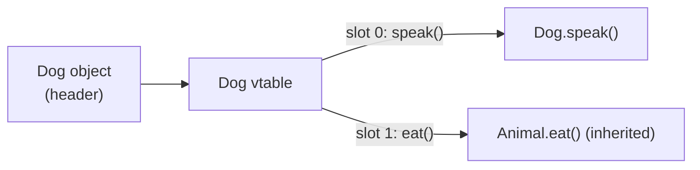
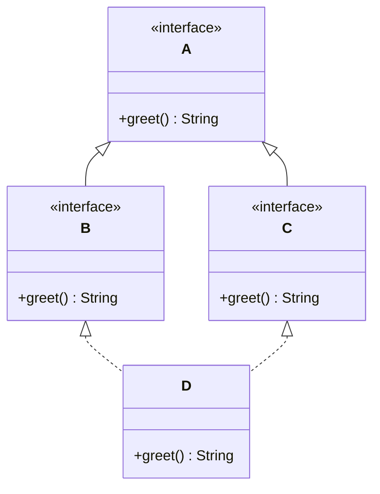

Calling `x.foo()` is two decisions: the **compiler** checks the call is legal against the *reference type*; the **JVM** then picks the actual body from the *object's real type*. That second step is **dynamic dispatch**.

## Static vs dynamic binding

| | Static (early) binding | Dynamic (late) binding |
|--|--|--|
| Decided at | **compile** time | **run** time |
| Based on | the **reference** type | the **object's** real type |
| Applies to | `static`, `private`, `final`, overloading, fields | overridden `instance` methods |
| Mechanism | direct call / declared type | **vtable** lookup |

## Every object carries a pointer to its class's vtable

Each class has one **virtual method table** (vtable): an array of pointers to the method bodies for that class. An object header points at its class's vtable, so a virtual call is just *"index into the table and jump."*



*Overridden slots point to the subclass body; non-overridden slots reuse the inherited body — so `a.speak()` always finds the right override regardless of the reference type.*

## The diamond problem

If `D` could inherit **state and implementation** from two paths that both lead to `A`, which `A` does it get? Java bans this for **classes** (single inheritance) but permits multiple **interfaces** — and forces you to disambiguate clashing `default` methods.



*`D` implements both `B` and `C`, which each extend `A`. If `B` and `C` supply conflicting `default greet()`, `D` **must** override and pick via `B.super.greet()` or `C.super.greet()`.*

## Resolving a call through the hierarchy

```walkthrough
title: How D.greet() is resolved
code: |
  interface A { default String greet() { return "A"; } }
  interface B extends A { default String greet() { return "B"; } }
  interface C extends A { default String greet() { return "C"; } }
  class D implements B, C {
    public String greet() { return B.super.greet(); }
  }
  new D().greet();   // ?
steps:
  - text: 'The compiler sees `D` inherits a `default greet()` from **both** `B` and `C` — an ambiguous clash. Compilation FAILS unless `D` overrides it.'
    line: 4
  - text: '`D` provides its own `greet()`, so the ambiguity is resolved — this method now owns `D`''s vtable slot.'
    line: 5
  - text: 'Inside, `B.super.greet()` explicitly selects `B`''s default (not `C`''s, not `A`''s). "Most specific" rules mean `B` overrides `A`.'
    line: 5
  - text: 'At the call site the JVM looks up `greet()` in `D`''s vtable → runs `D.greet()` → returns **"B"**.'
    line: 7
```

:::gotcha
**Overloading is resolved statically** by the compiler using the *declared* argument types — before any runtime object exists. Only **overriding** uses dynamic dispatch. Mixing them (`add(Object)` vs `add(String)` on a `String` typed as `Object`) surprises everyone in interviews.
:::

:::senior
`private`, `static`, and `final` methods aren't in the dispatchable vtable — they're bound statically, which lets the JIT **inline** them. This is why marking a hot method `final` can help performance and why a `private` method can't be overridden (it isn't inherited, so a same-named subclass method is simply a separate method).
:::

## Check yourself

```quiz
title: Dispatch & resolution
questions:
  - q: 'Which methods use dynamic dispatch?'
    options:
      - text: 'Overridden non-final, non-static instance methods'
        correct: true
      - '`static` methods'
      - '`private` methods'
    explain: 'Only overridable instance methods live in the vtable. `static`/`private`/`final` are bound at compile time.'
  - q: 'How does Java avoid the classic diamond problem for state?'
    options:
      - text: 'A class may extend only ONE class, so there is no ambiguous inherited state'
        correct: true
      - 'It merges the duplicated fields automatically'
      - 'It picks the leftmost parent'
    explain: 'Single class inheritance sidesteps duplicated state. Interfaces (no state) can multiply-inherit, with `default` clashes resolved manually.'
  - q: 'A vtable lookup happens based on…'
    options:
      - text: 'The object''s actual runtime type'
        correct: true
      - 'The reference/declared type'
      - 'The order of imports'
    explain: 'The object header points to its real class''s vtable; the reference type only gates what the compiler lets you call.'
```

:::key
Compiler resolves the call against the **reference type** (static binding: overloading, `static`, `private`, `final`, fields). The JVM dispatches overridden instance methods against the **object's real type** via its **vtable**. Java dodges the state-diamond with single class inheritance; interface `default` clashes need `X.super.m()`.
:::

## Terminology

```flashcards
title: Dispatch terms
cards:
  - front: 'vtable'
    back: 'Per-class array of method pointers; the object header points to it. A virtual call = index + jump.'
  - front: 'Static (early) binding'
    back: 'Method chosen at compile time from the reference type — overloading, `static`, `private`, `final`.'
  - front: 'Dynamic (late) binding'
    back: 'Overridden instance method chosen at runtime from the object''s real type.'
  - front: 'Diamond problem'
    back: 'Ambiguity when a type inherits the same member via two paths; resolved by single class inheritance + `X.super.m()`.'
```
