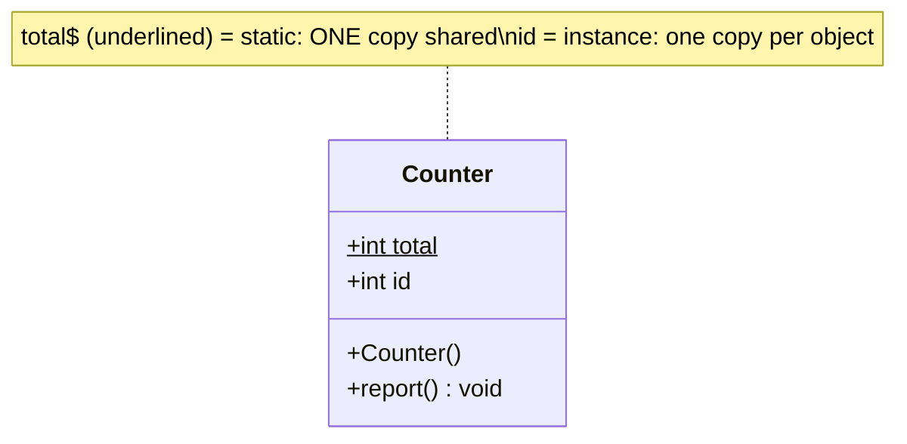
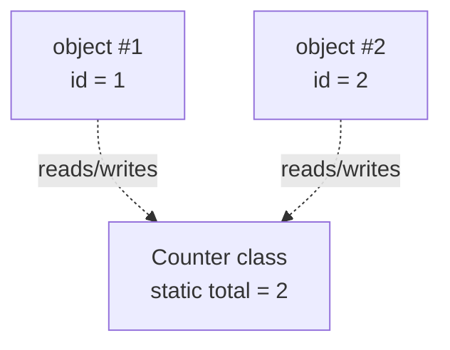

A **static** member belongs to the **class** — one shared copy for the whole program. An **instance** member belongs to each **object** — its own copy per `new`.

## One copy per class vs one per object



*In UML a trailing `$` / underline marks a static member. Every `Counter` shares `total`; each has its own `id`.*



## Static vs instance at a glance

| | Static member | Instance member |
|--|--|--|
| Belongs to | the **class** | each **object** |
| Copies | **one**, shared | one **per instance** |
| Accessed via | `ClassName.member` | `reference.member` |
| Sees `this`? | **no** | yes |
| Can call | only other statics directly | statics **and** instance members |
| Created when | class is loaded | object is constructed |

````tabs
tabs:
  - label: When static fits
    body: |
      Utility functions and shared constants that need no per-object state.
      ```java
      class MathUtil {
        static final double PI = 3.14159;      // shared constant
        static int square(int n) { return n * n; }  // pure function
      }
      int x = MathUtil.square(5);   // no object needed
      ```
  - label: When instance fits
    body: |
      Anything that varies per object — its identity or mutable state.
      ```java
      class BankAccount {
        private double balance;                 // per-object state
        void deposit(double a) { balance += a; }
      }
      var acct = new BankAccount();  // each account, own balance
      ```
````

## Static methods are *hidden*, not overridden

Redefining a `static` method in a subclass does **not** override it — there's no vtable slot. The version called is decided at **compile time** by the reference type. This is **static hiding**.

```walkthrough
title: Hiding vs overriding
code: |
  class Animal { static String kind() { return "animal"; } }
  class Dog extends Animal { static String kind() { return "dog"; } }
  Animal a = new Dog();
  a.kind();     // ?
steps:
  - text: '`Dog.kind()` does NOT override `Animal.kind()` — static methods have no dynamic dispatch, so this is *hiding*.'
    line: 2
  - text: 'The reference `a` is declared as type `Animal`, even though it points to a `Dog`.'
    line: 3
  - text: 'Static calls bind at COMPILE time to the **reference type**, ignoring the real object.'
    line: 4
  - text: 'So `Animal.kind()` runs → returns **"animal"**. (Contrast: an instance method would return "dog".)'
    line: 4
```

:::gotcha
Calling a static method through an instance (`a.kind()`) compiles but is misleading — it still binds to the reference type. Always call statics via the **class name** (`Animal.kind()`) to make intent obvious.
:::

:::senior
Overusing `static` produces hidden global state that's hard to test and not thread-safe. A shared mutable static field is a classic bug source. Prefer statics for **pure functions and true constants**; reach for instances (or dependency injection) when behavior needs state or must be mocked.
:::

## Check yourself

```quiz
title: Static vs instance
questions:
  - q: 'How many copies of a `static` field exist for 100 objects?'
    options:
      - text: 'One — shared by the whole class'
        correct: true
      - '100 — one per object'
      - 'Zero until first access'
    explain: 'A static field lives on the class, loaded once; all instances share the single copy.'
  - q: 'A subclass redefines a parent''s `static` method. What happened?'
    options:
      - text: 'Static hiding — bound by reference type at compile time, not overriding'
        correct: true
      - 'Normal overriding via dynamic dispatch'
      - 'A compile error'
    explain: 'Static methods have no vtable slot, so they are hidden, not overridden; the reference type decides which runs.'
  - q: 'Why can''t a `static` method use `this`?'
    options:
      - text: 'It belongs to the class, not any instance — there is no `this`'
        correct: true
      - 'Because `this` is reserved'
      - 'It can, but only inside a loop'
    explain: 'A static method isn''t invoked on an object, so no `this` exists; it can only touch other static members directly.'
```

:::key
`static` = one shared copy on the **class**, no `this`, bound at compile time (so it's **hidden**, not overridden). Instance members = one per **object** with their own state. Use static for pure functions and constants; instance for stateful behavior.
:::

## Terminology

```flashcards
title: Static & instance terms
cards:
  - front: 'Static member'
    back: 'Belongs to the class; a single shared copy; accessed via the class name; no `this`.'
  - front: 'Instance member'
    back: 'Belongs to each object; one copy per `new`; can use `this`.'
  - front: 'Static hiding'
    back: 'Redefining a static method in a subclass — resolved by reference type at compile time, NOT dynamic dispatch.'
  - front: 'Class loading'
    back: 'When statics are initialized — once, before the first use of the class.'
```
