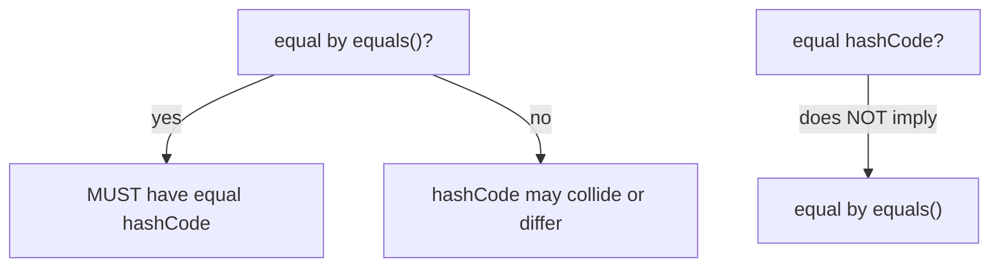

Two objects can be **equal by value** yet **distinct by identity**. `==` asks *"same object?"*; `.equals()` asks *"same value?"*. Hash-based collections rely on both, plus `hashCode()`.

## `==` vs `.equals()`

| | `a == b` | `a.equals(b)` |
|--|--|--|
| Compares | **references** (identity) | **contents** (value, if overridden) |
| For objects | same object on the heap? | logically equal? |
| For primitives | value comparison | n/a |
| Default `Object.equals` | — | behaves like `==` until overridden |

## Equal by value, distinct by identity

```walkthrough
title: Two Points — same value, different objects
code: |
  Point a = new Point(1, 2);
  Point b = new Point(1, 2);
  a == b;          // ?
  a.equals(b);     // ?  (equals compares x and y)
steps:
  - text: '`new` allocates a fresh object on the heap. `a` points to object #1.'
    array: ['a → #1 (1,2)']
    highlight: [0]
    line: 1
  - text: 'A second `new` allocates a SEPARATE object #2, even though the values match.'
    array: ['a → #1 (1,2)', 'b → #2 (1,2)']
    highlight: [1]
    line: 2
  - text: '`a == b` compares references: #1 vs #2 — different addresses → **false**. Same identity? No.'
    array: ['a → #1 (1,2)', 'b → #2 (1,2)']
    pointers: { 0: 'a', 1: 'b' }
    line: 3
  - text: '`a.equals(b)` compares x and y: 1==1 and 2==2 → **true**. Same value? Yes.'
    array: ['a → #1 (1,2)', 'b → #2 (1,2)']
    line: 4
```

## The hashCode contract

If you override `equals`, you **must** override `hashCode` — hash collections (`HashMap`, `HashSet`) find a bucket by hash first, then confirm with `equals`.



- **Consistent**: repeated `hashCode()` calls return the same value (while fields unchanged).
- **Equal ⇒ equal hash**: `a.equals(b)` ⟹ `a.hashCode() == b.hashCode()`.
- **Not the reverse**: equal hashes may still be unequal objects (a **collision** — allowed).

````tabs
tabs:
  - label: Correct value object
    body: |
      Override both together — `record` does it for you.
      ```java
      record Point(int x, int y) {}   // auto equals + hashCode
      // or, by hand:
      class P {
        final int x, y;
        P(int x, int y) { this.x = x; this.y = y; }
        @Override public boolean equals(Object o) {
          return o instanceof P p && p.x == x && p.y == y;
        }
        @Override public int hashCode() {
          return Objects.hash(x, y);   // stays in sync with equals
        }
      }
      ```
  - label: The classic bug
    body: |
      Override equals but NOT hashCode → lost in a HashSet.
      ```java
      class Bad {
        int id;
        @Override public boolean equals(Object o) {
          return o instanceof Bad b && b.id == id;
        }
        // hashCode NOT overridden → uses identity hash!
      }
      var set = new HashSet<Bad>();
      set.add(new Bad());          // bucket A
      set.contains(new Bad());     // looks in bucket B → false (BUG)
      ```
````

:::gotcha
A **mutable** field used in `equals`/`hashCode` is a trap: put the object in a `HashSet`, then mutate the field, and its hash changes — the object is now in the "wrong" bucket and effectively lost. Base equality on **immutable** fields.
:::

:::senior
`==` on boxed integers is a notorious pitfall: `Integer` caches `-128..127`, so `Integer.valueOf(100) == Integer.valueOf(100)` is `true` but `Integer.valueOf(200) == Integer.valueOf(200)` is `false`. Always use `.equals()` for wrapper objects. Value semantics = compare contents; reference semantics = compare identity.
:::

## Check yourself

```quiz
title: Equality & hashing
questions:
  - q: 'Two distinct objects with equal field values: what do `==` and `.equals()` (properly overridden) return?'
    options:
      - text: '`==` false, `.equals()` true'
        correct: true
      - '`==` true, `.equals()` true'
      - 'Both false'
    explain: '`==` compares references (different objects → false); a value-based `equals` compares contents → true.'
  - q: 'You override `equals` but not `hashCode`. What breaks?'
    options:
      - text: 'Equal objects can land in different buckets, so HashMap/HashSet lookups miss'
        correct: true
      - 'Nothing — hashCode is optional'
      - 'The code won''t compile'
    explain: 'Hash collections locate a bucket via hashCode first. Unequal hashes for equal objects → they never meet, breaking `contains`/`get`.'
  - q: 'Does `a.hashCode() == b.hashCode()` guarantee `a.equals(b)`?'
    options:
      - text: 'No — equal hashes may be a collision; you still confirm with equals'
        correct: true
      - 'Yes, always'
      - 'Only for records'
    explain: 'The contract is one-way: equal objects must share a hash, but equal hashes do not imply equal objects (collisions are allowed).'
```

:::key
`==` = identity (same reference); `.equals()` = value (when overridden). **Override both together**: equal objects must have equal `hashCode`, but equal hashes don't imply equality. Base equality on **immutable** fields; prefer `record` for value objects.
:::

## Terminology

```flashcards
title: Equality terms
cards:
  - front: 'Identity equality (`==`)'
    back: 'Do two references point to the SAME object on the heap?'
  - front: 'Value equality (`.equals()`)'
    back: 'Are two objects logically equal by content? Meaningful only when overridden.'
  - front: 'hashCode contract'
    back: 'Consistent; equal objects ⇒ equal hash. Equal hash does NOT imply equal objects.'
  - front: 'Hash collision'
    back: 'Two unequal objects with the same hashCode — legal; the bucket falls back to `equals`.'
```
