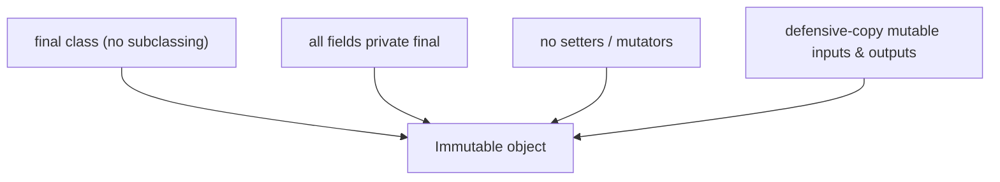
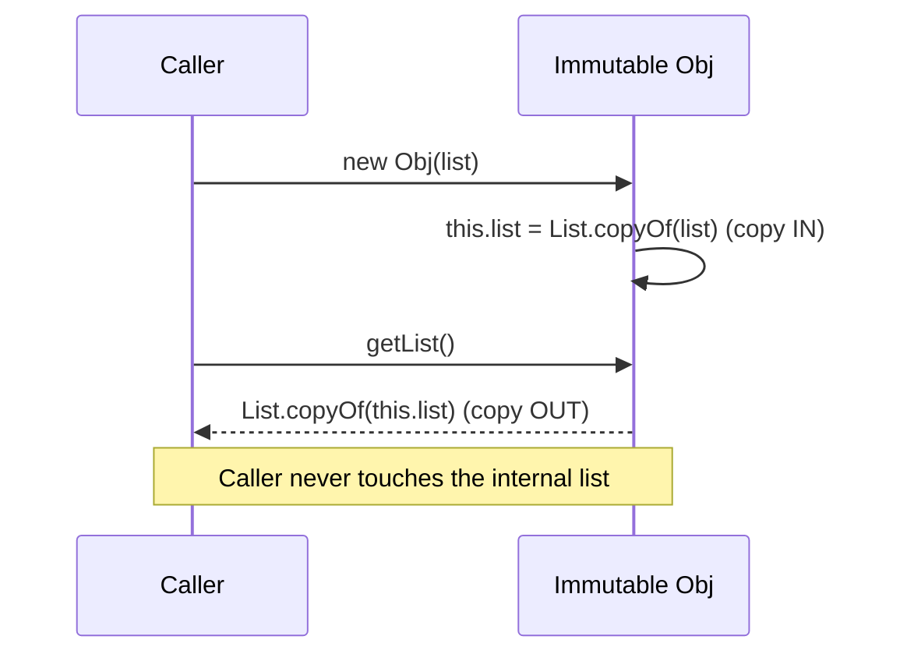

An **immutable** object's state is fixed at construction and never changes. That single constraint buys thread-safety, safe sharing, and freedom from a whole class of bugs.

## The recipe for immutability



## Mutable vs immutable

````tabs
tabs:
  - label: Mutable (risky)
    body: |
      Anyone can change state after construction — aliasing bugs, not thread-safe.
      ```java
      class MutablePoint {
        private int x, y;
        MutablePoint(int x, int y) { this.x = x; this.y = y; }
        void setX(int x) { this.x = x; }   // state can change
        int getX() { return x; }
      }
      var p = new MutablePoint(1, 2);
      var q = p;      // q and p ALIAS the same object
      q.setX(99);     // p.getX() is now 99 too — surprise!
      ```
  - label: Immutable (safe)
    body: |
      Fixed after construction; a "change" returns a NEW object.
      ```java
      final class Point {
        private final int x, y;
        Point(int x, int y) { this.x = x; this.y = y; }
        int getX() { return x; }
        Point withX(int nx) { return new Point(nx, y); } // copy-on-change
      }
      // Or simply a record — immutable by design:
      record Pt(int x, int y) {}
      ```
````

## Defensive copying — sealing the leaks

An object with a mutable field (array, `List`, `Date`) is only immutable if it copies on the way **in** (constructor) and on the way **out** (getter). Otherwise callers hold a reference to the internal state and can mutate it.



:::gotcha
`final` on a field only stops **reassignment** of the reference — it does *not* make the pointed-to object immutable. `private final int[] data` can still have its elements changed. Wrap or copy mutable contents.
:::

## Why bother? The payoff

| Benefit | Why immutability gives it |
|--|--|
| **Thread-safe** | No writes after construction → no data races, no locks needed |
| **Safe sharing** | Can be freely cached, reused, and passed around — no aliasing bugs |
| **Valid by construction** | Invariants checked once in the constructor, then can't be broken |
| **Good hash keys** | Hash/equality never change → safe in `HashMap`/`HashSet` |
| **Simpler reasoning** | State can't change under you — easier to test and debug |

:::senior
This is why `String`, the wrapper types, and `record`s are immutable. A **value object** models a value (money, a coordinate, a date range) rather than an entity with identity; it should be immutable and define `equals`/`hashCode` by value. Records give you all of that in one line — reach for them.
:::

## Check yourself

```quiz
title: Immutability
questions:
  - q: 'Which is NOT required to make a class immutable?'
    options:
      - text: 'Implementing `Cloneable`'
        correct: true
      - 'Making fields `private final`'
      - 'Defensively copying mutable inputs'
    explain: '`Cloneable` is unrelated. Immutability needs final fields, no mutators, and defensive copies of mutable state.'
  - q: 'Why are immutable objects inherently thread-safe?'
    options:
      - text: 'Their state never changes after construction, so there are no races'
        correct: true
      - 'The JVM locks them automatically'
      - 'They live in a special memory region'
    explain: 'With no post-construction writes, concurrent reads can never observe an inconsistent or half-updated state.'
  - q: 'A field is `private final List<T> items`. Is the object immutable?'
    options:
      - text: 'Not necessarily — the List contents can still be mutated unless copied/wrapped'
        correct: true
      - 'Yes, `final` guarantees it'
      - 'Only if the list is empty'
    explain: '`final` fixes the reference, not the contents. Defensively copy in and out (or use `List.copyOf`) for true immutability.'
```

:::key
Immutable = `final` class, `private final` fields, no mutators, and **defensive copies** of mutable state in and out. Payoff: thread-safety, safe sharing, stable hash keys, and simpler reasoning. **Value objects** model values by content — use `record`s.
:::

## Terminology

```flashcards
title: Immutability terms
cards:
  - front: 'Immutable object'
    back: 'State fixed at construction; never changes. A "change" produces a new object.'
  - front: 'Defensive copy'
    back: 'Copying a mutable input (constructor) or output (getter) so callers can''t mutate internal state.'
  - front: 'Value object'
    back: 'Models a value (money, point) with no identity; immutable and equal by content.'
  - front: 'Copy-on-write / `withX`'
    back: 'A mutator-style method that returns a new immutable instance with one field changed.'
```
