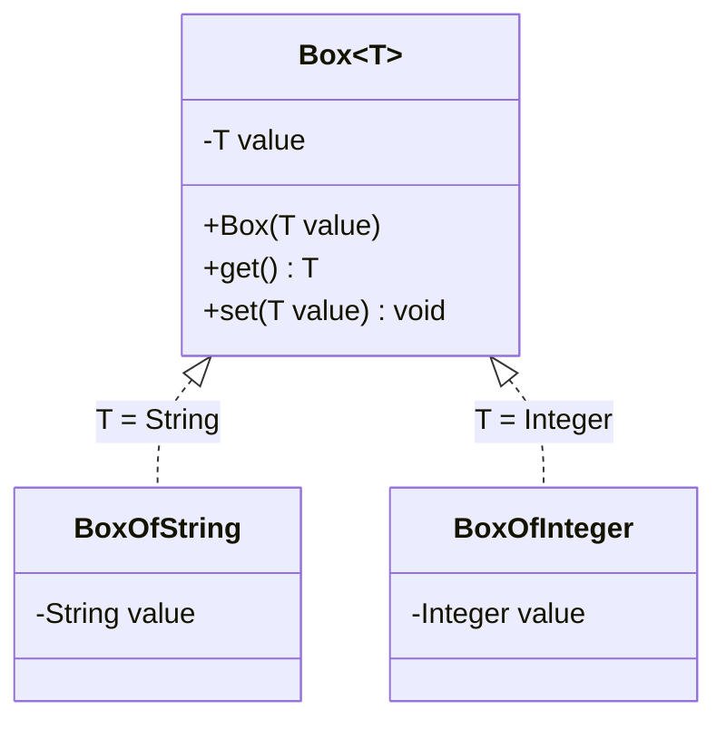

**Generics** let a type or method work over a *type parameter* `T` — one implementation, type-safe for every `T`. This is **parametric polymorphism**: the same code, many types.

## A generic type



*One `Box<T>` definition yields a type-safe `Box<String>`, `Box<Integer>`, … — no casts, no duplication.*

```java
class Box<T> {
  private T value;
  Box(T value) { this.value = value; }
  T get() { return value; }
}
Box<String> s = new Box<>("hi");
String v = s.get();      // no cast — compiler knows it's a String
```

## Bounded type parameters

A bound constrains `T` so you can call methods on it. `<T extends Comparable<T>>` means *"any T that is comparable to itself."*

```java
static <T extends Comparable<T>> T max(T a, T b) {
  return a.compareTo(b) >= 0 ? a : b;   // compareTo allowed by the bound
}
```

- **Upper bound** `<T extends Number>` — T is a Number *or subtype* (can read as Number).
- **Wildcard** `List<? extends Number>` — a list of some unknown Number subtype (producer, read-only).
- **Lower bound** `List<? super Integer>` — accepts Integer and its supertypes (consumer). *PECS: Producer `extends`, Consumer `super`.*

## The three kinds of polymorphism

| Kind | A.k.a. | Mechanism | Example |
|--|--|--|--|
| **Ad-hoc** | overloading | compiler picks by argument types | `print(int)` vs `print(String)` |
| **Parametric** | generics | one impl over a type parameter `T` | `Box<T>`, `List<T>` |
| **Subtype** | overriding | dynamic dispatch on the real type | `Animal a = new Dog(); a.speak()` |

:::note
"Same name, different unrelated bodies" = **ad-hoc**. "Same body, any type" = **parametric**. "Same signature, per-subclass body chosen at runtime" = **subtype**. Interviewers love this taxonomy.
:::

:::senior
Java generics use **type erasure**: `Box<String>` and `Box<Integer>` share one runtime class; `T` is erased to its bound (or `Object`) and casts are inserted by the compiler. Consequences: no `new T()`, no `T[]` creation, no `instanceof List<String>`, and overloads can't differ only by generic parameter. Erasure keeps generics backward-compatible but is why they're a compile-time-only guarantee.
:::

## Check yourself

```quiz
title: Generics & polymorphism kinds
questions:
  - q: 'What kind of polymorphism do generics provide?'
    options:
      - text: 'Parametric — one implementation over a type parameter'
        correct: true
      - 'Ad-hoc'
      - 'Subtype'
    explain: 'Generics are parametric polymorphism: the same code operates uniformly for every type argument.'
  - q: 'What does `<T extends Comparable<T>>` buy you inside the method?'
    options:
      - text: 'You can call `compareTo` on any `T`, checked at compile time'
        correct: true
      - 'It makes T immutable'
      - 'It boxes T automatically'
    explain: 'The bound guarantees every T implements Comparable, so `compareTo` is legal and type-safe.'
  - q: 'Why can''t you write `new T()` inside a generic class?'
    options:
      - text: 'Type erasure removes T at runtime, so the type isn''t known'
        correct: true
      - 'It''s a syntax error only in older Java'
      - 'T is always null'
    explain: 'Erasure replaces T with its bound (or Object) at runtime, so the JVM has no concrete type to instantiate.'
```

:::key
**Generics** = parametric polymorphism: one type-safe implementation over a parameter `T`, optionally **bounded** (`extends`/`super`, PECS). The three polymorphisms: **ad-hoc** (overloading), **parametric** (generics), **subtype** (overriding). Java generics are compile-time via **type erasure**.
:::

## Terminology

```flashcards
title: Generics terms
cards:
  - front: 'Type parameter `<T>`'
    back: 'A placeholder type filled in by the caller — enables one impl for many types.'
  - front: 'Bounded type `<T extends X>`'
    back: 'Restricts T to X or a subtype, so you may call X''s members on T.'
  - front: 'PECS'
    back: 'Producer `extends`, Consumer `super` — pick the right wildcard bound.'
  - front: 'Type erasure'
    back: 'Generics exist only at compile time; T is erased to its bound at runtime.'
  - front: 'Parametric vs ad-hoc vs subtype'
    back: 'Generics vs overloading vs overriding — one code/many types, name reuse, runtime dispatch.'
```
