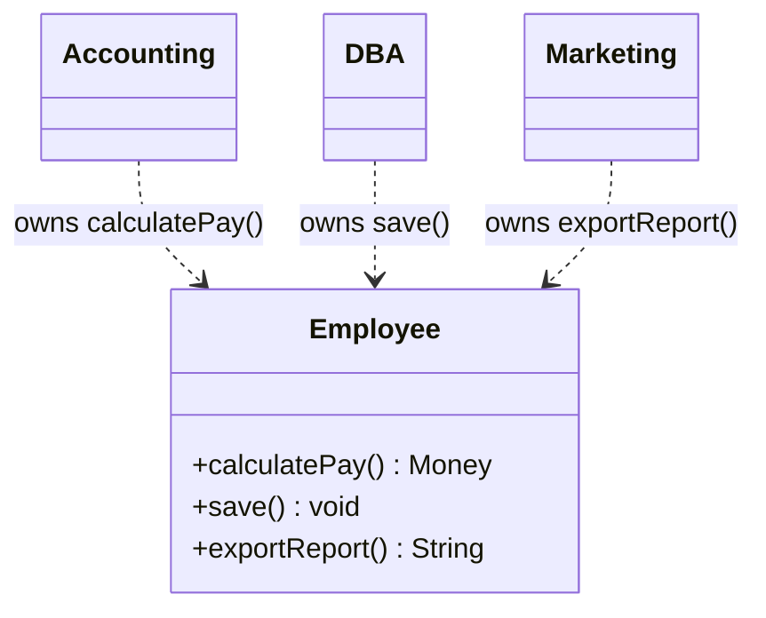
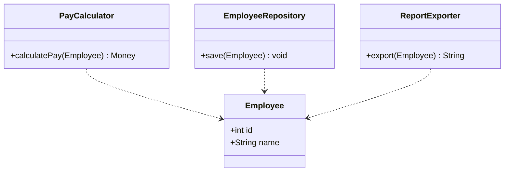

The **S** in SOLID. *"A class should have only **one reason to change**."* — Robert C. Martin.

A "reason to change" is an **actor**: a stakeholder who can request a change. If the tax office, the DBA, and the marketing team can all force edits to the same class, that class has three responsibilities — and three ways to break each other.

## The god-class smell

One `Employee` class computes pay, saves itself, and formats a report. Three unrelated actors reach into it.



Change the report format and you risk breaking payroll — nothing in the compiler stops it.

## The fix: one class per reason to change

Split along the actors. Each class now has a single owner and a single reason to change.



## Before vs after

````tabs
tabs:
  - label: Violation (god class)
    body: |
      One class, three actors, three reasons to change.
      ```java
      class Employee {
          int id; String name; double baseRate;

          Money calculatePay() { /* accounting rules */ }
          void save()          { /* SQL / JDBC here */ }
          String exportReport(){ /* HTML formatting */ }
      }
      ```
      A change to the SQL schema, the tax rules, or the report layout all edit the *same* file.
  - label: Fix (separated)
    body: |
      Each responsibility gets its own class.
      ```java
      class Employee { int id; String name; double baseRate; }

      class PayCalculator {
          Money calculatePay(Employee e) { /* accounting */ }
      }
      class EmployeeRepository {
          void save(Employee e) { /* persistence */ }
      }
      class ReportExporter {
          String export(Employee e) { /* presentation */ }
      }
      ```
      Now the accountant, DBA, and marketer each edit their own class in isolation.
````

:::key
SRP is about **who** asks for a change, not how many methods a class has. Group things that change **for the same reason**; separate things that change for **different** reasons. High cohesion, low coupling.
:::

:::gotcha
Don't shatter every class into single-method fragments — that's the opposite smell (**"needless complexity"** / a "shotgun" of tiny classes). SRP separates *reasons to change*, not lines of code.
:::

:::senior
SRP is really **cohesion** restated. A related failure mode is when a change to one requirement forces edits scattered across many classes — that's **Shotgun Surgery**, the mirror image of a god class. Both signal responsibilities living in the wrong place.
:::

## Check yourself

```quiz
title: SRP check
questions:
  - q: 'What is a "reason to change" in SRP?'
    options:
      - 'A new method being added'
      - text: 'An actor / stakeholder who can request a modification'
        correct: true
      - 'A compiler warning'
    explain: 'Martin defines a responsibility as a reason to change, tied to a single actor. Different actors = different responsibilities.'
  - q: 'A `Report` class both computes totals *and* renders HTML. Which SRP fix is best?'
    options:
      - text: 'Split into a calculator class and a renderer class'
        correct: true
      - 'Add more methods to `Report`'
      - 'Make every method `static`'
    explain: 'Calculation (business rules) and rendering (presentation) change for different reasons and different actors — separate them.'
  - q: 'Is "one method per class" the goal of SRP?'
    options:
      - 'Yes, always'
      - text: 'No — it separates reasons to change, not method counts'
        correct: true
    explain: 'Over-splitting creates needless complexity. SRP groups by shared reason to change.'
```
