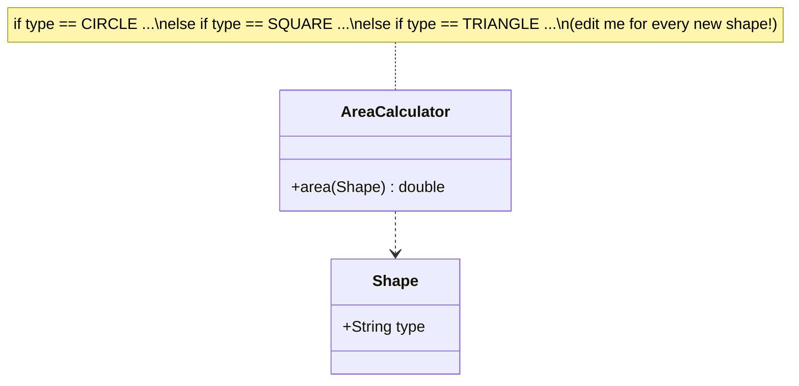
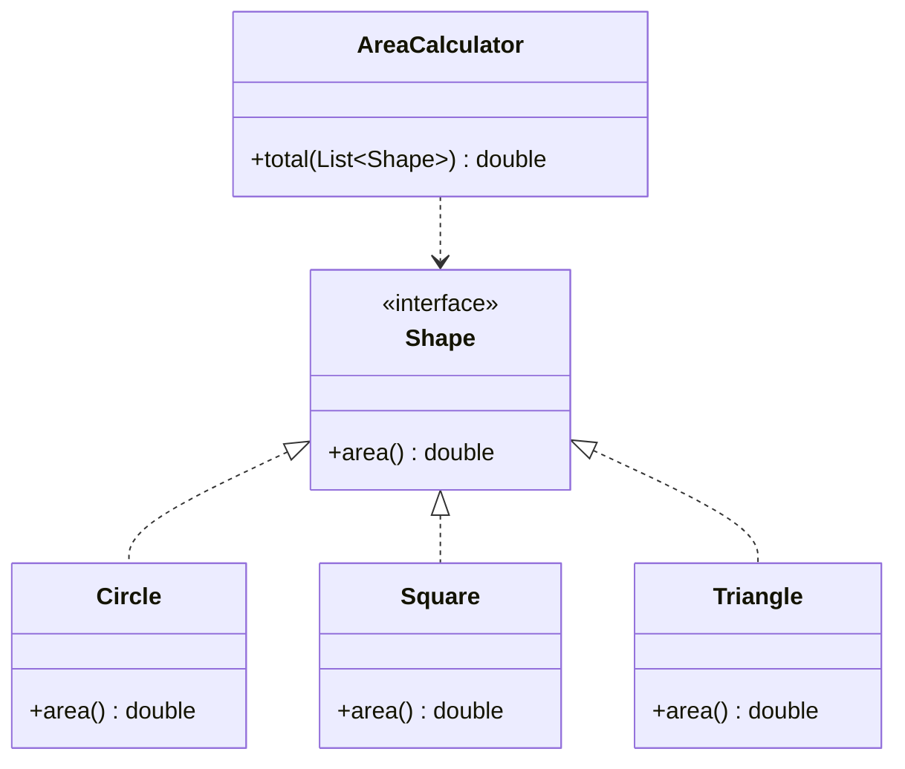

The **O** in SOLID. *"A module should be **open for extension** but **closed for modification**."* — Bertrand Meyer.

You should be able to add **new behaviour** without touching **existing, tested code**. The enemy is the ever-growing `if`/`switch` on a type flag: every new case re-opens (and re-risks) a working class.

## The smell: a switch that keeps growing

`AreaCalculator` must be edited for every new shape. It *depends on* the concrete shapes and their type tags.



## The fix: extend via polymorphism (Strategy)

Push the varying behaviour behind an abstraction. New shapes = new **classes**; `AreaCalculator` never changes.



Adding `Triangle` touches **only** the new file — the arrow into `AreaCalculator` never moves.

## Before vs after

````tabs
tabs:
  - label: Violation (type switch)
    body: |
      Every new shape forces an edit to `area()`.
      ```java
      class AreaCalculator {
          double area(Shape s) {
              switch (s.type) {
                  case CIRCLE: return Math.PI * s.r * s.r;
                  case SQUARE: return s.side * s.side;
                  // add TRIANGLE here... and re-test everything
                  default: throw new IllegalArgumentException();
              }
          }
      }
      ```
  - label: Fix (polymorphic)
    body: |
      Each shape owns its formula; the calculator is closed.
      ```java
      interface Shape { double area(); }

      record Circle(double r)  implements Shape {
          public double area() { return Math.PI * r * r; }
      }
      record Square(double side) implements Shape {
          public double area() { return side * side; }
      }
      // NEW: just add a class — nothing else changes
      record Triangle(double b, double h) implements Shape {
          public double area() { return 0.5 * b * h; }
      }

      class AreaCalculator {
          double total(List<Shape> shapes) {
              return shapes.stream().mapToDouble(Shape::area).sum();
          }
      }
      ```
````

:::key
OCP = **add new code, don't edit old code**. Achieve it with abstraction: interfaces, inheritance, and the **Strategy** pattern. A repeated `switch`/`instanceof` on a type is the classic OCP violation.
:::

:::senior
"Closed" is never absolute — you can't predict every future axis of change. The pragmatic version: identify the axis that changes *most* and design the abstraction there. Speculatively abstracting everything is over-engineering (YAGNI). OCP pays off after the *second* change request, not the first.
:::

## Check yourself

```quiz
title: OCP check
questions:
  - q: 'Which code smell most directly signals an OCP violation?'
    options:
      - text: 'A `switch`/`instanceof` on a type flag that grows with each new type'
        correct: true
      - 'A method longer than 5 lines'
      - 'Using generics'
    explain: 'A type-dispatching switch must be edited for every new type — the class is not closed to modification.'
  - q: 'OCP is best achieved through...'
    options:
      - 'Marking classes `final`'
      - text: 'Abstraction — interfaces / polymorphism so new behaviour arrives as new classes'
        correct: true
      - 'Copy-pasting the class'
    explain: 'Depend on an abstraction; add new implementations without touching the consumer.'
  - q: 'Adding a `Triangle` shape in the polymorphic design requires editing `AreaCalculator`. True?'
    options:
      - text: 'False — you only add a new `Triangle` class'
        correct: true
      - 'True — you must add a new case'
    explain: 'That is the whole point: the calculator is closed to modification, open to new Shape implementations.'
```
