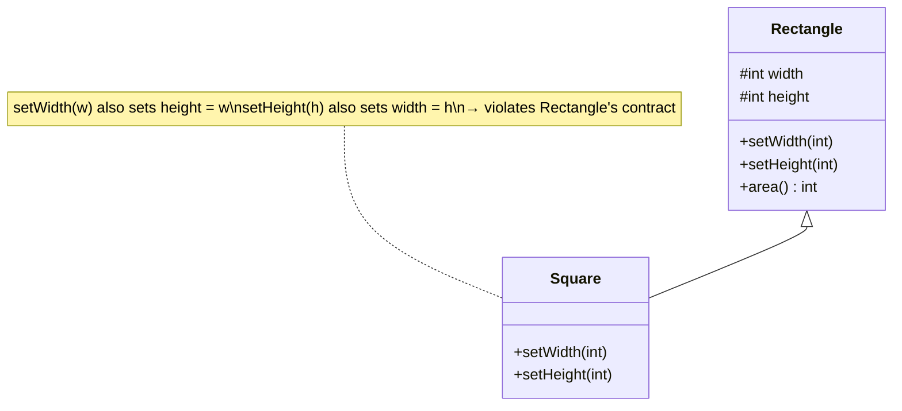

The **L** in SOLID. *"If S is a subtype of T, objects of T may be replaced with objects of S **without altering the correctness** of the program."* — Barbara Liskov.

Inheritance says "a `Square` **is-a** `Rectangle`." LSP asks a harder question: can code written against `Rectangle` keep working when you hand it a `Square`? If not, the inheritance is a **lie**.

## The classic trap: Square extends Rectangle

Mathematically a square *is* a rectangle. In code, `Square` must override the setters to keep its sides equal — and that breaks any caller who set width and height independently.



## Watch the contract break

```walkthrough
title: The assertion that Square fails
code: |
  void resizeAndCheck(Rectangle r) {
      r.setWidth(5);
      r.setHeight(4);
      assert r.area() == 20;   // 5 * 4
  }
  resizeAndCheck(new Rectangle()); // OK
  resizeAndCheck(new Square());    // BOOM
steps:
  - text: 'The method is written against `Rectangle`. Its contract: width and height are **independent**. Expecting `5 * 4 == 20` is reasonable.'
    line: 4
  - text: 'Pass a real `Rectangle`: `setWidth(5)`, `setHeight(4)` → area 20. The assertion holds.'
    line: 6
  - text: 'Pass a `Square`. `setWidth(5)` sets both sides to 5. Then `setHeight(4)` sets both sides to 4.'
    line: 7
  - text: 'Now `area()` returns `4 * 4 == 16`, not 20. The assertion **fails** — `Square` is not substitutable for `Rectangle`. LSP violated.'
    line: 3
```

## Why it fails — and the fix

The `Square` **strengthens a precondition / breaks an invariant** the base type never had (width == height). The honest fix: don't inherit. Model both as an immutable `Shape` with an `area()`, or make them siblings — no mutable-setter inheritance.

````tabs
tabs:
  - label: Violation
    body: |
      `Square` overrides setters and silently breaks the base contract.
      ```java
      class Rectangle {
          protected int w, h;
          void setWidth(int w)  { this.w = w; }
          void setHeight(int h) { this.h = h; }
          int area() { return w * h; }
      }
      class Square extends Rectangle {
          @Override void setWidth(int s)  { this.w = this.h = s; }
          @Override void setHeight(int s) { this.w = this.h = s; }
      }
      ```
  - label: Fix (no inheritance)
    body: |
      Make shapes immutable siblings behind a common abstraction.
      ```java
      interface Shape { int area(); }

      record Rectangle(int w, int h) implements Shape {
          public int area() { return w * h; }
      }
      record Square(int side) implements Shape {
          public int area() { return side * side; }
      }
      ```
      No setters, no broken invariant — every `Shape` is fully substitutable.
````

## The LSP contract rules

| A subtype may... | A subtype may NOT... |
|--|--|
| **Weaken** preconditions (accept more) | **Strengthen** preconditions (demand more) |
| **Strengthen** postconditions (promise more) | **Weaken** postconditions (promise less) |
| Preserve base invariants | Break base-class invariants |
| — | Throw new checked exceptions the base doesn't declare |

:::gotcha
The compiler happily accepts an LSP violation — `Square extends Rectangle` compiles fine. LSP is a **behavioural / semantic** contract, not a syntactic one. Common real-world offenders: `UnsupportedOperationException` from an immutable `List`, or a subclass that ignores a method.
:::

:::senior
Rule of thumb: if you override a method just to **throw** or to **no-op** it, you're almost certainly violating LSP. Prefer **composition over inheritance** and model behaviour with interfaces. "Is-a" in English is not enough — it must be "is-substitutable-for" in behaviour.
:::

## Check yourself

```quiz
title: LSP check
questions:
  - q: 'Why does `Square extends Rectangle` violate LSP?'
    options:
      - text: 'Overriding the setters breaks the invariant that width and height vary independently'
        correct: true
      - 'A square has no area'
      - 'It fails to compile'
    explain: 'Callers of Rectangle assume independent width/height. Square breaks that base-class invariant, so it is not substitutable.'
  - q: 'Which is ALLOWED for a subtype under LSP?'
    options:
      - 'Strengthen a precondition (demand more from callers)'
      - text: 'Weaken a precondition (accept a wider range of input)'
        correct: true
      - 'Throw a new checked exception the base never declared'
    explain: 'Subtypes may require less and promise more — never require more or promise less.'
  - q: 'A subclass overrides a method solely to `throw new UnsupportedOperationException()`. This is...'
    options:
      - 'Fine, it documents intent'
      - text: 'A likely LSP violation — the subtype is not substitutable'
        correct: true
    explain: 'Callers of the base type expect the method to work. Throwing instead breaks substitutability.'
```
