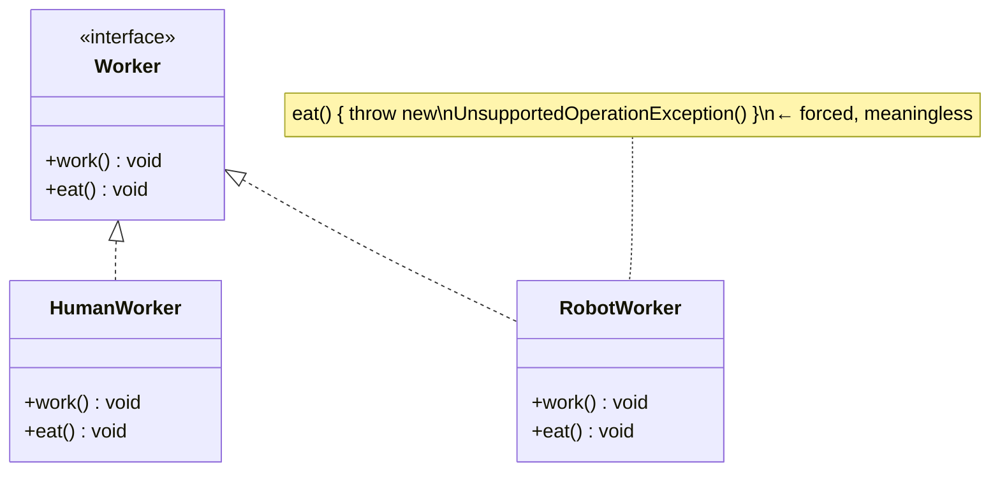
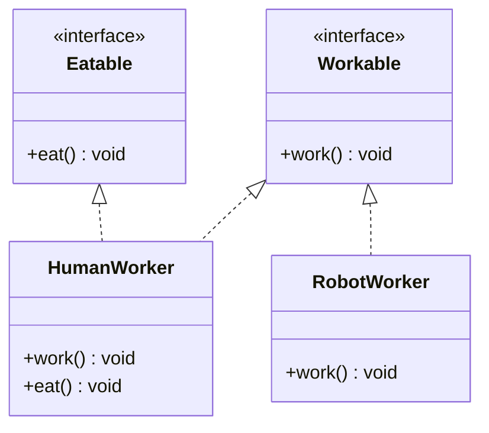

The **I** in SOLID. *"Clients should not be forced to depend upon interfaces they do **not use**."*

A **fat interface** forces implementers to supply methods that make no sense for them — usually by throwing exceptions or leaving empty bodies. Each unused method is a lie in the type system and a source of accidental coupling.

## The smell: a fat interface

`Worker` bundles `work()` **and** `eat()`. A `RobotWorker` can work but can't eat — so it's forced to fake `eat()`.



## The fix: segregate into role interfaces

Split `Worker` into the smallest cohesive roles. Each class implements **only** what it can honour.



`RobotWorker` no longer knows `eat()` even exists — no fake method, no lie.

## Before vs after

````tabs
tabs:
  - label: Violation (fat interface)
    body: |
      The robot is forced to implement a method it can't support.
      ```java
      interface Worker {
          void work();
          void eat();
      }
      class RobotWorker implements Worker {
          public void work() { /* ... */ }
          public void eat() {
              throw new UnsupportedOperationException(); // smell!
          }
      }
      ```
  - label: Fix (role interfaces)
    body: |
      Small interfaces; classes pick only the roles they fulfil.
      ```java
      interface Workable { void work(); }
      interface Eatable  { void eat();  }

      class HumanWorker implements Workable, Eatable {
          public void work() { /* ... */ }
          public void eat()  { /* ... */ }
      }
      class RobotWorker implements Workable {
          public void work() { /* ... */ }   // no eat(), by design
      }
      ```
````

:::key
ISP: **many small, client-specific interfaces beat one general-purpose fat one.** The tell-tale symptom is an implementer throwing `UnsupportedOperationException` or writing empty method bodies to satisfy a contract it doesn't need.
:::

:::note
ISP and SRP are cousins: SRP is about a **class** having one reason to change; ISP is about an **interface** exposing one cohesive role. Java's `java.util` fat `List` (with optional `add`/`remove` that immutable lists reject) is a famous real-world ISP violation.
:::

:::senior
ISP reduces the "ripple" of change: a client depending on a tiny interface won't recompile or break when unrelated methods are added elsewhere. It also enables mocking — you stub a 1-method role interface, not a 20-method monster.
:::

## Check yourself

```quiz
title: ISP check
questions:
  - q: 'What is the clearest symptom of an ISP violation?'
    options:
      - text: 'An implementer throws `UnsupportedOperationException` or leaves methods empty'
        correct: true
      - 'An interface has a generic type parameter'
      - 'A class implements two interfaces'
    explain: 'Being forced to stub-out or throw from a method you don''t need means the interface is too fat for this client.'
  - q: 'The ISP fix for a fat `Worker { work(); eat(); }` interface is to...'
    options:
      - 'Add a default method for `eat()`'
      - text: 'Split it into `Workable` and `Eatable` role interfaces'
        correct: true
      - 'Make `Worker` abstract'
    explain: 'Segregate into small, cohesive role interfaces so clients depend only on what they use.'
  - q: 'ISP most closely mirrors which other SOLID principle, at the interface level?'
    options:
      - text: 'SRP — one cohesive responsibility/role'
        correct: true
      - 'LSP'
      - 'DIP'
    explain: 'ISP is essentially SRP applied to interfaces: one cohesive role per interface.'
```
